[学习参考来源1：](https://www.liaoxuefeng.com/wiki/896043488029600)

[学习参考来源2：](https://note.youdao.com/ynoteshare1/index.html?id=4653994abae090b764e7fb65a039a7fe&type=note)

# Git

## Git简介

###什么是git？

Git是目前世界上最先进的分布式版本控制系统。

###集中式和分布式版本控制系统有什么区别？

**集中式版本控制系统：**

​	版本库是集中存放在中央服务器的，而干活的时候，用的都是自己的电脑，所以要先从中央服务器取得最新的版本，然后开始干活，干完活了，再把自己的活推送给中央服务器。中央服务器就好比是一个图书馆，你要改一本书，必须先从图书馆借出来，然后回到家自己改，改完了，再放回图书馆。

​	缺点：集中式版本控制系统最大的毛病就是必须联网才能工作。

**分布式版本控制系统**：

​	分布式版本控制系统根本没有“中央服务器”，每个人的电脑上都是一个完整的版本库，这样，你工作的时候，就不需要联网了，因为版本库就在你自己的电脑上。既然每个人电脑上都有一个完整的版本库，那多个人如何协作呢？比方说你在自己电脑上改了文件A，你的同事也在他的电脑上改了文件A，这时，你们俩之间只需把各自的修改推送给对方，就可以互相看到对方的修改了。

**另：**

​	所有的版本控制系统，其实只能跟踪文本文件的改动，比如TXT文件，网页，所有的程序代码等等，Git也不例外。如果要真正使用版本控制系统，就要以纯文本方式编写文件。建议使用标准的**UTF-8**编码。

​	windows建议使用Visual Studio Code代替记事本。

###安装Git

在Windows上使用Git，可以从Git官网直接[下载安装程序](https://git-scm.com/downloads)，然后按默认选项安装即可。

安装完成后，在开始菜单里找到“Git”->“Git Bash”，蹦出一个类似命令行窗口的东西，就说明Git安装成功！

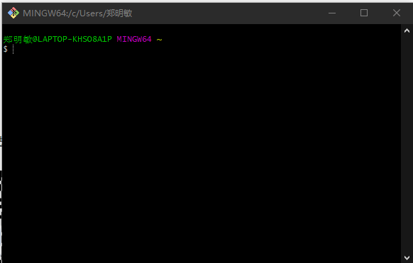

安装完成后，还需要设置用户签名，在命令行输入：

```
$ git config --global user.name "Your Name"
$ git config --global user.email "email@example.com"
```

如果想检查一下看看有没有设置成功，可以再输入git config user.name然后回车，如果设置成功了就会显示你刚刚设置的用户名，同理，可以用git config user.email来查看你设置的邮箱。


作用：

区分不同操作者的身份。用户的签名信息在每一个版本的提交信息中能够看到，以此确认本次提交是谁做的。**首次安装git时必须设置一下用户签名，否者无法提交代码**


这里设置的用户签名和将来登录github或其他代码托管中心没有任何关系。


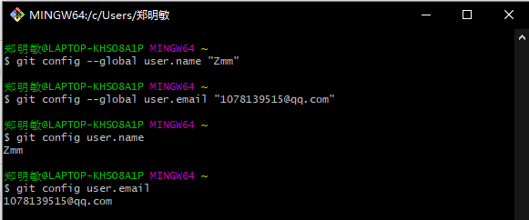


### 创建版本库

​	版本库又名仓库，英文名**repository**，你可以简单理解成一个目录，这个目录里面的所有文件都可以被Git管理起来，每个文件的修改、删除，Git都能跟踪，以便任何时刻都可以追踪历史，或者在将来某个时刻可以“还原”。

**步骤：**

1. 在git bash中cd进入到合适的地方，创建一个空目录

   ```
   $ mkdir myselfgit //创建一个myselfgit空目录
   $ cd myselfgit	  //进入到该目录
   $ pwd			  //显示路径
   
   示例：
   $ pwd
   /e/git/myselfgit
   ```

   

2. 第二步，通过`git init`命令把这个目录变成Git可以管理的仓库（初始化本地库）：

   ```
   $ git init
   Initialized empty Git repository in E:/Git/myselfgit/.git/
   ```

   之后仓库就建好了，目录下会多一个`.git`的目录，这个目录是Git来跟踪管理版本库的，不要轻易去修改。

   如果没有看到`.git`目录，那是因为这个目录默认是隐藏的，用`ls -ah`命令就可以看见。

   

###把文件添加到版本库

1. 首先要到git仓库下的目录或子目录，否则git无法找到这个文件，以readme.txt举例

2. 用`git add`命令告诉git，把文件提交到仓库：

   ```
   $ git add readme.txt
   ```

   执行上面的命令，没有任何显示，这就对了，Unix的哲学是“没有消息就是好消息”，说明添加成功。

3. 用命令`git commit`告诉Git，把文件提交到仓库：

   其中 `-m`后面输入的是本次提交的说明，可以输入任意内容，当然最好是有意义的，这样你就能从历史记录里方便地找到改动记录。

   ```
   $ git commit -m "wrote a readme file"
   [master (root-commit) 82fd9b6] wrote a readme file
   
    //git commit命令执行成功后会告诉你，1 file changed：1个文件被改动（我们新添加的readme.txt文件）；2 insertions：插入了两行内容（readme.txt有两行内容）。
     
     1 file changed, 2 insertions(+)  
     
    create mode 100644 readme.txt
   ```

**另：**因为`commit`可以一次提交很多文件，所以你可以多次`add`不同的文件 例如：

```
$ git add file1.txt
$ git add file2.txt file3.txt
$ git commit -m "add 3 files."
```

## 具体操作

- 要随时掌握工作区的状态，使用`git status`命令。

- 如果`git status`告诉你有文件被修改过，用`git diff`可以查看修改内容。

- [git diff命令详解](https://blog.csdn.net/wq6ylg08/article/details/88798254)

  

**举例**：当目前工作区有一个testDiff.txt文件经过git add/git commit命令之后，再次修改这个testDiff这个文件，这时通过git status命令可以查看到工作区哪个文件发生了改变，会显现如下：

`modified: testDiff.txt`

经过修改的testDiff.txt文件状态是修改未提交

git diff testDiff.txt比较的是工作区和暂存区(stage)的不同


- **比较工作区与暂存区**

　　　　git diff 不加参数即默认比较工作区与暂存区

- **比较暂存区与最新本地版本库（本地库中最近一次commit的内容）**

　　　　git diff --cached  [...] 

- **比较工作区与最新本地版本库**

　　　　git diff HEAD [...]  如果HEAD指向的是master分支，那么HEAD还可以换成master


### 版本回退

 **查看历史记录：**

```
git reflog 查看历史版本
git log    查看版本详细信息

```


​	在Git中，我们用`git log`命令查看，显示从最近到最远的提交日志。

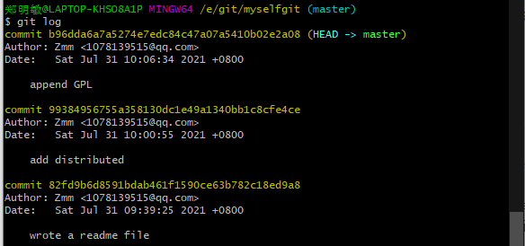

​	**其中**在Git中，用`HEAD`表示当前版本，上一个版本就是`HEAD^`，上上一个版本就是`HEAD^^`，当然往上100个版本写100个`^`比较容易数不过来，所以写成`HEAD~100`。

​	如果嫌输出信息太多，看得眼花缭乱的，可以试试加上`--pretty=oneline`参数：

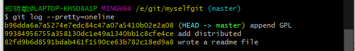


**使用`git reset`命令可以回退到指定的版本：**

```
$ git reset --hard HEAD^   //回到上一个版本
HEAD is now at 9938495 add distributed

$ cat readme.txt		   //读取readme.txt内容
Git is a distributed version control system.	//readme.txt中的内容
Git is free software.

$ git reset --hard b96dda   //回退到之前的版本，通过commit id（版本号）
HEAD is now at b96dda6 append GPL

```

**Git提供了一个命令`git reflog`用来记录你的每一次命令：**

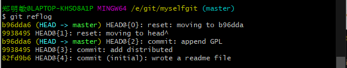


**小结：**

- `HEAD`指向的版本就是当前版本，因此，Git允许我们在版本的历史之间穿梭，使用命令`git reset --hard commit_id`。
- 穿梭前，用`git log`可以查看提交历史，以便确定要回退到哪个版本。
- 要重返未来，用`git reflog`查看命令历史，以便确定要回到未来的哪个版本。


### 工作区和暂存区

- **工作区（Working Directory）：**.git所在的目录下，除了.git之外的其他文件都是在工作区内。
- **版本库（Repository）：**.git目录内所存的记录，有暂存区和Git为我们自动创建的第一个分支master，以及指向master的一个指针叫HEAD。
- **stage（或者叫index）的暂存区：**用add命令放进来文件的位置。


如果文件在工作区被编辑，对应的status状态就是 Changes not staged for commit 

如果工作区新增文件，则对应的status状态就是 Untracked files 

如果文件被add后，对应的status状态就是 Changes to be committed 

多次add后的文件都放在暂存区，最后一次性全部提交。提交后的status状态就是 nothing to commit, working tree clean 

这时候工作区就是干净的，暂存区也没有任何内容了。


.git是Git的版本库，里面存了很多东西，其中最重要的就是称为stage（或者叫index）的**暂存区**，还有Git为我们自动创建的第一个分支`master`，以及指向`master`的一个指针叫`HEAD`。


第一步是用`git add`把文件添加进去，实际上就是把文件修改添加到暂存区；

第二步是用`git commit`提交更改，实际上就是把暂存区的所有内容提交到当前分支。

因为我们创建Git版本库时，Git自动为我们创建了唯一一个`master`分支，所以，现在，`git commit`就是往`master`分支上提交更改。

> git diff比较的是工作目录中当前文件和暂存区域快照之间的差异， 也就是修改之后还没有暂存起来的变化内容。若要查看已暂存的将要添加到下次提交里的内容，可以用 git diff --cached 命令。

> 请注意，git diff 本身只显示尚未暂存的改动，而不是自上次提交以来所做的所有改动。 所以有时候你一下子暂存了所有更新过的文件后，运行 git diff 后却什么也没有，就是这个原因


###管理修改

​	如果工作区中的一个文件经过修改之后add，没有commit；然后对其再进行一个修改，然后直接commit，这时commit提交的是上一次修改提交到暂存区的文件，git status的话会显示还有一次修改没有提交。因为commit只对暂存区生效。

### 撤销修改

​	命令`git checkout -- readme.txt`意思就是，把`readme.txt`文件在工作区的修改全部撤销，这里有两种情况：

​	一种是`readme.txt`自修改后还没有被放到暂存区，现在，撤销修改就回到和版本库一模一样的状态；

​	一种是`readme.txt`已经添加到暂存区后，又作了修改，现在，撤销修改就回到添加到暂存区后的状态。

总之，就是让这个文件回到最近一次`git commit`或`git add`时的状态。

**小结：**

​	场景1：当你改乱了工作区某个文件的内容，想直接丢弃工作区的修改时，用命令`git checkout -- file`。

​	场景2：当你不但改乱了工作区某个文件的内容，还添加到了暂存区时，想丢弃修改，分两步，第一步用命令`git reset HEAD <file>`，就回到了场景1，第二步按场景1操作。

​	场景3：已经提交了不合适的修改到版本库时，想要撤销本次提交，参考[版本回退](https://www.liaoxuefeng.com/wiki/896043488029600/897013573512192)一节，不过前提是没有推送到远程库。

### 删除文件

情况1：一个文件已经提交，这个时候想要删除它

1. 手动删除在工作区的文件

   这个时候删除的仅仅是在工作区上的文件，暂存区上仍然有存留

2. 使用给`$git rm <file>`

   或者 `git rm --cached <file>`

3. 使用`$git commit -m "原因"`

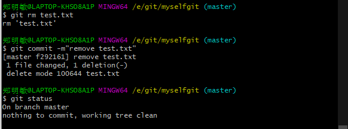

情况2：删错了，因为版本库里还有，所以可以把误删的文件恢复到最新版本：

​	`$git checkout --<file>`

**注意：从来没有被添加到版本库就被删除的文件，是无法恢复的！**


## 远程仓库

###创建远程仓库

步骤：

1. 创建SSH Key。

   1. )在用户主目录下，看看有没有.ssh目录

   2. )查询方式：ls -al ~/.ssh

      

   3. )如果有步骤3，没有就步骤2

2. 打开Git Bash,创建SSH Key，输入如下代码：

   ```
   $ ssh-keygen -t rsa -C "youremail@example.com"  //邮件地址换成自己的邮件地址
   ```

   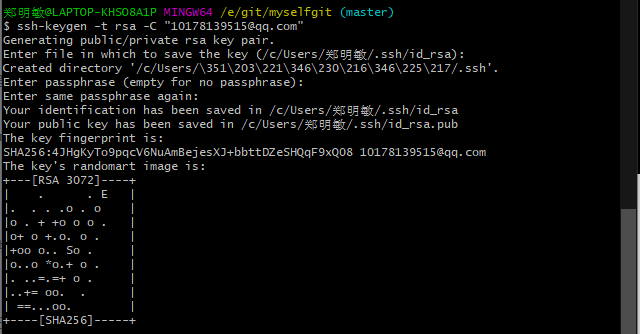

   在用户目录下：

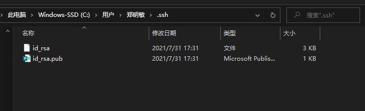

​	`id_rsa`和`id_rsa.pub`两个文件，这两个就是SSH Key的秘钥对，`id_rsa`是私钥，不能泄露出去，`id_rsa.pub`是公钥，可以放心地告诉任何人。

3. 登录GitHub，打开“Account settings”--->“SSH and GPG Keys”--->"New SSH key":

   1. 用vscode把id_rsa.pub打开，把里面的内容复制到key中，title命名自定义。

   2. 点击 Add SSH key 完成

      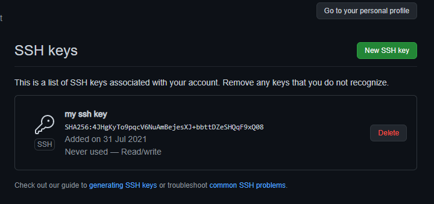

**为什么GitHub需要SSH Key？**

​	因为GitHub需要识别出你推送的提交确实是你推送的，而不是别人冒充的，而Git支持SSH协议，所以，GitHub只要知道了你的公钥，就可以确认只有你自己才能推送。

​	当然，GitHub允许你添加多个Key。假定你有若干电脑，你一会儿在公司提交，一会儿在家里提交，只要把每台电脑的Key都添加到GitHub，就可以在每台电脑上往GitHub推送了。


简单说，SSH是一种**网络协议**，用于计算机之间的**加密登录**。如果一个用户从本地计算机，**使用SSH**协议登录另一台远程计算机，我们就可以认为，这种登录是**安全**的，即使被中途截获，密码也不会泄露。


### 添加远程库

情景：

​	已经在本地创建了一个Git仓库后，又想在GitHub创建一个Git仓库，并且让这两个仓库进行远程同步，这样，GitHub上的仓库既可以作为备份，又可以让其他人通过该仓库来协作。

步骤：

1. 登录Github，左上角点击 New repository,如图设置好仓库名后，点击Greate repository

   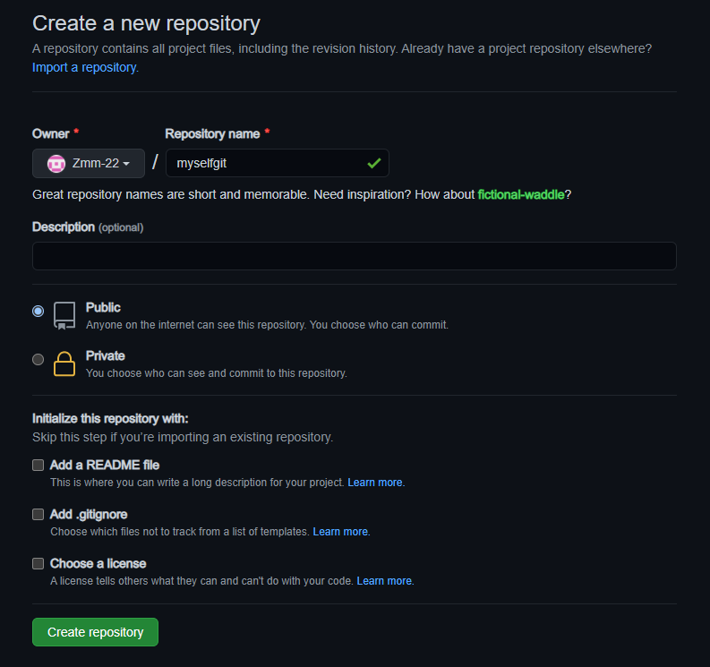

   在GitHub上的这个仓库还是空的，GitHub告诉我们，可以从这个仓库克隆出新的仓库，也可以把一个已有的本地仓库与之关联，然后，把本地仓库的内容推送到GitHub仓库。

   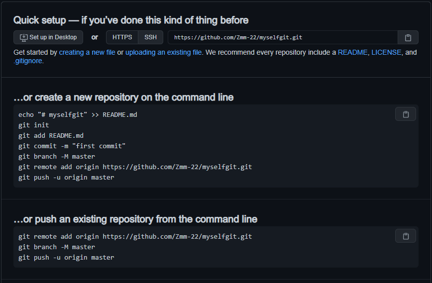

2. 在本地的myselfgit仓库下运行命令：

   其中origin是远程库的别名，代替的是origin后面的一长串。如下：

   `git remote add origin https://github.com/自己的github账户名/learn-git.git`

   或者是

   `git remote add origin git@server-name:path/repo-name.git`

   ​	**实际上**，Git支持多种协议，默认的`git://`使用ssh，但也可以使用`https`等其他协议。使用`https`除了速度慢以外，还有个最大的麻烦是每次推送都必须输入口令，但是在某些只开放http端口的公司内部就无法使用`ssh`协议而只能用`https`。

   

3. 把本地库的所有内容推送到远程库上：

   ```
   $ git push -u origin master   //其中origin是别名，推送的最小单位是分支
   ```

   ​	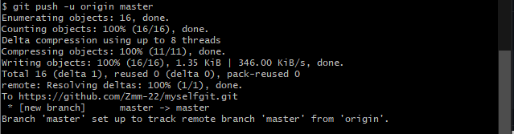

   ​	github默认把master改名成main了,解决方法一是把master改成main，二是在GitHub设置中把main改成master。

   ​	由于远程库是空的，我们第一次推送`master`分支时，加上了`-u`参数，Git不但会把本地的`master`分支内

   容推送的远程新的`master`分支，还会把本地的`master`分支和远程的`master`分支关联起来，

   

   ​	**在以后的推送或者拉取时就可以简化命令：`git push origin master`**即可。

   Github页面中看到的远程库已经和本地一摸一样

   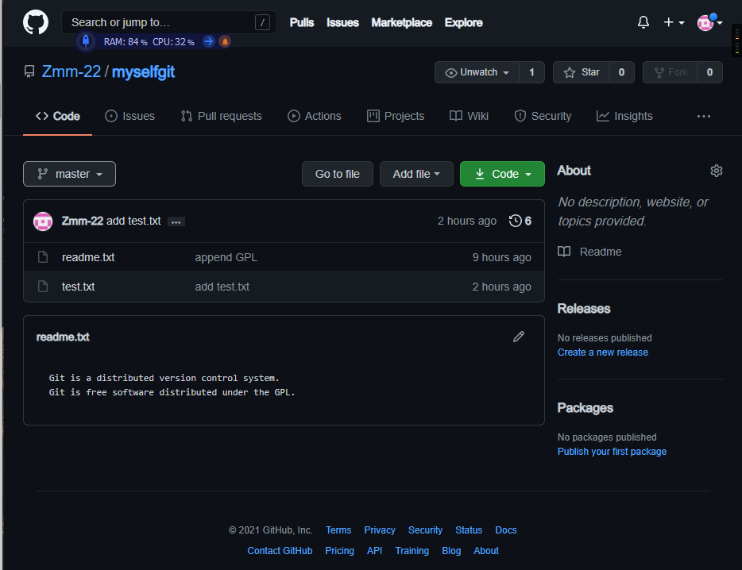

   

   **SSH警告**：

   ​	当第一次使用Git的`clone`或者`push`命令连接GitHub时，会得到一个警告：

   ​	这是因为Git使用SSH连接，而SSH连接在第一次验证GitHub服务器的Key时，需要你确认GitHub的Key的指纹信息是否真的来自GitHub的服务器，输入`yes`回车即可。

   Git会输出一个警告，告诉你已经把GitHub的Key添加到本机的一个信任列表里了：

   ```
   The authenticity of host 'github.com (192.30.255.112)' can't be established.
   RSA key fingerprint is SHA256:nThbg6kXUpJWGl7E1IGOCspRomTxdCARLviKw6E5SY8.
   This key is not known by any other names
   Are you sure you want to continue connecting (yes/no/[fingerprint])? yes
   Warning: Permanently added 'github.com' (RSA) to the list of known hosts.
   
   ```

   

### 删除远程库

```
$ git remote -v  //查看远程库信息

$ git remote rm <name>   //删除远程库，根据name删除

```

​	此处的“删除”其实是解除了本地和远程的绑定关系，并不是物理上删除了远程库。远程库本身并没有任何改动。要真正删除远程库，需要登录到GitHub，在后台页面找到删除按钮再删除。

 

###从远程库克隆

情景：先创建远程库，然后从远程库克隆到本地

```
$ git clone git@github.com:Zmm-22/gitskills.git
```


### 拉取远程库到本地库

`git pull origin master`  origin是远程库别名 master是要拉取的分支


## 分支管理

创建`dev`分支，然后切换到`dev`分支：

```
$ git checkout -b dev
Switched to a new branch 'dev'
```

 `git checkout`命令加上`-b`参数表示创建并切换，相当于以下两条命令：

```
$ git branch dev
$ git checkout dev
Switched to branch 'dev'
```

然后，用`git branch`命令查看当前分支：

```
$ git branch
* dev
  master
```

`git branch`命令会列出所有分支，当前分支前面会标一个`*`号。


**回退到上一个目录：**cd ../


### 创建与合并分支

Git鼓励大量使用分支：

查看分支：`git branch`

创建分支：`git branch <name>`

切换分支：`git checkout <name>`或者`git switch <name>`

创建+切换分支：`git checkout -b <name>`或者`git switch -c <name>`

合并某分支到当前分支：`git merge <name>`

+ 前提：当前head指向的是master，name代表的是要合并到master的分支

删除分支：`git branch -d <name>`


### 解决冲突

冲突：当两个分支上对同一个文件有修改并分别有提交

​	当Git无法自动合并分支时，就必须首先解决冲突。解决冲突后，再提交，合并完成。

解决冲突就是把Git合并失败的文件手动编辑为我们希望的内容，再提交。

用`git log --graph`命令可以看到分支合并图。


### 分支管理策略

​	通常，合并分支时，如果可能，Git会用`Fast forward`模式，但这种模式下，删除分支后，会丢掉分支信息。

​	如果要强制禁用`Fast forward`模式，Git就会在merge时生成一个新的commit，这样，从分支历史上就可以看出分支信息。

```
$ git switch -c dev  //创建并切换到dev分支

$ git merge --no-ff -m "merge with no-ff" dev   
//禁用fast forward，并产生一个提交。所以同时再加上一个提交信息（如果不加则会进入vim模式让编辑提交信息）

$ git log --graph --pretty=oneline --abbrev-commit

其中，--graph 是图形化，--pretty=oneline 是一行显示，--abbrev-commit 是只显示每次提交id的前几位。
```

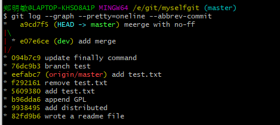


**分支策略**

基本原则：

`master`分支应该是非常稳定的，也就是仅用来发布新版本

dev分支是用来干活的，每个人都创建一个分支，然后合并到dev上

Git分支十分强大，在团队开发中应该充分应用。

合并分支时，加上`--no-ff`参数就可以用普通模式合并，合并后的历史有分支，能看出来曾经做过合并，而`fast forward`合并就看不出来曾经做过合并。


### bug分支

**没有太明白，先放着**

修复bug时，我们会通过创建新的bug分支进行修复，然后合并，最后删除；

当手头工作没有完成时，先把工作现场`git stash`一下，然后去修复bug，修复后，再`git stash pop`，回到工作现场；

在master分支上修复的bug，想要合并到当前dev分支，可以用`git cherry-pick <commit>`命令，把bug提交的修改“复制”到当前分支，避免重复劳动。


###Feature分支

如果需要开发一个新功能，建议在分支dev的基础上再创建一个分支，之后如果还没有合并又需要被丢弃的话可以通过：`git branch -D <name>`强行删除。


### 多人协作

**在以后的推送或者拉取时就可以简化命令：`git push origin master`**即可。

#### 推送分支

```
$ git push origin master
```

如果要推送其他分支，比如`dev`，就改成：

```
$ git push origin dev
```

推送原则：

- `master`分支是主分支，因此要时刻与远程同步；
- `dev`分支是开发分支，团队所有成员都需要在上面工作，所以也需要与远程同步；
- bug分支只用于在本地修复bug，就没必要推到远程了，除非老板要看看你每周到底修复了几个bug；
- feature分支是否推到远程，取决于你是否和你的小伙伴合作在上面开发。


#### 抓取分支

场景：当本人将本地库推送到远程库之后，其余成员想要从远程库克隆到本地，只能看到本地的master分支

，如果想要再dev分支上开发，就必须创建远程origin的dev分支到本地:

```
$ git checkout -b dev origin/dev
```

倘若当其余成员和自己提交并修改了同一份文件，那么就会产生冲突，推送失败。

解决方法：

需要使用git pull把最新的提交从origin/dev抓下来，然后在本地合并，解决冲突，再推送。

```
指定本地dev分支与远程origin/dev分支的链接，根据提示，设置dev和origin/dev的链接：
$ git branch --set-upstream-to=origin/dev dev

然后再git pull下来

手动解决冲突，并合并

提交，再push
```


**小结：**

- 查看远程库信息，使用`git remote -v`；
- 本地新建的分支如果不推送到远程，对其他人就是不可见的；
- 从本地推送分支，使用`git push origin branch-name`，如果推送失败，先用`git pull`抓取远程的新提交；
- 在本地创建和远程分支对应的分支，使用`git checkout -b branch-name origin/branch-name`，本地和远程分支的名称最好一致；
- 建立本地分支和远程分支的关联，使用`git branch --set-upstream branch-name origin/branch-name`；
- 从远程抓取分支，使用`git pull`，如果有冲突，要先处理冲突。


## 标签管理

Git的标签就是版本库的快照，但其实它就是指向某个commit的指针。

### 创建标签

在Git中打标签非常简单，首先，切换到需要打标签的分支上：

```
$ git branch
* dev
  master
$ git checkout master
Switched to branch 'master'
```

然后，敲命令`git tag <name>`就可以打一个新标签：

```
$ git tag v1.0
```

可以用命令`git tag`查看所有标签：

```
$ git tag
v1.0
```

默认标签是打在最新提交的commit上的。

或者找到历史提交的commit id，然后打上标签

比方说要对`add merge`这次提交打标签，它对应的commit id是`f52c633`，敲入命令：

```
$ git tag v0.9 f52c633
```


创建带有说明的标签，用`-a`指定标签名，`-m`指定说明文字：

用命令`git show <tagname>`可以看到说明文字：


### 操作标签

删除标签：$ git tag -d <name>

因为创建的标签都只存储在本地，不会自动推送到远程。所以，打错的标签可以在本地安全删除。

如果要推送某个标签到远程，使用命令`git push origin <tagname>`：


## 快捷键

清屏：ctrl+L

复制：CTRL+insert

粘贴：shift+insert


## 使用vim

1. vim  \<file name.后缀>

2. 输入 ' i ' 之后 进行编辑
3. 按Esc退出编辑
4. 输入`:wq`保存刚才编辑的文件


### IDEA集成Git

