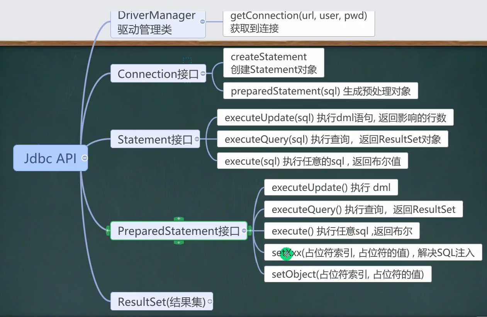
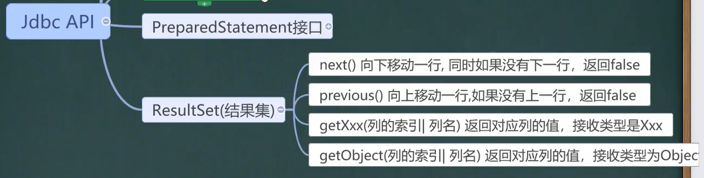
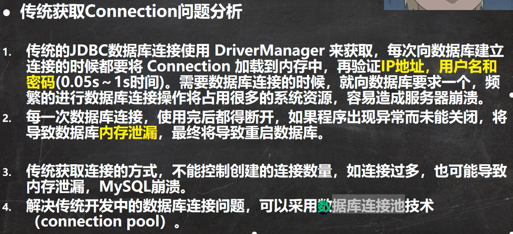
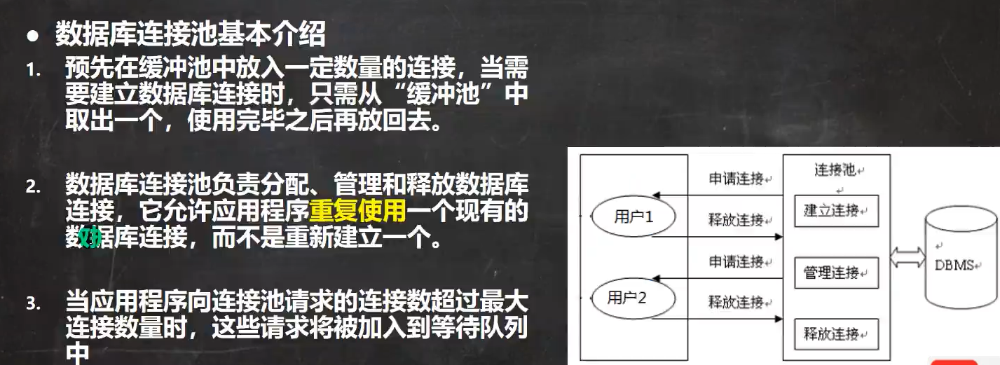
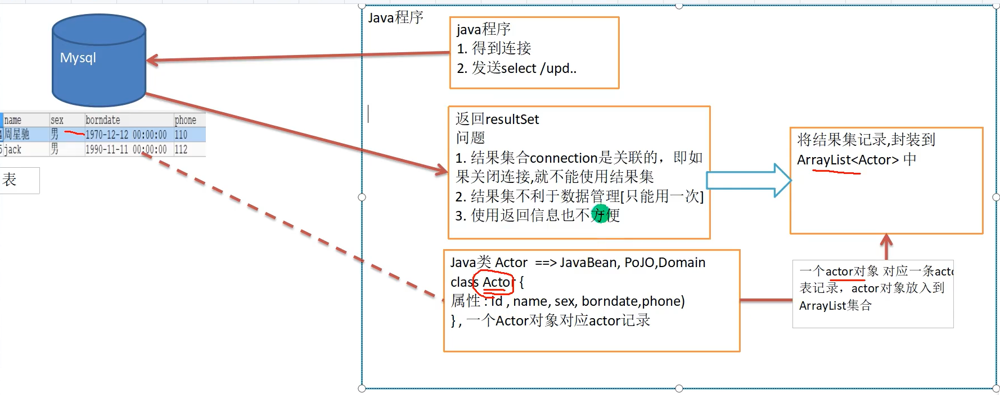
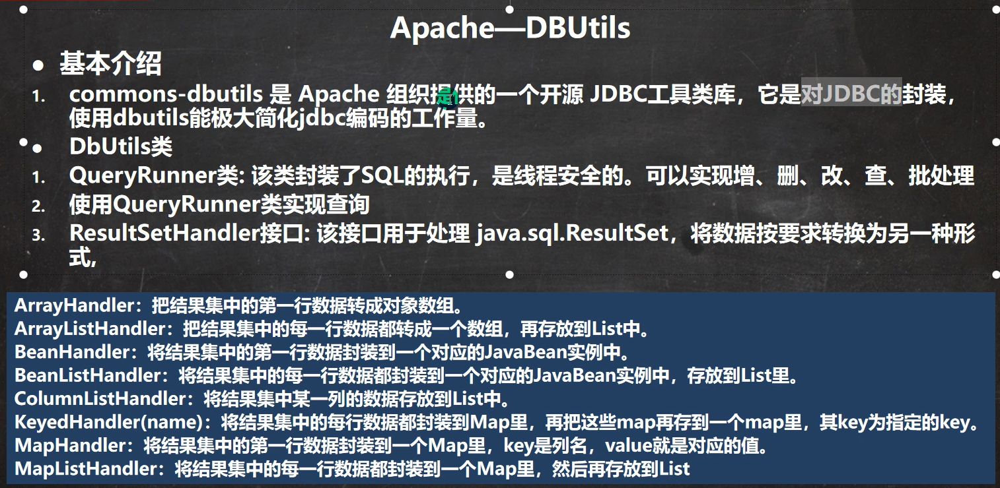
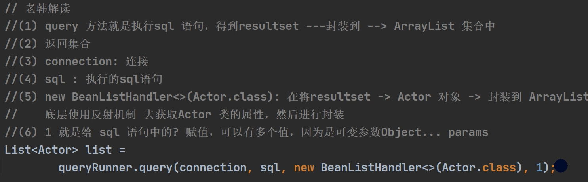

 ## 1.JDBC概述

### 1.1 基本介绍

1. JDBC为访问不同的数据库提供了统一的接口，为使用者屏蔽了细节问题
2. Java程序员使用jdbc，可以连接任何提供了jdbc驱动程序的数据库系统，从而完成对数据库的各种操作
3. Java提供一套用于数据库操作的接口API。Java程序员只需要面向这套接口编程即可。不同的数据库厂商，需要针对这套接口，提供不同实现。

### 1.2 JDBC程序编写步骤

#### 1.2.1 方式一

1. 注册驱动 - 加载Driver类
2. 获取连接 - 得到Connection
3. 执行增删改查 - 发送SQL给mysql执行
4. 释放资源 - 关闭相关连接

```java
会直接使用com.mysql.jdbc.Driver(),属于静态加载，灵活性差，依赖强
//1.注册驱动
        Driver driver = new Driver();
        //2.获取连接
        String url="jdbc:mysql://localhost:3306/zmm_db02";
        Properties properties = new Properties();
        properties.setProperty("user","root");
        properties.setProperty("password","zmm");
        Connection connect = driver.connect(url, properties);

        //3.执行sql语句
        String sql="insert into actor values(null,'zmm','男','1970-11-11','110')";
        Statement statement = connect.createStatement();
        int rows=statement.executeUpdate(sql);
        System.out.println(rows>0?"成功":"失败");

        //释放资源
        statement.close();
        connect.close();
```

#### 1.2.5 方式五

```java
		Properties properties=new Properties();
        properties.load(new FileInputStream("src\\mysql.properties"));
        String user=properties.getProperty("user");
        String password=properties.getProperty("password");
        String driver=properties.getProperty("driver");
        String url=properties.getProperty("url");

        Class.forName(driver);

        Connection connection = DriverManager.getConnection(url, user, password);
        String sql="insert into actor values(3,'zmm','男','1970-11-11','110')";
        Statement statement = connection.createStatement();
        int rows = statement.executeUpdate(sql);

        System.out.println(rows>0?"成功":"失败");

        //释放资源
        statement.close();
        connection.close();
```


## 2.resultSet

表示数据库结果集的数据表，通常通过执行查询数据库的语句生成

```
Properties properties = new Properties();
properties.load(new FileInputStream("src//mysql.properties"));

String url=properties.getProperty("url");
String user=properties.getProperty("user");
String password=properties.getProperty("password");
String driver=properties.getProperty("driver");

//1.注册驱动
Class.forName(driver);

//2.得到连接
Connection connection = DriverManager.getConnection(url, user, password);

//3.得到Statement
Statement statement = connection.createStatement();

//4.组织sql
String sql="select id,name,sex,borndate,phone from actor";
//执行给定的SQL语句，该语句返回单个ResultSet对象
ResultSet resultSet = statement.executeQuery(sql);

//5.使用while取出数据
while(resultSet.next()){
    int id =resultSet.getInt(1);
    String name=resultSet.getString(2);
    String sex= resultSet.getString(3);
    Date date=resultSet.getDate(4);
    System.out.println(id+"\t"+name+"\t"+sex+"\t"+date);
}

//6.关闭连接
resultSet.close();
connection.close();
statement.close();
```

## 3.sql注入问题

## 4.PreparedStatement接口

解决sql注入问题，在实际开发中不会使用Statement。

### 4.1基本介绍

1. PreparedStatement执行的SQL语句中的参数用问号来表示，调用PrepareStatment对象的setXxx()方法来设置这些参数。setXxx()方法有两个参数，第一个参数是要设置的SQL语句中的参数索引（从1开始），第二个是设置的SQL语句中的参数的值
2. 调用executeQuery(),返回ResultSet对象
3. 调用executeUpdate():执行更新，包括增、删、修改，看影响了多少行。

```java
Scanner scanner=new Scanner(System.in);

System.out.println("请输入管理员名字：");
String adminName=scanner.nextLine();
System.out.println("请输入管理员的密码:");
String adminPwd=scanner.nextLine();


Properties properties = new Properties();
properties.load(new FileInputStream("src\\mysql.properties"));

String user=properties.getProperty("user");
String url=properties.getProperty("url");
String password=properties.getProperty("password");
String driver=properties.getProperty("driver");

Connection connection = DriverManager.getConnection(url, user, password);

//3.得到PreparedStatement
//3.1 组织Sql，Sql语句的 ？ 就相当于占位符
String sql="select name,pwd from admin where name=? and pwd=?";
//3.2 preparedStatement 对象实现了preparedStatemnt 接口的实现类的对象
PreparedStatement preparedStatement = connection.prepareStatement(sql);
//给 ？ 赋值
preparedStatement.setString(1,adminName);
preparedStatement.setString(2,adminPwd);

//4.执行select 语句使用 executeQuery
// 如果执行的是dml 就使用executeUpdate()

ResultSet resultSet = preparedStatement.executeQuery();//这里的（）内不要写入sql

if(resultSet.next()){
    System.out.println("登录成功!");
}else{
    System.out.println("登录失败！");
}

		resultSet.close();
        connection.close();
        preparedStatement.close();
```


## 5. JDBC常用API






## 6.封装JDBCUtils

在jdbc操作中，获取连接和释放资源是经常使用到的，为了减少代码冗余可以将其封装到jdbc连接二代工具类JDBCUtils

代码实现：

```java
package com.zmm.utils;

import java.io.FileInputStream;
import java.io.IOException;
import java.sql.*;
import java.util.Properties;

/**
 * @author zmm
 * 这是一个工具类，完成mysql的连接和关闭资源
 */
public class JDBCUtils {
    //定义相关属性(4个)，因为只需要一份，因此我们做出static
    private static String user;
    private static String password;
    private static String url;
    private static String driver;

    //在static代码块去初始化
    static{
        try {
            Properties properties = new Properties();
            properties.load(new FileInputStream("src\\mysql.properties"));
            //读取相关信息的属性值
            user=properties.getProperty("user");
            password=properties.getProperty("password");
            url=properties.getProperty("url");
            driver=properties.getProperty("driver");
        } catch (IOException e) {
            //在实际开发中，我们可以这样处理
            //1.将编译异常转成运行异常，也可以选择默认处理该异常，比较方便。
            //2.这时调用者，可以选择捕获该异常，也可以选择默认处理该异常，比较方便
            throw new RuntimeException(e);
        }
    }


    //连接数据库，返回Connection
    public static Connection getConnection(){
        try {
            return DriverManager.getConnection(url,user,password);
        } catch (SQLException e) {
            throw new RuntimeException(e);
        }
    }

    //关闭相关资源
    /*
        1.ResultSet 结果集
        2.Statement 或者 PreparedStatement
        3.Connection
        4.如果需要关闭资源，就传入对象，否则传入null
     */

    public static void close(ResultSet set, Statement statement,Connection connection){
        //判断是否为null
        try {
            if(set !=null){
                set.close();
            }
            if(statement !=null){
                statement.close();
            }
            if(connection !=null){
                connection.close();
            }
        } catch (SQLException e) {
            throw new RuntimeException(e);
        }

    }


}
```

如何使用JDBCUtils工具类

代码实现：

```java
package com.zmm.utils;

import org.junit.Test;

import java.sql.*;

/**
 * @author zmm
 */
public class JDBCUtils_Use {
    public static void main(String[] args) {

    }
    @Test
    public void testSelect(){
        //1.得到连接
        Connection connection=null;
        //2.组织一个sql
        String sql ="select * from actor";
        PreparedStatement preparedStatement=null;
        ResultSet set=null;
        //3.创建PreparedStatement对象
        //preparedStatement提高外面去扩大作用域
        try {
            connection=JDBCUtils.getConnection();
            preparedStatement=connection.prepareStatement(sql);
            //给占位符赋值,如果sql语句有需要的话
//            preparedStatement.setString(1,"你大爷");
//            preparedStatement.setInt(2,1);
            //执行,得到结果集
            set = preparedStatement.executeQuery();
            //遍历结果集
            while(set.next()){
                int id=set.getInt("id");
                String name=set.getString("name");
                String sex=set.getString("sex");
                Date borndate = set.getDate("borndate");
                String phone=set.getString("phone");
                System.out.println(id+"\t"+name+"\t"+sex+"\t"+borndate+"\t"+phone);
            }
        } catch (SQLException e) {
            e.printStackTrace();
        }finally{
            //关闭资源
            JDBCUtils.close(set,preparedStatement,connection);
        }
    }

    @Test
    public void testDML(){
        //1.得到连接
        Connection connection=null;
        //2.组织一个sql
        String sql ="update actor set name = ? where id= ?";
        PreparedStatement preparedStatement=null;
        //3.创建PreparedStatement对象
        //preparedStatement提高外面去扩大作用域
        try {
            connection=JDBCUtils.getConnection();
            preparedStatement=connection.prepareStatement(sql);
            //给占位符赋值
            preparedStatement.setString(1,"你大爷");
            preparedStatement.setInt(2,1);
            //执行
            preparedStatement.executeUpdate();
        } catch (SQLException e) {
            e.printStackTrace();
        }finally{
            //关闭资源
            JDBCUtils.close(null,preparedStatement,connection);


        }

    }
}
```

## 7.事务

基本介绍

1. **jdbc程序中当一个Connection对象创建时，默认情况下是自动提交事务**：每次执行一个sql语句时，如果执行成功，就会向数据库自动提交，而不能回滚
2. jdbc程序中为了让多个sql语句作为一个整体执行，需要使用事务（事务用于保证数据的一致性，它由一组相关的dml语句组成，该组dml语句要么全部成功，要么全部失败）
3. 调用Connection的setAutoCommit(false)可以取消自动提交事务
4. 在所有的SQL语句都成功执行后，调用Connection 的 commit();方法提交事务
5. 在其中某个操作失败或出现异常时，调用Connection 的  rollback();方法回滚事务

```java
package com.zmm.jdbc.transaction_;

import com.zmm.utils.JDBCUtils;

import java.sql.Connection;
import java.sql.PreparedStatement;
import java.sql.SQLException;
import java.time.Period;
import java.util.Properties;

/**
 * @author zmm
 */
public class Transaction_ {
    public void useTransaction(){
        //使用事务来解决
        Connection connection=null;
        PreparedStatement preparedStatement=null;

        String sql="update account set balance=balance-? where id=?";
        String sql2="update account set balance=balance+? where id=?";

        try {
            //在默认情况下，connection是默认自动提交的
            connection=JDBCUtils.getConnection();
            //将connection设置为不自动提交
            connection.setAutoCommit(false);//开启了事务
            preparedStatement=connection.prepareStatement(sql);
            preparedStatement.setInt(1,100);
            preparedStatement.setInt(2,1);
            preparedStatement.executeUpdate();

            //int i=1/0; //模拟异常
            
            preparedStatement=connection.prepareStatement(sql2);
            preparedStatement.setInt(1,100);
            preparedStatement.setInt(2,2);
            preparedStatement.executeUpdate();

            //在所有的SQL语句都成功执行后，调用Connection 的 commit();方法提交事务
            connection.commit();


        } catch (SQLException e) {
            try {
                connection.rollback();
            } catch (SQLException throwables) {
                throwables.printStackTrace();
            }
            throw new RuntimeException();
        } finally {
            JDBCUtils.close(null,preparedStatement,connection);
        }
    }
}
```

## 8.批处理

基本介绍

1. 当需要成批插入或者更新记录时。可以采用Java的批量更新机制，这一机制允许多条语句一次性提交给数据库批量处理。通常情况下比单独提交处理更有效率。

2. JDBC的批量处理语句包括下面方法：

   1. addBatch()：添加需要批量处理的SQL语句或参数
   2. executeBatch()：执行批量处理语句
   3. clearBatch()：清空批处理包的语句

3. jdbc连接mysql时，如果要使用批处理功能，请在url中加参数

    **？rewriteBatchedStatements=true**,否则无效

4. 批处理往往和PreparedStatement一起搭配使用，可以即减少编译次数，又减少运行次数，效率大大提高

```java
for(int i=0;i<5000;i++){
    preparedStatement.setString();
    preparedStatement.addBatch(); 
    
    if((i+1)%1000==0){
        preparedStatement.executeBatch();
        preparedStatement.clearBatch();
    }
}
```


## 9 数据库连接池（druid）



基本介绍：




德鲁伊连接池的使用：

1. 加入Druid jar包

2. 加入配置文件

   ```
   #key=value
   driverClassName=com.mysql.jdbc.Driver
   url=jdbc:mysql://localhost:3306/zmm_db02?rewriteBatchedStatements=true
   username=root
   password=zmm
   #initial connection Size 初始化链接数
   initialSize=10
   #min idle connecton size 最小连接数，即空闲的时候保持多少连接比较合适
   minIdle=5
   #max active connection size 最大连接数
   maxActive=50
   #max wait time (5000 mil seconds) 最大等待时间，即请求在等候队列等待的最大时间
   maxWait=5000
   ```

3. 创建Properties对象，读取配置文件

4. 创建一个指定参数的数据库连接池，Druid连接池

具体实现：

```java
@Test
public static void main(String[] args) throws Exception {
    Properties properties = new Properties();
    properties.load(new FileInputStream("src\\druid.properties"));
    
    DataSource dataSource = DruidDataSourceFactory.createDataSource(properties);

    Connection connection=dataSource.getConnection();
    System.out.println("连接成功！");
    connection.close();
}
```

   使用druid创建jdbcutils：

```java
package com.zmm.jdbc.datasource;

import com.alibaba.druid.pool.DruidDataSourceFactory;

import javax.sql.DataSource;
import java.io.FileInputStream;
import java.sql.Connection;
import java.sql.ResultSet;
import java.sql.SQLException;
import java.sql.Statement;
import java.util.Properties;

/**
 * @author zmm
 * 基于druid数据库连接池的工具类
 */
public class JDBCUtilsByDruid {

    //在静态代码块完成 ds初始化
    private static DataSource ds;

    static {
        Properties properties = new Properties();

        try {
            properties.load(new FileInputStream("src\\druid.properties"));
            ds= DruidDataSourceFactory.createDataSource(properties);
        } catch (Exception e) {
            e.printStackTrace();
        }
    }

    //编写getConnection方法
    public static Connection getConnection() throws SQLException {
        return ds.getConnection();
    }

    //关闭连接，数据库连接池技术中，close不是真的断掉连接
    //而是把使用的Connection对象放回连接池
    public static void close(ResultSet set, Statement statement,Connection connection){
        try {
            if(set != null){
                set.close();
            }
            if(statement !=null){
                statement.close();
            }
            if( connection !=null){
                connection.close();
            }
        } catch (SQLException e) {
            throw new RuntimeException();
        }
    }
}
```

   

具体使用：

```java
package com.zmm.jdbc.datasource;

import com.zmm.utils.JDBCUtils;
import org.junit.Test;

import javax.sql.DataSource;
import java.sql.Connection;
import java.sql.PreparedStatement;
import java.sql.ResultSet;
import java.sql.SQLException;
import java.util.Properties;

/**
 * @author zmm
 */
public class JDBCUtilsByDruid_USE {

    @Test
    public static void main(String[] args) {

        Connection connection=null;
        PreparedStatement preparedStatement=null;
        ResultSet resultSet=null;

        String sql="select * from account where id=?";

        try {
            connection=JDBCUtilsByDruid.getConnection();
            preparedStatement=connection.prepareStatement(sql);
            preparedStatement.setInt(1,2);

            resultSet = preparedStatement.executeQuery();

            while (resultSet.next()){
                int id=resultSet.getInt("id");
                String name=resultSet.getString("name");
                double balance=resultSet.getDouble("balance");
                System.out.println(id+"\t"+name+"\t"+balance);
            }

        } catch (SQLException e) {
            e.printStackTrace();
        } finally {
            JDBCUtilsByDruid.close(resultSet,preparedStatement,connection);
        }


    }
}

```


## 10. Apache-DBUtils 

###10.1 问题引出



   ### 10.2 基本介绍



### 10.3 具体实现

部分代码解读：




##11.BasicDAO

基本说明：

DAO：data access object数据访问对象

这样的通用类，称为BasicDao，是专门和数据库交互的，即完成对数据库（表）的crud操作


## 12.jdbc梳理

## 13.项目设计

