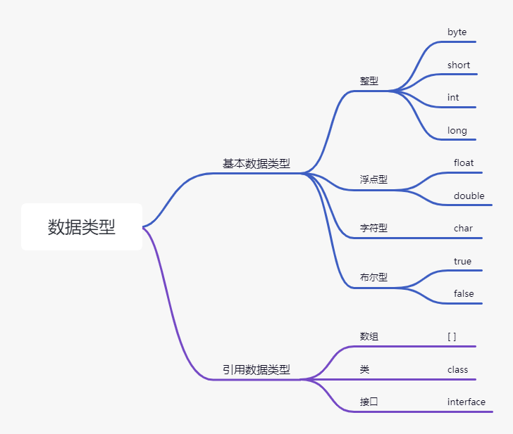

## 1. 标识符

### 1.1 标识符的命名规则

​	标识符可以使用大小写英文字母、数字、下划线(__)和美元符号( $ )，但是不能以数字开头，不能使用保留字、关键字和空格，严格区分大小。

###1.2 标识符的命名规范

①包名：全部小写

②类名\接口名：所有单词首字母大写 （大驼峰）

③方法名\变量名：开头单词的首字母小写，多单词时第二个开始的每个单词首字母大写 （小驼峰）

④常量：全部大写，多单词时用 _ 连接

## 2. 变量

**概念：变量相当于内存中一个数据存储空间的表示，使用变量名来访问和使用这块内存空间。**

定义：数据类型  变量名 = 值；

## 3.数据类型




**数据类型的转换**

①自动类型转换:

​	byte,short,char --> int --> long -->float -->double 

​	其中byte、short、char三者之间不会发生自动类型转换，但是可以进行计算，前提是转换成int类型

②强制类型转换：需要使用强制类型转换符  ()

```java
public class sss2 {
    public static void main(String[] args) {
        //编写程序，输入一个字符，判断它是否为小写字母，如果是，将它转换成大写字母，否则，不转换
        Scanner scanner = new Scanner(System.in);
        System.out.print("输入一个字符：");
        String str=scanner.next();
        char s=str.charAt(0);
        if(s >='A' && s <='Z'){
            System.out.println("你刚刚输入的是："+s);
        }else{
            s-=32;
            System.out.println("你输入的是小写字母，转换成大写字母为 "+s);
        }
    }
}
```

## 4. 运算符

**针对基本数据类型的运算符**

1. 算术运算符：加减乘除、正号负号、取模、自增自减；

2. 逻辑运算符：

   1. 逻辑与  &

   2. 逻辑或  |

   3. 逻辑非  ！

   4. 逻辑异或： ^       左右两边必须是一个为true，一个为false，结果才为true，否则为false

   5. 短路与： && 

   6. 短路或：||

      **ps：逻辑运算符的操作数，必须是布尔值** 

3. 赋值运算符

4. 比较运算符

5. 条件运算符：三元运算符：条件表达式 ？ 结果表达式1：结果表达式2

6. 位运算符：>> 除  << 乘

   **ps:运算符的优先等级：**

   **( ) >算术运算符 >比较运算符>逻辑运算符>三元运算符>赋值运算符**


## 5.流程控制

1. **顺序**

2. **分支**
1. if:
  
2. switch
  
   1. 语法：
```
         switch(变量或表达式){

         	case 常量值1: 语句1;break;

         	case 常量值2: 语句2;break;

         ....

         	default: 语句n;break;

         }
```

3. **循环:**
   1. while
   2. do-while 
   3. for
4. **跳转**
   1. break：跳出所在的最近的循环
   2. continue:  结束本次循环，继续下一次循环
   3. return：用于跳出所在的方法