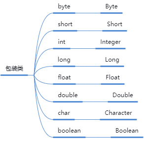
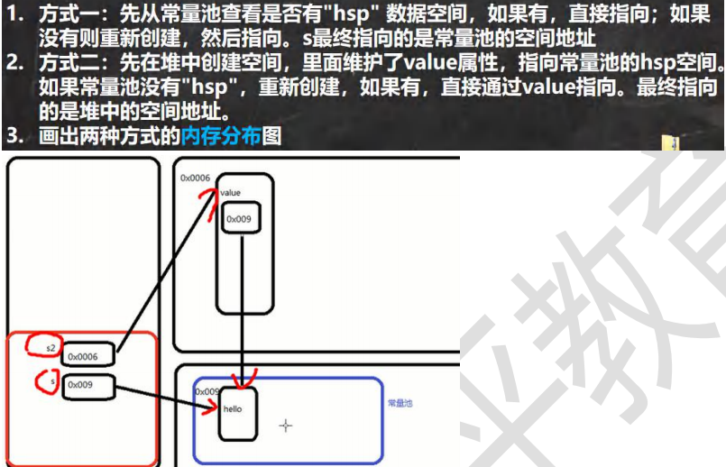
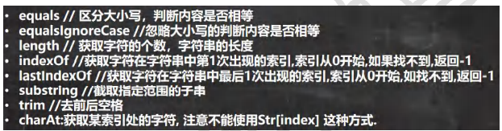
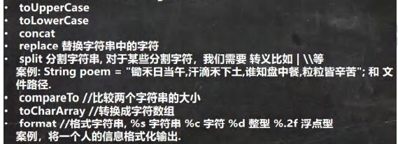

## 1.Object类详解

java.lang.Object

### 1.1 equals方法

equals是Object类中的方法（如下），只能判断引用类型。

```java
public boolean equals(object obj){
    return(this==obj); 
}
```

其中==是一个比较运算符

**==和equals的对比**

1. ==：既可以判断基本类型，又可以判断引用类型
2. ==：如果判断基本类型，判断的是值是否相等。
3. ==：如果判断引用类型，判断的是地址是否相等，即判定是不是同一个对象
4. equals只能判断引用类型

### 1.2 equals方法的重写

equals默认判断的是地址是否相等，子类中往往重写该方法，用于判断内容是否相等。

字符串的比较使用equals

### 1.3 hashcode方法

返回该对象的哈希码值

两个引用，如果指向的是同一个对象，则哈希值肯定是一样的

两个引用，如果指向的是不同对象，则哈希值是不一样的

### 1.4 toString 方法

1. 基本介绍

   默认返回：全类名+@+哈希值的16进制

2. 重写toString 方法，打印对象或拼接对象时，都会自动调用该对象的toString 形式

   子类往往重写toString 方法，用于返回对象的属性信息

--------------------------------------------------------------

## 2.包装类

为什么要使用包装类？

在程序中某些位置，例如（集合，泛型）等不能使用基本数据类型，因此需要把基本数据类型转换成对象类型。

###2.1 包装类的分类




###2.2 自动装箱和拆箱

```java
int num=200;
//自动装箱 int->Integer
Integer integer=num;//底层使用的是Integer.valueOf(num)
//自动拆箱 Integer->int
int num2=integer; //底层仍然使用的是 intValue()方法


题目：
    Object obj1=true？new Integer(1):new Double(2.0)
    System.out.println(obj1)//输出的结果是1.0而不是1
    //解释：因为三元运算符是一个整体，Double是精度最高的，所以要提升精度。
```


### 2.3 包装类型和String类型的相互转换

前提：Integer i = 100;//自动装箱

基本数据类型->String :

1. String str1 = i + "";
2. String str2 = i.toString();
3. String str3 = String.valueOf(i);

String->基本数据类型：

​	String str4 = "12345";

2. Integer i2 = Integer.parseInt(str4);//使用到自动装箱
3. Integer i3 = new Integer(str4);//构造器
4. Integer i4 = Integer.valueOf("23");


阅读源码：

```java
Integer m=1;底层Integer.valueOf(1);
Integer n=1;底层Integer.valueOf(1);
System.out.println(m==n);//True

Integer i1=127;
int i2=127;
System.out.println(i1==i2);
//只要有基本数据类型，判断的是值是否相同 

//valueOf的底层源码
public static Integer valueOf(int i){
    if(i>=IntegerCache.low && i<=IntegerCache.hight)
        //如果i是在-128~127就是直接返回，否则创建新的对象
        return IntegerCache.cache[i+(-IntegerCache.low)];
    return new Integer(i);
}


```


## 3. Math类

Math类包含用于执行基本数学运算的方法，如初等指数、对数、平方根和三角函数

```java
//看看 Math 常用的方法(静态方法)
//1.abs 绝对值
int abs = Math.abs(-9);
System.out.println(abs);//9

//2.pow 求幂
double pow = Math.pow(2, 4);//2 的 4 次方
System.out.println(pow);//16

//3.ceil 向上取整,返回>=该参数的最小整数(转成 double);
double ceil = Math.ceil(3.9);
System.out.println(ceil);//4.0

//4.floor 向下取整，返回<=该参数的最大整数(转成 double)
double floor = Math.floor(4.001);
System.out.println(floor);//4.0

//5.round 四舍五入 Math.floor(该参数+0.5)
long round = Math.round(5.51);
System.out.println(round);//6

//6.sqrt 求开方
double sqrt = Math.sqrt(9.0);
System.out.println(sqrt);//3.0

//7.random 求随机数  前闭后开
// random 返回的是 0 <= x < 1 之间的一个随机小数
// Math.random() * (b-a) 返回的就是 0 <= 数 <= b-a
// Math.random()*6 返回的是 0 <= x < 6 小数
// 2 + Math.random()*6 返回的就是 2<= x < 8 小数
// (int)(2 + Math.random()*6) 返回的就是 2 <= x <= 7//取整
// 公式就是 (int)(a + Math.random() * (b-a +1) )

//8.max , min 返回最大值和最小值
int min = Math.min(1, 9);
int max = Math.max(45, 90);
System.out.println("min=" + min);
System.out.println("max=" + max);
```


##4. Arrays类

Arrays里面包含了一系列静态方法，用于管理或操作数组（比如排序和搜索）

1. toString 返回数组的字符串形式

   `Arrays.toString(arr)`

2. sort排序

   

3. binarySearch通过二分搜索法进行查找，要求必须排好序

   `int index=Arrays.binarySearch(arr,3);`

4. copyOf 数组元素的复制

   `Integer[] newArr = Arrays.copyOf(arr, arr.length);`

5. equals 比较两个数组元素内容是否完全一致

   `boolean equals = Arrays.equals(arr, arr2);`

## 5. Date类

时间戳：(Timestamp):1970年1月1日8时到现在的总秒数

```java
Date date=new Data();
long time=data.getTime();
System.out.println(time);//将得到一个到现在的总秒数
```

如何转换将时间戳格式化成年月日 时分秒

```java
//通过format格式化一个时间戳
SimpleDateFormat sf=new SimpleDateFormat("yyyy年MM月dd日 hh:mm:ss");
String format=sf.format(date);
System.out.println(format);
```

如何通过一个时间戳获得一个时间

```
Long time=System.currentTimeMillos();
time-=15000000;
Date date=new Date(time);

SimpleDateFormat sf=new SimpleDateFormat("yyyy-MM月-日 hh:mm:ss");
String format=sf.format(date);
System.out.println(format);
```


日期进行比较

java.util.Date类实现了Comparable接口，可以直接调用Date的compareTo()方法来比较大小

compareTo()方法的返回值，date1小于date2返回-1，date1大于date2返回1，相等返回0


## 6.日历类Calendar

Calendar是一个抽象类，并且构造器时private。所以Calendar不能通过new来创建对象，而是通过getInstance()来获取实例

```java
Calendar c = Calendar.getInstance(); //创建日历类对象//比较简单，自由
System.out.println("c=" + c);
//2.获取日历对象的某个日历字段
System.out.println("年：" + c.get(Calendar.YEAR));
// 这里为什么要 + 1, 因为 Calendar 返回月时候，是按照 0 开始编号
System.out.println("月：" + (c.get(Calendar.MONTH) + 1));
System.out.println("日：" + c.get(Calendar.DAY_OF_MONTH));
System.out.println("小时：" + c.get(Calendar.HOUR));
System.out.println("分钟：" + c.get(Calendar.MINUTE));
System.out.println("秒：" + c.get(Calendar.SECOND));
//Calender 没有专门的格式化方法，所以需要程序员自己来组合显示
System.out.println(c.get(Calendar.YEAR) + "-" + (c.get(Calendar.MONTH) + 1)
                   						+ "-" +c.get(Calendar.DAY_OF_MONTH) 
                   						+" " + c.get(Calendar.HOUR_OF_DAY) 
                   						+ ":" + c.get(Calendar.MINUTE) 
                   						+ ":" + c.get(Calendar.SECOND) );
}
```

JDK8之后加入：

LocalDate(日期/年月日)：只包含日期，可以获取日期字段

LocalTime(时间/时分秒)：只包含时间，可以获取时间字段

LocalDateTime(日期时间/年月日时分秒)：包含日期+时间，可以获取日期和时间字段

```java
//1. 使用 now() 返回表示当前日期时间的 对象
LocalDateTime ldt = LocalDateTime.now(); //LocalDate.now();//LocalTime.now()
System.out.println(ldt);

//2. 使用 DateTimeFormatter 对象来进行格式化
// 创建 DateTimeFormatter 对象
DateTimeFormatter dateTimeFormatter = DateTimeFormatter.ofPattern("yyyy-MM-dd HH:mm:ss");
String format = dateTimeFormatter.format(ldt);
System.out.println("格式化的日期=" + format);

System.out.println("年=" + ldt.getYear());
System.out.println("月=" + ldt.getMonth());
System.out.println("月=" + ldt.getMonthValue());
System.out.println("日=" + ldt.getDayOfMonth());
System.out.println("时=" + ldt.getHour());
System.out.println("分=" + ldt.getMinute());
System.out.println("秒=" + ldt.getSecond());

LocalDate now = LocalDate.now(); //可以获取年月日
LocalTime now2 = LocalTime.now();//获取到时分秒
//提供 plus 和 minus 方法可以对当前时间进行加或者减
//看看 890 天后，是什么时候 把 年月日-时分秒
LocalDateTime localDateTime = ldt.plusDays(890);
System.out.println("890 天后=" + dateTimeFormatter.format(localDateTime));
//看看在 3456 分钟前是什么时候，把 年月日-时分秒输出
LocalDateTime localDateTime2 = ldt.minusMinutes(3456);
System.out.println("3456 分钟前 日期=" + dateTimeFormatter.format(localDateTime2));
```


## 7. String类

### 介绍

​	String对象用于保存字符串，也就是一组字符序列。字符串常量对象是用双引号括起的字符序列。字符串的字符使用Unicode字符编码，一个字符占两个字节（不区分字母还是汉字）


### 创建String对象的两种方式

方式一：

​	直接赋值 String s="zmm";

方式二：

​	调用构造器String s=new String("zmm");


两者方式的区别：




### String方法



