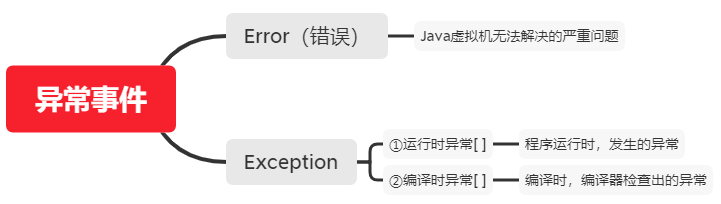

# 异常

## 1.异常的介绍

**将程序执行中发生的不正常情况称为异常**



**对于①来说：**

一般是指编程时的逻辑错误，是程序员应该避免其出现的异常。java.lang.RuntimeException类及它的子类都是运行时异常。**可以不做处理**

常见的运行时异常：

1) NullPointerException 空指针异常 

2) ArithmeticException 数学运算异常 

3) ArrayIndexOutOfBoundsException 数组下标越界异常

 4) ClassCastException 类型转换异常

 5) NumberFormatException 数字格式不正确异常

**对于②来说：**

编译时异常：是编译器要求必须处置的异常

1. FileNotFoundException
2. ClassNotFoundException

## 2. 异常处理：

就是当异常发生时，对异常处理的方式

1. try-catch-finally

   程序员在代码中捕获发生的异常，自行处理

2. throws

   将发生的异常抛出，交给调用者（方法）来处理，最顶级的处理者就是JVM

### 2.1**try-catch异常处理**

Java提供try和catch块来处理异常。try块用于包含可能出错的代码。catch块用于处理try块中发生的异常。可以根据需要在程序中有多个try...catch块

基本语法：

```
try{
	//可疑代码
	//将异常生成对应的异常对象，传递给catch块
}catch（异常）{
	//对异常的处理
}finally{
	//释放资源等..
}
//执行顺序
如果没有出现异常，则执行try块中所有语句，不执行catch块中语句，如果有finally，最后还需要执行finally里面的语句。
如果出现异常，则try块中异常发生后，try块剩下的语句不再执行，将执行catch块中的语句，如果有finally，最后还需要执行finally里面的语句。
```

注意事项：

1. 如果异常发生了，则异常发生后面的代码不会执行，直接进入到catch块

2. 如果异常没有发生，则顺序执行try的代码块，不会进入到catch
3. 如果希望不管是否发生异常，都执行某段代码(比如关闭连接，释放资源等)则使用finally{ }
4. 可以有多个catch语句，捕获不同的异常（进行不同的业务处理），要求**父类异常在后，子类异常在前**，如果发生异常，只会匹配一个catch


### 2.2 throws异常处理

**基本介绍：**

如果一个方法可能生成某种异常，但是并不能确定如何处理这种异常，则此方法应显示地声明抛出异常，表明该方法将不对这些异常进行处理，而由该方法地调用者负责处理。

在方法声明中用throws语句可以声明抛出异常的列表，throws后面的 异常类型可以是方法中产生的异常类型，也可以是它的父类。

**注意事项：**

1. 对于编译异常，程序中必须处理，要么try-catch，要么throws
2. 对于运行时异常，程序中如果没有处理，默认就是throws的方式处理
3. 子类重写父类的方法时，对抛出异常的规定：子类重写的方法，所抛出的异常类型要么和父类抛出的异常一致，要么为父类抛出异常的类型的子类型
4. 在throws过程中，如果有try-catch，就相当于处理异常，就可以不必throws

### 2.3 自定义异常

**基本概念：**

当程序中出现某些错误并且不在Throwable子类中描述处理，这个时候可以自己设计异常类，用于描述该错误信息。

**步骤：**

1. 定义类继承Exception或者RuntimeException
2. 如果继承Exception，属于编译异常
3. 如果继承RuntimeException，属于运行异常（一般选择这个）

```java
public class CustomException {
	public static void main(String[] args) /*throws AgeException*/ {
		int age = 180;
		//要求范围在 18 – 120 之间，否则抛出一个自定义异常
		if(!(age >= 18 && age <= 120)) {
		//这里我们可以通过构造器，设置信息
			throw new AgeException("年龄需要在 18~120 之间");
		}
		System.out.println("你的年龄范围正确.");
	}	
}

class AgeException extends RuntimeException {
	public AgeException(String message) {//构造器
		super(message);
	}
}

```

**throw和throws的区别**

在意义上：throws是异常处理的一种方式；throw是手动生成异常对象的关键字

在位置中：throws用在方法声明处；throw用在方法体中

通常throws后面跟则异常类型，throw后面跟着异常对象