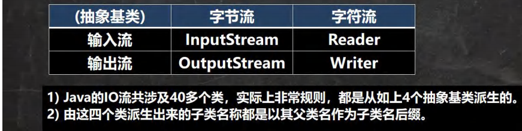
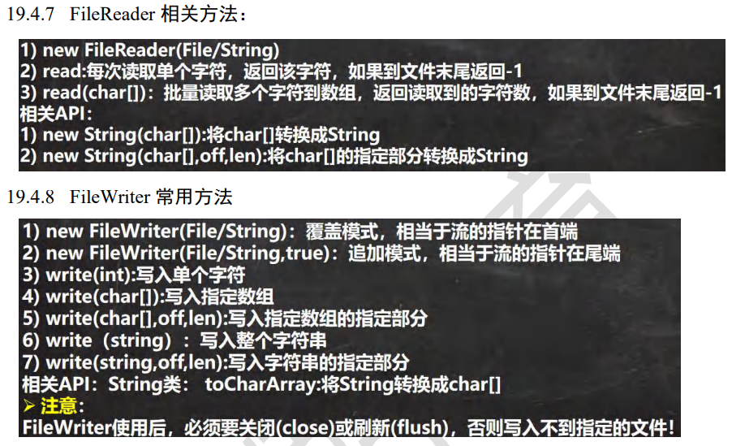
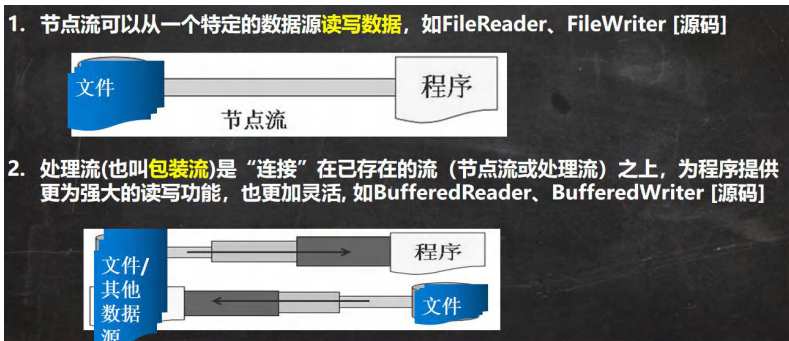

# IO流

## 文件

保存数据的地方

## 文件流

文件在程序中是以流的形式来操作


流：数据在数据源（文件）和程序（内存）之间经历的路径

输入流：数据从数据源（文件）到程序（内存的路径）

输出流：数据从程序（内存）到数据源（文件的路径）


## 常用文件操作

### 创建文件对象相关构造器和方法

1、首先确定创建文件的方式：

1. 根据路径构建一个File对象

   `new File(String pathname)`

2. 根据父目录文件+子路径构建

   `new File(File parent,String child)`

3. 根据父目录+子路径构建

   `new File(String parent,String child)`

2、然后createNewFile  创建新文件


### 获取文件相关信息

```java
//如果获取到文件的大小，文件名，路径，父File，式文件还是目录（目录本质也是文件，一种特殊的文件），是否存在。
@Test
public void info() throws IOException {
    File file = new File("e:\\news1.txt");
    //file.createNewFile();

    System.out.println("文件名字=" + file.getName());
    System.out.println("文件绝对路径=" +file.getAbsolutePath());
    System.out.println("文件父级目录=" + file.getParent());
    System.out.println("文件大小(字节)=" + file.length());
    System.out.println("文件是否存在=" + file.exists());
    System.out.println("是不是一个文件=" + file.isFile());
    System.out.println("是不是一个目录=" + file.isDirectory());
}

//结果
文件名字=news1.txt
文件绝对路径=e:\news1.txt
文件父级目录=e:\
文件大小(字节)=0
文件是否存在=true
是不是一个文件=true
是不是一个目录=false
    
//目录的操作和文件删除
//mkdir创建一级目录、mkdirs创建多级目录、delete删除空目录或文件


```


## 流的分类

按操作数据单位不同分为：

1. 字节流（8bit）二进制文件
2. 字符流（按字符）文本文件

按数据流的流向不同分为：

1. 输入流
2. 输出流

按流的角色不同分为：

1. 节点流
2. 处理流/包装流




## FileInputStream

```java
package com.zmm.inputstream;

import org.junit.jupiter.api.Test;

import java.io.FileInputStream;
import java.io.FileNotFoundException;
import java.io.IOException;

/**
 * @author zmm
 */
public class FileInputStream_ {
    public static void main(String[] args) {

    }

    @Test
    public void readFile01(){
        String filePath="e:\\hello.txt";
        int readData=0;
        FileInputStream fileInputStream=null;

        try {
            fileInputStream=new FileInputStream(filePath);
            //read读取一个字节的数据返回到readDate，如果hello.txt中有中文的话
            //会出现乱码，因为一个中文不止占一个字节，而每次读取只读取一个字节，所以会乱码。
            while((readData=fileInputStream.read())!=-1){
                System.out.print((char)readData);
            }
        } catch (IOException e) {
            e.printStackTrace();
        } finally {
            try {
                fileInputStream.close();
            } catch (IOException e) {
                e.printStackTrace();
            }
        }

    }

    @Test
    public void readFile02(){
        String filePath="e:\\hello.txt";
        byte[] buf=new byte[8];
        int readLen=0;
        FileInputStream fileInputStream=null;

        try {
            fileInputStream=new FileInputStream(filePath);
            while((readLen=fileInputStream.read(buf))!=-1){
                System.out.print(new String(buf,0,readLen));
            }
        } catch (IOException e) {
            e.printStackTrace();
        } finally {
            try {
                fileInputStream.close();
            } catch (IOException e) {
                e.printStackTrace();
            }
        }
    }

}
```


## FileOutputStream

//1. new FileOutputStream(filePath) 创建方式，当写入内容是，会覆盖原来的内容 

//2. new FileOutputStream(filePath, true) 创建方式，当写入内容是，是追加到文件后面

```java
@Test
public void writeFile(){
    String filePath="e:\\a.txt";
    FileOutputStream fileOutputStream=null;

    try {
        fileOutputStream=new FileOutputStream(filePath,true);
        String str="hello,world";
        //str.getBytes()可以把 字符串 变成字节数组
        fileOutputStream.write(str.getBytes(),0,str.length());
    } catch (IOException e) {
        e.printStackTrace();
    } finally {
        try {
            fileOutputStream.close();
        } catch (IOException e) {
            e.printStackTrace();
        }
    }

}
```


### 文件的拷贝

```java
public class FileCopy {
    public static void main(String[] args) {
        String srcFilePath="e:\\dog.jpg";
        String destFilePath="e:\\dog2.jpg";
        FileInputStream fileInputStream=null;
        FileOutputStream fileOutputStream=null;

        try {
            fileInputStream=new FileInputStream(srcFilePath);
            fileOutputStream=new FileOutputStream(destFilePath);
            byte[] buf=new byte[1024];
            int readLen=0;
            while((readLen=fileInputStream.read(buf))!=-1){
                fileOutputStream.write(buf,0,readLen);
            }
            System.out.println("拷贝ok~");

        } catch (IOException e) {
            e.printStackTrace();
        } finally {
            try {
                if(fileInputStream!=null){
                    fileInputStream.close();
                }
                if(fileOutputStream!=null){
                    fileOutputStream.close();
                }
            } catch (IOException e) {
                e.printStackTrace();
            }
        }
    }

}
```


## FileReader和FileWriter

### 常用方法




```java
//使用fileReader从story.txt读取内容
@Test
public void readFile01(){
    String filePath="e:\\story.txt";
    FileReader fileReader=null;
    int data=0;

    try {
        fileReader=new FileReader(filePath);
        while((data=fileReader.read())!=-1){
            System.out.print((char)data);
        }
    } catch (IOException e) {
        e.printStackTrace();
    } finally {
        try {
            if (fileReader != null) {
                fileReader.close();
            }
        } catch (IOException e) {
            e.printStackTrace();
        }
    }
}

-------------------------------------------------------------------------------------

@Test
    public void readFile02(){
        //通过字符数组读取文件
        String filePath="e:\\story.txt";

        FileReader fileReader=null;

        int readLen=0;
        char[] bur=new char[8];

        try {
            fileReader=new FileReader(filePath);
            while((readLen=fileReader.read(bur))!=-1){
                System.out.print(new String(bur,0,readLen));
            }
        } catch (IOException e) {
            e.printStackTrace();
        } finally {
            try {
                if (fileReader != null) {
                    fileReader.close();
                }
            } catch (IOException e) {
                e.printStackTrace();
            }
        }
    }
```


```java
//使用 FileWriter 将 “你好福州~” 写入到 hello.txt 文件中,
public class FileWriter_ {

    public static void main(String[] args) {
        String filePath="e:\\hello.txt";
        FileWriter fileWriter=null;

        try {
            fileWriter=new FileWriter(filePath);
            fileWriter.write("你好福州~");
        } catch (IOException e) {
            e.printStackTrace();
        } finally {
            try {
                if(fileWriter!=null){
                    fileWriter.close();
                }
            } catch (IOException e) {
                e.printStackTrace();
            }
        }

        System.out.println("程序结束~");
    }

}
```


## 节点流和处理流



### 节点流和处理流的区别和联系


### 处理流的功能主要体现在以下两个方面：


### 处理流-BufferedReader 和 BufferedWrite

​	使用BufferedReader读取文本文件，并显示在控制台

```java
public class BufferedReader_ {
    public static void main(String[] args) throws IOException {
        String filePath="e:\\hello.txt";
        BufferedReader bufferedReader = new BufferedReader(new FileReader(filePath));

        String line;
        while((line=bufferedReader.readLine())!=null){
            System.out.println(line);
        }
        bufferedReader.close();
    }
}
```

使用BufferedWriter 将字符串写入到文件中

```java
public class BufferedWrite_ {
    public static void main(String[] args) throws IOException {
        String filePath="e:\\news2.txt";
        BufferedWriter bufferedWriter = new BufferedWriter(new FileWriter(filePath,true));
        bufferedWriter.write("计算机科学与技术01");
        bufferedWriter.newLine();
        bufferedWriter.write("计算机科学与技术02");
        bufferedWriter.newLine();
        bufferedWriter.write("计算机科学与技术03");
        bufferedWriter.newLine();

        bufferedWriter.close();
    }
}
```