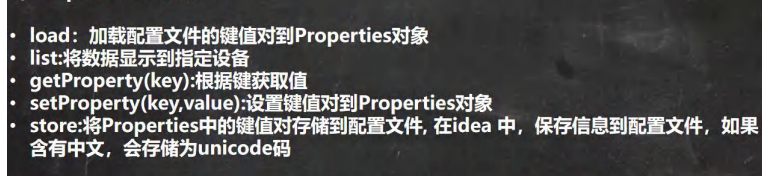

# IO流

## 文件

保存数据的地方

## 文件流

文件在程序中是以流的形式来操作


流：数据在数据源（文件）和程序（内存）之间经历的路径

输入流：数据从数据源（文件）到程序（内存的路径）

输出流：数据从程序（内存）到数据源（文件的路径）


## 常用文件操作

### 创建文件对象相关构造器和方法

1、首先确定创建文件的方式：

1. 根据路径构建一个File对象（通过将给定路径名字符串转换为抽象路径名来**创建**一个新 `File` 实例。）

   `new File(String pathname)`

2. 根据父目录文件+子路径构建

   `new File(File parent,String child)`

3. 根据父目录+子路径构建

   `new File(String parent,String child)`

2、然后createNewFile  创建新文件（真正的创建文件）


### 获取文件相关信息

```java
//如果获取到文件的大小，文件名，路径，父File，式文件还是目录（目录本质也是文件，一种特殊的文件），是否存在。
@Test
public void info() throws IOException {
    File file = new File("e:\\news1.txt");
    file.createNewFile();

    System.out.println("文件名字=" + file.getName());
    System.out.println("文件绝对路径=" +file.getAbsolutePath());
    System.out.println("文件父级目录=" + file.getParent());
    System.out.println("文件大小(字节)=" + file.length());
    System.out.println("文件是否存在=" + file.exists());
    System.out.println("是不是一个文件=" + file.isFile());
    System.out.println("是不是一个目录=" + file.isDirectory());
}

//结果
文件名字=news1.txt
文件绝对路径=e:\news1.txt
文件父级目录=e:\
文件大小(字节)=0
文件是否存在=true
是不是一个文件=true
是不是一个目录=false
    


```


### 目录的操作和文件删除

```java
//目录的操作和文件删除
//mkdir创建一级目录、mkdirs创建多级目录、delete删除空目录或文件
import org.junit.Test;

import java.io.File;
import java.io.IOException;

/**
 * @author zmm
 */
public class Test_ {

    @Test
    public void testFile() throws IOException {
        String filePath="e:\\Test.txt";
        File file = new File(filePath);
        //如果不执行createNewFile语句的话，文件不存在。
        System.out.println(file.exists());
        file.createNewFile();
        //判断e:\Test.txt是否存在，如果存在就删除
        if(file.exists()){
            file.delete();
            System.out.println("该文件存在，已执行删除操作。");
        }

    }
    @Test
    public void TestDirectory(){
        //判断E:\\demo02是否存在，存在就删除，否则提示不存在
        String directoryPath="e:\\demo02";
        File file = new File(directoryPath);
        if(file.exists()){
            file.delete();
            System.out.println("该目录存在，已执行删除操作。");
        }else{
            System.out.println("该目录不存在。");
        }
    }
    @Test
    public void TestDirectory2(){
        //判断E:\\demo\\a\\b\\c目录是否存在，如果存在就提示已经存在，否则就创键
        String directoryPath="E:\\demo\\a\\b\\c";
        File file = new File(directoryPath);
        if(file.exists()){
            System.out.println("该目录已经存在");
        }else{
            file.mkdirs();
            System.out.println("该目录不存在，已创建");
        }
    }
}

```


## IO流原理及流的分类

### IO流原理


### 流的分类

按操作数据单位不同分为：

1. 字节流（8bit）二进制文件
2. 字符流（按字符）文本文件

按数据流的流向不同分为：

1. 输入流
2. 输出流

按流的角色不同分为：

1. 节点流
2. 处理流/包装流


### IO流体系图-常用的类


#### FileInputStream

字节输入流 文件（磁盘）--->程序（内存）

```java
package com.zmm.inputstream;

import org.junit.jupiter.api.Test;

import java.io.FileInputStream;
import java.io.FileNotFoundException;
import java.io.IOException;

/**
 * @author zmm
 */
public class FileInputStream_ {
    public static void main(String[] args) {

    }

    @Test
    public void readFile01(){
        String filePath="e:\\hello.txt";
        int readData=0;
        FileInputStream fileInputStream=null;

        try {
            fileInputStream=new FileInputStream(filePath);
            //read读取一个字节的数据返回到readDate，如果hello.txt中有中文的话
            //会出现乱码，因为一个中文不止占一个字节，而每次读取只读取一个字节，所以会乱码。
            while((readData=fileInputStream.read())!=-1){
                System.out.print((char)readData);
            }
        } catch (IOException e) {
            e.printStackTrace();
        } finally {
            try {
                //关闭文件流，释放资源
                fileInputStream.close();
            } catch (IOException e) {
                e.printStackTrace();
            }
        }

    }

    @Test
    public void readFile02(){
        String filePath="e:\\hello.txt";
        byte[] buf=new byte[8];//开辟一个字节数组当做存储读取数据的缓冲区
        int readLen=0;
        FileInputStream fileInputStream=null;

        try {
            fileInputStream=new FileInputStream(filePath);
            //read(byte[] b)从此输入流中将最多 b.length 个字节的数据读入一个 byte 数组中。
            //在某些输入可用之前，此方法将阻塞。 b - 存储读取数据的缓冲区。
            //返回读入缓冲区的字节总数，如果因为已经到达文件末尾而没有更多的数据，则返回 -1。 
            while((readLen=fileInputStream.read(buf))!=-1){
                System.out.print(new String(buf,0,readLen));
            }
        } catch (IOException e) {
            e.printStackTrace();
        } finally {
            try {
                fileInputStream.close();
            } catch (IOException e) {
                e.printStackTrace();
            }
        }
    }

}
```


#### FileOutputStream

1. new FileOutputStream(filePath) 创建方式，当写入内容是，会覆盖原来的内容 

2. new FileOutputStream(filePath, true) 创建方式，当写入内容是，是追加到文件后面

```java
@Test
public void writeFile(){
    String filePath="e:\\a.txt";
    FileOutputStream fileOutputStream=null;

    try {
        //true的意思是默认添加到原文件内容的后面。无true的话默认就是覆盖原文件的内容。
        fileOutputStream=new FileOutputStream(filePath,true);
        String str="hello,world";
        //str.getBytes()可以把 字符串 变成字节数组
        fileOutputStream.write(str.getBytes(),0,str.length());
    } catch (IOException e) {
        e.printStackTrace();
    } finally {
        try {
            fileOutputStream.close();
        } catch (IOException e) {
            e.printStackTrace();
        }
    }

}
```


#### 文件的拷贝

```java
public class FileCopy {
    public static void main(String[] args) {
        String srcFilePath="e:\\dog.jpg";
        String destFilePath="e:\\dog2.jpg";
        FileInputStream fileInputStream=null;
        FileOutputStream fileOutputStream=null;

        try {
            fileInputStream=new FileInputStream(srcFilePath);
            fileOutputStream=new FileOutputStream(destFilePath);
            byte[] buf=new byte[1024];
            int readLen=0;
            while((readLen=fileInputStream.read(buf))!=-1){
                fileOutputStream.write(buf,0,readLen);
            }
            System.out.println("拷贝ok~");

        } catch (IOException e) {
            e.printStackTrace();
        } finally {
            try {
                if(fileInputStream!=null){
                    fileInputStream.close();
                }
                if(fileOutputStream!=null){
                    fileOutputStream.close();
                }
            } catch (IOException e) {
                e.printStackTrace();
            }
        }
    }

}
```


#### FileReader和FileWriter

##### 常用方法


```java
//使用fileReader从story.txt读取内容
@Test
public void readFile01(){
    String filePath="e:\\story.txt";
    FileReader fileReader=null;
    int data=0;

    try {
        fileReader=new FileReader(filePath);
        while((data=fileReader.read())!=-1){
            System.out.print((char)data);
        }
    } catch (IOException e) {
        e.printStackTrace();
    } finally {
        try {
            if (fileReader != null) {
                fileReader.close();
            }
        } catch (IOException e) {
            e.printStackTrace();
        }
    }
}

-------------------------------------------------------------------------------------

@Test
    public void readFile02(){
        //通过字符数组读取文件
        String filePath="e:\\story.txt";

        FileReader fileReader=null;

        int readLen=0;
        char[] bur=new char[8];

        try {
            fileReader=new FileReader(filePath);
            while((readLen=fileReader.read(bur))!=-1){
                System.out.print(new String(bur,0,readLen));
            }
        } catch (IOException e) {
            e.printStackTrace();
        } finally {
            try {
                if (fileReader != null) {
                    fileReader.close();
                }
            } catch (IOException e) {
                e.printStackTrace();
            }
        }
    }
```


```java
//使用 FileWriter 将 “你好福州~” 写入到 hello.txt 文件中,
public class FileWriter_ {

    public static void main(String[] args) {
        String filePath="e:\\hello.txt";
        FileWriter fileWriter=null;

        try {
            fileWriter=new FileWriter(filePath);
            fileWriter.write("你好福州~");
        } catch (IOException e) {
            e.printStackTrace();
        } finally {
            try {
                if(fileWriter!=null){
                    fileWriter.close();
                }
            } catch (IOException e) {
                e.printStackTrace();
            }
        }

        System.out.println("程序结束~");
    }

}
```


## 节点流和处理流

#### 基本介绍


### 节点流和处理流的区别和联系


### 处理流的功能主要体现在以下两个方面：


### 处理流-BufferedReader 和 BufferedWrite

​	使用BufferedReader读取文本文件，并显示在控制台

```java
public class BufferedReader_ {
    public static void main(String[] args) throws IOException {
        String filePath="e:\\hello.txt";
        BufferedReader bufferedReader = new BufferedReader(new FileReader(filePath));

        //用String变量来承接所读取的结果
        String line;
        while((line=bufferedReader.readLine())!=null){//读一行就列出一行，直到没有东西可以读为止。
            System.out.println(line);
        }
        bufferedReader.close();
    }
}
```

使用BufferedWriter 将字符串写入到文件中

```java
public class BufferedWrite_ {
    public static void main(String[] args) throws IOException {
        String filePath="e:\\news2.txt";
        BufferedWriter bufferedWriter = new BufferedWriter(new FileWriter(filePath,true));
        bufferedWriter.write("计算机科学与技术01");
        bufferedWriter.newLine();
        bufferedWriter.write("计算机科学与技术02");
        bufferedWriter.newLine();
        bufferedWriter.write("计算机科学与技术03");
        bufferedWriter.newLine();

        bufferedWriter.close();
    }
}
```

**缓冲区**

使用缓冲区比没有使用缓冲区的效率更好。通过BufferedWriter和FileWriter的链接，BufferedWriter可以暂存一堆数据，然后到满的时候在实际写入磁盘，这样就可以减少对磁盘操作的次数。

如果想要缓冲区立即写入，只要调用**writer.flush()**这个方法就可以要求缓冲区马上把内容写下去。


## 对象流-ObjectInputStream和ObjectOutStream

### 序列化和反序列化

1. 序列化就是在保存数据时，保存数据的值和数据类型
2. 反序列化就是在恢复数据时，恢复数据的值和数据类型
3. **需要让某个对象支持序列化机制，则必须让其类是可序列化**。该类必须实现如下两个接口：
   1. Serializable  //这是一个标记接口，没有任何方法需要实现(推荐使用)
      + 如果某类是可序列化的，则它的子类也自动地可以序列化（接口）
   2. Externalizable //该接口有方法需要实现  一般实现上面的Serializable接口
4. 读取反序列化的顺序需要和你保存数据的序列化的顺序一致
5. 序列化是全有或全无的
6. 如果将某个变量标记为trasient的，那就代表说在序列化的过程中该变量会被忽略。
7. 静态变量不会被序列化，因为静态代表每个类一个，而不是每个对象一个。所以当对象被还原的时候，静态变量会维持类中原本的样子，而不是存储是的样子。


### 对象流介绍

功能：提供了对基本类型或对象类型的序列化和反序列化的方法

1. ObjectOutputStream 提供 序列化功能

2. ObjectInputStream 提供 反序列化功能


```java
package com.zmm.OutputStream;

import java.io.*;

/**
 * @author zmm
 */
public class ObjectOutStream_ {
    public static void main(String[] args) throws IOException, ClassNotFoundException {

        String filePath="e:\\data.dat";

//        ObjectOutputStream oos = new ObjectOutputStream(new FileOutputStream(filePath));
//
//        oos.writeInt(100);
//        oos.writeBoolean(true);
//        oos.writeChar('a');
//        oos.writeDouble(9.5);
//        oos.writeUTF("nb");
//
//        oos.writeObject(new Dog("旺财",10));
//        oos.close();
//        System.out.println("数据保存完毕（序列化形式）");

        ObjectInputStream ois = new ObjectInputStream(new FileInputStream(filePath));

        System.out.println(ois.readInt());
        System.out.println(ois.readBoolean());
        System.out.println(ois.readChar());
        System.out.println(ois.readDouble());
        System.out.println(ois.readUTF());
        System.out.println(ois.readObject());


        ois.close();
        System.out.println("以反序列化的方式读取（恢复）ok~");


    }
}
class Dog implements Serializable{
    String name;
    int age;

    public Dog(String name, int age) {
        this.name = name;
        this.age = age;
    }

    @Override
    public String toString() {
        return "Dog{" +
                "name='" + name + '\'' +
                ", age=" + age +
                '}';
    }
}
```


## 标准输入和输出流

System.in  标准输入

System.out  标准输出


## 转换流InputStreamReader 和 OutputStreamWriter

转换流：把字节流转换成字符流


### 打印流PrintStream 和 PrintWriter

打印流只有输出流，没有输入流


## Properites类

### 基本介绍：

专门用于读写配置文件的集合类

配置文件的格式：

键=值

键=值

注意：键值对不需要有空格，值不需要用引号括起来。默认类型是String

### Properties的常见方法




**使用Properties类完成对mysql.properties的读取**

```java
package com.zmm.properties_;

import java.io.FileNotFoundException;
import java.io.FileReader;
import java.io.IOException;
import java.util.Properties;

/**
 * @author zmm
 */
public class Properties02 {
    public static void main(String[] args) throws IOException {
        Properties properties = new Properties();
        properties.load(new FileReader("src\\mysql.properties"));
        properties.list(System.out);
        String user = properties.getProperty("user");
        String pwd = properties.getProperty("pwd");
        System.out.println("用户名=："+user);
        System.out.println("密码是=："+pwd);
    }
}
```


**使用Properties类来创建 配置文件，修改配置文件内容**

```java
package com.zmm.properties_;

import java.io.FileOutputStream;
import java.io.FileWriter;
import java.io.IOException;
import java.util.Properties;

/**
 * @author zmm
 */
public class Properties03 {
    public static void main(String[] args) throws IOException {
        Properties properties = new Properties();
        //如果该文件没有key，就是创建，有就是修改
        properties.setProperty("charset","utf-8");
        properties.setProperty("user","汤姆");
        properties.setProperty("pwd","233");

        //null这个位置就是在配置文件中添加注释，null代表为空。
        properties.store(new FileWriter("src\\mysql2.properties"),null);
        
        System.out.println("文件配置成功~");

    }
}
```


课后练习题


```java
package com.zmm.homework;

import org.junit.jupiter.api.Test;

import java.io.BufferedWriter;
import java.io.File;
import java.io.FileWriter;
import java.io.IOException;

/**
 * @author zmm
 */
public class Homework01 {
    public static void main(String[] args) {

    }
    @Test
    public void m1(){
        String directoryPath="e:\\mytemp";

        File file = new File(directoryPath);
        if(file.exists()){
            System.out.println("目录存在！");
        }else{
            System.out.println("目录不存在,正在创建目录"+directoryPath);
            file.mkdir();
        }
    }
    @Test
    public void m2() throws IOException {
        String filePath="e:\\mytemp\\hello.txt";
        File file = new File(filePath);
        if(file.exists()){
            System.out.println("文件已存在！");
            BufferedWriter buf = new BufferedWriter(new FileWriter(filePath));
            buf.write("hello,world");
            buf.close();
        }else{
            file.createNewFile();
            BufferedWriter buf = new BufferedWriter(new FileWriter(filePath));
            buf.write("hello,world");
            buf.close();
        }
    }
}
```


```java
package com.zmm.homework;

import java.io.BufferedReader;
import java.io.FileReader;
import java.io.IOException;

/**
 * @author zmm
 */
public class Homework2 {
    public static void main(String[] args) throws IOException {
        String filePath="e:\\f2.txt";
        BufferedReader bufferedReader = new BufferedReader(new FileReader(filePath));
        String line="";
        int lineNum=0;

       while((line=bufferedReader.readLine())!=null){
           System.out.println(++lineNum+" "+line);
       }
       bufferedReader.close();
    }
}
```


```java
package com.zmm.homework;

import org.junit.jupiter.api.Test;

import java.io.*;
import java.util.Properties;

/**
 * @author zmm
 */
public class Homework03 {
    public static void main(String[] args) throws IOException {

        Properties properties = new Properties();
        properties.load(new FileReader("src\\dog.properties"));
        String name=properties.getProperty("name");
        String age=properties.getProperty("age");
        String color=properties.getProperty("color");
        int ages=Integer.parseInt(age);

        String filePath="e:\\dog.dat";

        ObjectOutputStream obj = new ObjectOutputStream(new FileOutputStream(filePath));
        obj.writeObject(new Dog(name,ages,color));
        obj.close();
        System.out.println("数据保存完毕（序列化形式）");

    }
    @Test
    public void m1() throws IOException, ClassNotFoundException {
        //反序列化
        String filePath="e:\\dog.dat";
        ObjectInputStream ois = new ObjectInputStream(new FileInputStream(filePath));

        System.out.println(ois.readObject());
        ois.close();
        System.out.println("以反序列化的方式读取（恢复）ok~");
    }

}
class Dog implements Serializable {
    private String name;
    private int age;
    private String color;

    public String getName() {
        return name;
    }

    public void setName(String name) {
        this.name = name;
    }

    public int getAge() {
        return age;
    }

    public void setAge(int age) {
        this.age = age;
    }

    public String getColor() {
        return color;
    }

    public void setColor(String color) {
        this.color = color;
    }

    @Override
    public String toString() {
        return "Dog{" +
                "name='" + name + '\'' +
                ", age=" + age +
                ", color='" + color + '\'' +
                '}';
    }

    public Dog(String name, int age, String color) {
        this.name = name;
        this.age = age;
        this.color = color;
    }
}
```