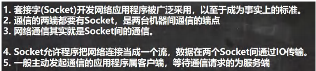

# 网络编程

## 网络的相关概念

### 网络通信

1. 概念：两台设备之间通过网络实现数据传输
2. 网络通信：将数据通过网络从一台设备传输到另一台设备
3. Java.net包下提供了一系列的类或接口，供程序员使用，完成网络通信

### 网络


### ip地址


### ipv4地址分类


### 域名


### 网络通信协议

TCP/IP模型

应用层（HTTP）

传输层（TCP）

网络层（IP）

数据链路层


### TCP和UDP

TCP：传输控制协议

1. 使用TCP协议之前，需建立TCP链接，形成传输数据通道
2. 传输前，采用三次握手方式，是可靠的
3. TCP协议进行通信的两个应用进程：客户端、服务端
4. 在连接中可进行大数据量的传输
5. 传输完毕，需要释放已建立的连接，效率低。

UDP：用户数据协议


## InetAddress 类

### 相关方法


## 套接字 Socket

### 基本介绍



Socket的理解

1. tcp编程  可靠
2. udp编程  不可靠


## TCP网络通信编程

案例：


客户端连接服务端成功之后，各自返回一个Socket

ServerSocket 可以通过 accept() 返回多个 Socket[多个客户端连接服务器的并发]

客户端

```java
package com.zmm.socket;

import java.io.IOException;
import java.io.OutputStream;
import java.net.InetAddress;
import java.net.Socket;
/**
 * @author zmm
 * 客户端
 */
public class SocketTCP01Client {
    public static void main(String[] args) throws IOException {
        //因为这里演示的是在主机，所以ip地址用InetAddress.getLocalHost()代替ip地址，端口号9999
        //该条指令的意思就是连接该IP地址的9999端口号
        Socket socket = new Socket(InetAddress.getLocalHost(),9999);
        System.out.println("连接成功，客户端socket返回="+socket.getClass());

        OutputStream outputStream =socket.getOutputStream();
        outputStream.write("hello,server".getBytes());
        outputStream.close();
        socket.close();
        System.out.println("客户端退出。。。");
    }
}
```

服务端

```java
package com.zmm.socket;

import java.io.IOException;
import java.io.InputStream;
import java.net.ServerSocket;
import java.net.Socket;

/**
 * @author zmm
 * 服务端
 *
 */
public class SocketTCP01Server {
    public static void main(String[] args) throws IOException {
        
        //这个 ServerSocket 可以通过 accept() 返回多个 Socket[多个客户端连接服务器的并发
        ServerSocket serverSocket = new ServerSocket(9999);
        System.out.println("服务器端，在9999端口监听，等待连接。。");
        //当没有客户端连接到9999端口时，程序会 阻塞，等待连接
        //如果有客户端连接，则会返回Socket对象，程序继续
        Socket socket = serverSocket.accept();

        System.out.println("接受到客户端连接，服务器端socket="+socket.getClass());

        InputStream inputStream=socket.getInputStream();
        byte[] buf =new byte[1024];
        int readLen=0;
        while((readLen=inputStream.read(buf))!=-1){
            System.out.println(new String(buf,0,readLen));
        }
        inputStream.close();
        socket.close();
        serverSocket.close();
    }
}
```


案例2


**socket.shoutdownOutput()**

设立结束标记，告诉对方已经自己已经停止往数据通道写入数据否则两方都会一致等待对方，造成死等。

```java
package com.zmm.socket;

import java.io.IOException;
import java.io.InputStream;
import java.io.OutputStream;
import java.net.InetAddress;
import java.net.Socket;
import java.net.UnknownHostException;

/**
 * @author zmm
 * 客户端
 */
public class SocketTCP01Client {
    public static void main(String[] args) throws IOException {
        Socket socket = new Socket(InetAddress.getLocalHost(),9999);

        System.out.println("成功连接服务端");
        //写入数据到数据通道
        OutputStream outputStream = socket.getOutputStream();
        outputStream.write("hello,server".getBytes());

        socket.shutdownOutput();

        InputStream inputStream = socket.getInputStream();

        int readLen=0;
        byte[] bytes = new byte[1024];

        while((readLen=inputStream.read(bytes))!=-1){
            System.out.println(new String(bytes,0,readLen));
        }

        inputStream.close();
        outputStream.close();
        socket.close();
        System.out.println("客户端退出");

    }
}
```

```java
package com.zmm.socket;

import java.io.IOException;
import java.io.InputStream;
import java.io.OutputStream;
import java.net.ServerSocket;
import java.net.Socket;

/**
 * @author zmm
 * 服务端
 *
 */
public class SocketTCP01Server {
    public static void main(String[] args) throws IOException {
        ServerSocket serverSocket = new ServerSocket(9999);
        System.out.println("监听端口，等待连接");
        Socket socket = serverSocket.accept();
        System.out.println("连接到客户端");

        InputStream inputStream = socket.getInputStream();

        int readLen=0;
        byte[] bytes = new byte[1024];
        while((readLen=inputStream.read(bytes))!=-1){
            System.out.println(new String(bytes,0,readLen));
        }

        OutputStream outputStream = socket.getOutputStream();
        outputStream.write("hello,client".getBytes());


        socket.shutdownOutput();

        outputStream.close();
        inputStream.close();
        socket.close();
        serverSocket.close();


    }
}
```


将案例2改写成以字符流的形式

注意：

bufferedWriter.newLine();//插入一个换行符，表示写入的内容结束，同时要求对方也使用readLine()表示输入结束

bufferedWriter.flush()；//如果使用的字符流，需要手动刷新，否则数据不会写入数据通道

```java
package com.zmm.socket;

import java.io.*;
import java.net.ServerSocket;
import java.net.Socket;

/**
 * @author zmm
 * 服务端
 *
 */
public class SocketTCP01Server {
    public static void main(String[] args) throws IOException {
        ServerSocket serverSocket = new ServerSocket(9999);
        System.out.println("监听端口，等待连接");
        Socket socket = serverSocket.accept();
        System.out.println("连接到客户端");

        InputStream inputStream = socket.getInputStream();
        //使用转换流InputStreamReader将字节流转换成字符流
        BufferedReader bufferedReader = new BufferedReader(new InputStreamReader(inputStream));
        String s=bufferedReader.readLine();
        System.out.println(s);

        OutputStream outputStream = socket.getOutputStream();
        BufferedWriter bufferedWriter = new BufferedWriter(new OutputStreamWriter(outputStream));
        bufferedWriter.write("hello,client 字符流");
        bufferedWriter.newLine();
        bufferedWriter.flush();


        bufferedReader.close();
        bufferedWriter.close();
        serverSocket.close();
        socket.close();
        bufferedReader.close();

    }
}
```

```java
package com.zmm.socket;

import java.io.*;
import java.net.InetAddress;
import java.net.Socket;
import java.net.UnknownHostException;

/**
 * @author zmm
 * 客户端
 */
public class SocketTCP01Client {
    public static void main(String[] args) throws IOException {
        Socket socket = new Socket(InetAddress.getLocalHost(),9999);

        System.out.println("成功连接服务端");
        //写入数据到数据通道
        OutputStream outputStream = socket.getOutputStream();
        BufferedWriter bufferedWriter = new BufferedWriter(new OutputStreamWriter(outputStream));
        bufferedWriter.write("hello,server 字符流");
        bufferedWriter.newLine();
        bufferedWriter.flush();

        InputStream inputStream = socket.getInputStream();
        BufferedReader bufferedReader = new BufferedReader(new InputStreamReader(inputStream));
        String s = bufferedReader.readLine();
        System.out.println(s);


        inputStream.close();
        bufferedWriter.close();
        outputStream.close();
        socket.close();
        System.out.println("客户端退出");

    }
}
```


案例4


```java
package com.zmm.Upload;

import java.io.*;
import java.net.ServerSocket;
import java.net.Socket;

/**
 * @author zmm
 * 服务端
 */
public class TCPFileUploadServer {
    public static void main(String[] args) throws IOException {
        //服务端端口8888
        ServerSocket serverSocket = new ServerSocket(8888);
        System.out.println("服务端在端口8888处监听，等待连接");
        Socket socket = serverSocket.accept();
        System.out.println("接收到客户端");

        //读取客户端写入数据通道的数据(图片)
        //客户端发送过是字节数组
        InputStream inputStream = socket.getInputStream();
        BufferedInputStream bufferedInputStream = new BufferedInputStream(inputStream);
        ByteArrayOutputStream bos = new ByteArrayOutputStream();//创建输出流对象
        byte[] b = new byte[1024];
        int len;
        while((len=bufferedInputStream.read(b))!=-1){
            bos.write(b, 0, len);
        }
        byte[] array = bos.toByteArray();
        bos.close();

        String destFilePath = "src\\dog2.jpg";
        BufferedOutputStream bos1 = new BufferedOutputStream(new FileOutputStream(destFilePath));
        bos1.write(array);
        bos1.close();


        // 向客户端回复 "收到图片"
        // 通过 socket 获取到输出流(字符)
        BufferedWriter writer = new BufferedWriter(new OutputStreamWriter(socket.getOutputStream()));
        writer.write("收到图片");
        writer.flush();//把内容刷新到数据通道
        socket.shutdownOutput();//设置写入结束标记


        //关闭其他资源
        writer.close();
        bufferedInputStream.close();
        socket.close();
        serverSocket.close();
    }
}

```

```java
package com.zmm.Upload;

import java.io.*;
import java.net.InetAddress;
import java.net.Socket;

/**
 * @author zmm
 * 客户端
 */
public class TCPFileUploadClient {
    public static void main(String[] args) throws IOException {
        System.out.println("客户端连接服务端。。。");
        Socket socket = new Socket(InetAddress.getLocalHost(),8888);
        System.out.println("连接成功");

        String filePath="e:\\dog.jpg";
        //因为图片本质是一个二进制文件，所以使用字节输入流比较合适。
        //得到一个bis是一串字节，将其读取存放到字节数组中去
        BufferedInputStream bis = new BufferedInputStream(new FileInputStream(filePath));

        //得到一个用来存放字节数组的类,立足于字节数组来说
        ByteArrayOutputStream bos = new ByteArrayOutputStream();
        byte[] bytes = new byte[1024];
        int len;
        while ((len=bis.read(bytes))!=-1){
            //写入到bos中
            bos.write(bytes,0,len);
        }
        //将存放字节的对象存放到字节数组中去
        byte[] array=bos.toByteArray();
        //关闭该对象，得到存有图片信息的字节数组array
        bos.close();

        OutputStream outputStream = socket.getOutputStream();
        //将其写入到数据通道中,因为是字节文件，所以，参考案例2
        BufferedOutputStream bufferedOutputStream = new BufferedOutputStream(outputStream);
        bufferedOutputStream.write(array);

        //bufferedOutputStream.close(); 放到最后
        bis.close();
        //设置写入数据的结束标记
        socket.shutdownOutput();


        //=====接收从服务端回复的消息=====
        InputStream inputStream = socket.getInputStream();
        BufferedReader reader = new BufferedReader(new InputStreamReader(inputStream));
        //字符串存在大量操作的的时候使用StringBuffer或者StringBuilder
        //如果字符串存在大量的修改操作，并在单线程的情况下，使用StringBuilder
        StringBuilder builder = new StringBuilder();
        String line;
        while((line=reader.readLine())!=null){
            builder.append(line+"\r\n");
        }
        String s = builder.toString();
        System.out.println(s);

        //关闭相关的流
        bufferedOutputStream.close();
        inputStream.close();
        socket.close();


    }
}
```

### netstat指令


### TCP网络通讯的细节

当客户端连接到服务端后，实际上客户端也是通过一个端口和服务端进行通讯的，这个端口是TCP/IP来分配的，是不确定的，是随机的。

