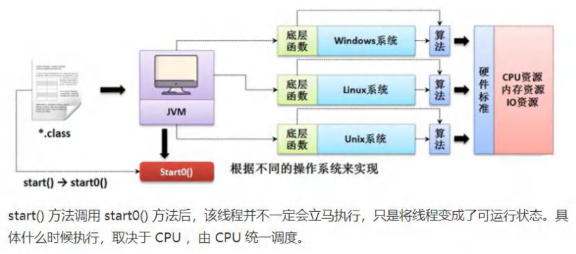
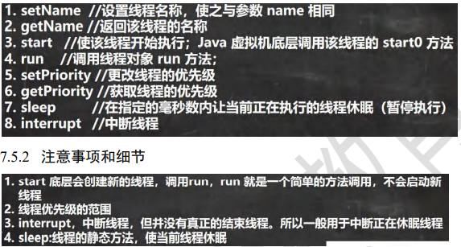
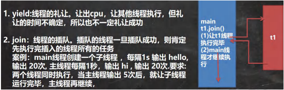
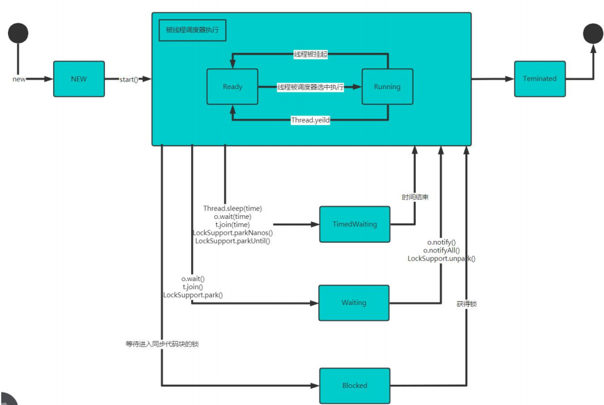
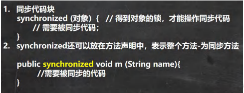
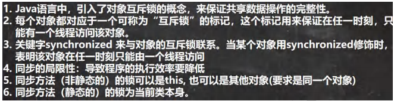
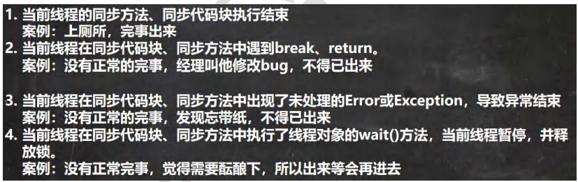
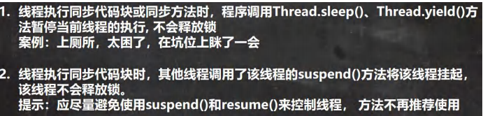

# 多线程基础

## 线程相关概念

### 程序

是为完成特定任务，用某种语言编写的一组指令的集合。通俗的说就是我们写的代码。

### 进程

进程就是运行中的程序，是程序的一次执行过程，或是正在运行的一个程序。

每当运行一个程序就是启动了一个进程，操作系统就会为该进程分配内存空间。

### 线程

#### 什么线程？

线程是由进程创建的，是进程的一个实体。

**一个进程可以拥有多个线程**

#### 其他相关的概念

1. 单线程：同一个时刻，只允许一个线程 Stringbuilder
2. 多线程：同一个时刻，可以执行多个线程，例如一个迅雷进程可以同时下载多个文件。Stringbuffer
3. 并发：同一个时刻，多个任务**交替执行**，由于速度很快造成一种同时进行的错觉。**单核CPU**实现的多任务就是并发
4. 并行：同一个时刻，多个任务**同时执行**，**多核cpu**可以实现并行

## 线程的基本使用

### 创建线程的两种方式

在java中线程的使用有两种方式

1. 继承Thread类，重写run方法
   + 当一个类继承了Thread类，该类就可以当作线程使用。
   + 然后重写run方法，写上自己的业务代码。
2. 实现Runnable接口，重写run方法


​	在多线程中，启动一个程序就是开始一个进程。进程下有主线程和子线程，主线程挂掉的话子线程如果没有进行完的话是不会退出进程的，**即如果主线程进行完毕但是主线程下的子线程仍然在执行的话，并不会造成整个应用程序结束。**

```java
package com.zmm.threaduse;

/**
 * @author zmm
 继承Thread类的方式
 */
public class Thread01 {
    public static void main(String[] args) {
        Cat cat = new Cat();
        cat.start();
        //说明: 当 main 线程启动一个子线程 Thread-0, 主线程不会阻塞, 会继续执行
        //这时 主线程和子线程是交替执行.
        //cat.start是启动线程的方法,不能用cat.run来替代，否则无法开启线程，只是会单纯的执行run方法，完毕之后才能向下执行。
      
    }
}
class Cat extends Thread{
    @Override
    public void run() {
        int times=0;
        while(true){
            times++;
            System.out.println("支付宝到账100元！  执行"+times+"次。");
            try {
                Thread.sleep(1000);
            } catch (InterruptedException e) {
                e.printStackTrace();
            }
            if(times==8){
                break;
            }
        }
    }
}
```


**为什么启动线程的方法是start而不是run？**

```java
(1)执行Thread.start()

    public synchronized void start() {
        start0();
    }
    
(2)
//start0() 是本地方法，是 JVM 调用, 底层是 c/c++实现

//真正实现多线程的效果， 是 start0(), 而不是 run

    private native void
```





```java
package com.zmm.threaduse;

/**
 * @author zmm'
 * 通过实现Runable的方式来实现多线程
 */
public class Thread02 {
    public static void main(String[] args) {
        Dog dog = new Dog();
        //因为Thread实现了Runnable接口,所以可以传入同样实现了Runnable接口的类
        Thread thread = new Thread(dog);
        thread.start();
        //主线程和子线程同时进行
        for (int i = 0; i < 10; i++) {
            System.out.println(i);
            try {
                Thread.sleep(1000);
            } catch (InterruptedException e) {
                e.printStackTrace();
            }
        }
    }
}
class Dog implements Runnable{
    @Override
    public void run() {
        int times=0;
        while(true){
            times++;
            System.out.println("支付宝到账100元！  执行"+times+"次。");
            try {
                Thread.sleep(1000);
            } catch (InterruptedException e) {
                e.printStackTrace();
            }
            if(times==8){
                break;
            }
        }
    }
}
```

通过实现Runnable接口来实现的多线程，这里底层使用了设计模式【代理模式】


线程使用应用案例-多线程执行

```java
package com.zmm.threaduse;

/**
 * @author zmm
 */
public class Thread03 {
    public static void main(String[] args) {
        T1 t1 = new T1();
        T2 t2 = new T2();
        Thread threadT1 = new Thread(t1);
        threadT1.start();
        Thread threadT2 = new Thread(t2);
        threadT2.start();
    }
}
class T1 implements Runnable{

    @Override
    public void run() {
        int times=0;
        while(true){
            System.out.println("hello,world"+"---"+(++times));
            try {
                Thread.sleep(1000);
            } catch (InterruptedException e) {
                e.printStackTrace();
            }
            if(times==10){
                break;
            }
        }
    }
}

class T2 implements Runnable{

    @Override
    public void run() {

        int times=0;
        while(true){
            System.out.println("hi"+"---"+(++times));
            try {
                Thread.sleep(1000);
            } catch (InterruptedException e) {
                e.printStackTrace();
            }
            if(times==5){
                break;
            }
        }
    }
}
```


## 继承Thread 和 实现Runnable的区别


## 线程终止

1. 当线程完成任务后，会自动退出
2. 还可以通过使用变量来控制run方法退出的方式停止线程，即通知方式。


## 线程常用方法






```java
package com.zmm.method;

/**
 * @author zmm
 */
public class ThreadMethodExercise {
    public static void main(String[] args) throws InterruptedException {
        thread02 thread02 = new thread02();
        Thread thread = new Thread(thread02);
        for (int i = 1; i <=10 ; i++) {
            System.out.println("hi ----"+i);
            if(i==5){
                thread.start();
                thread.join();
            }
        }
    }
}
class thread02 implements Runnable{

    @Override
    public void run() {
        int times=0;
        while(true){
            try {
                Thread.sleep(100);
            } catch (InterruptedException e) {
                e.printStackTrace();
            }
            System.out.println("hello ----"+(++times));
            if(times==10){
                break;
            }
        }

    }
}
```

### 用户线程和守护线程

1. 用户线程：也叫工作线程，当线程的任务执行完或通知方式结束
2. 守护线程：一般是为工作线程服务的，当所有的用户线程结束，守护线程自动结束
3. 常见的守护线程：垃圾回收机制（GC）

如果我们希望主线程结束后，子线程自动结束，只需将子线程设为守护线程即可。

```java
package com.zmm.method;

/**
 * @author zmm
 */
public class ThreadMethod03 {
    public static void main(String[] args) {
        MyDaemonThread myDaemonThread = new MyDaemonThread();
        //将myDaemonThread设置为守护线程，当主线程结束后，守护线程也自动结束
        myDaemonThread.setDaemon(true);
        //注意顺序，应是先设置声明守护线程后再开启线程。
        myDaemonThread.start();
        for (int i = 0; i < 10; i++) {
            System.out.println("hello");
            try {
                Thread.sleep(1000);
            } catch (InterruptedException e) {
                e.printStackTrace();
            }
        }
    }
}
class MyDaemonThread extends Thread{
    @Override
    public void run() {
        while(true){
            System.out.println("hi");
            try {
                Thread.sleep(500);
            } catch (InterruptedException e) {
                e.printStackTrace();
            }


        }
    }
}
```


## 线程的生命周期

### 线程状态。线程可以处于以下状态之一：（6种）

1. NEW

   尚为启动的线程处于此状态

2. RUNNABLE

   在java虚拟机中执行的线程处于此状态

3. BLOCKED

   被阻塞等待监视器锁定的线程处于此状态

4. WAITING

   正在等待另一个线程执行特定动作的线程处于此状态

5. TIMED_WAITING

   正在等待另一个线程执行特定动作达到指定等待时间的线程处于此状态

6. TERMINATED

   已退出的线程处于此状态

### 线程状态转换图（重要）

线程状态也可以说成是七种，因为Runnable可以细分成ready和running




## 线程的同步

### 线程的同步机制

1. 在多线程编程，一些敏感数据不允许被多个线程同时访问，此时就使用同步访问技术，保证数据在任何同一时刻，最多有一个线程被访问，以保证数据的完整性。
2. 线程同步，即当有一个线程在对内存进行操作时，其他线程都不可以对这个内存地址进行操作，直到该线程完成操作，其他线程才能对该内存地址进行操作。

### 同步具体方法 -Synchronized




使用synchronized可以解决超卖的问题，但是没有解决同票的问题

```java
public class SellTicket {
    public static void main(String[] args) throws InterruptedException {

        SellTicket03 sellTicket01 = new SellTicket03();
        SellTicket03 sellTicket02 = new SellTicket03();
        SellTicket03 sellTicket03 = new SellTicket03();
        Thread thread1 = new Thread(sellTicket01);
        Thread thread2 = new Thread(sellTicket02);
        Thread thread3 = new Thread(sellTicket03);
        thread1.start();
        thread2.start();
        thread3.start();

    }
}
class SellTicket03 implements Runnable{
    boolean loop=true;
    public static int tickets=100;
    public synchronized void sell(){
        System.out.println("窗口"+ Thread.currentThread().getName()+"售出一张票"+"剩余票数="+(--tickets));
        try {
            Thread.sleep(50);
        } catch (InterruptedException e) {
            e.printStackTrace();
        }
        if(tickets<=0){
            System.out.println("售票结束。。。");
            loop=false;
            return;
        }
    }
    @Override
    public void run() {
        while(loop){
            sell();
        }
    }
}
```

## 互斥锁

### 基本介绍



待补充


## 线程的死锁

### 基本介绍

多个线程都占用了对方的锁资源，但不肯相让，导致了死锁，在编程是一定要避免死锁的发生


## 释放锁

下面操作会释放锁



下面操作不会释放锁

