# 反射

ocp原则（开闭原则）：不修改源码，扩容功能

反射的意义：通过外部文件配置，在不修改源码的情况下，来控制程序。

## 反射机制

Java Reflection

1. 反射机制允许程序在执行期间借助于Reflection API取得任何类的内部信息（比如成员变量，构造器，成员方法等），并能操作对象的属性及方法。反射在设计模式和框架底层都会用到。
2. 加载完类之后，在堆中就产生了一个Class类型的对象（一个类只有一个Class对象），这个对象包含了类的完整结构信息。通过这个对象得到类的结构。这个Class对象就像是一面镜子，透过这个镜子看到类的结构，所以，形象的称之为：反射。


### 反射机制原理示意图

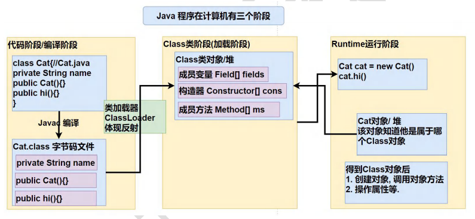

**反射机制可以完成**

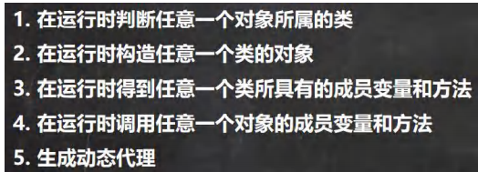

### 反射相关的主要类

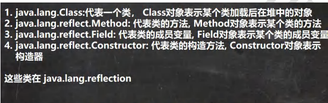

```java
package com.zmm.reflection;

import java.io.FileNotFoundException;
import java.io.FileReader;
import java.lang.reflect.Constructor;
import java.lang.reflect.Field;
import java.lang.reflect.Method;
import java.util.Properties;

/**
 * @author zmm
 */
public class Reflection01 {
    public static void main(String[] args) throws Exception {

        Properties properties = new Properties();
        properties.load(new FileReader("src\\re.properties"));
        String classfullpath = properties.getProperty("classfullpath");
        String methodName = properties.getProperty("method");

        Class<?> cls = Class.forName(classfullpath);
        Object o = cls.newInstance();
        Method method = cls.getMethod(methodName);
        method.invoke(o);

        //getFiled不能得到私有的属性
        Field age = cls.getField("age");
        //传统的写法： 对象.成员变量，
        //反射：成员变量对象.get(对象)
        System.out.println(age.get(o));

        //通过公有方法得到类的私有属性
        Method getName = cls.getMethod("getName");
        System.out.println(getName.invoke(o));

        //代表类的构造方法，其中()里可以指定构造器参数类型，返回无参构造器。
        Constructor<?> constructor = cls.getConstructor();
        System.out.println(constructor);


    }
}
```

### 反射的优点和缺点

1. 优点：可以动态的创建和使用对象（也是框架底层核心），使用灵活，没有反射机制，框架技术就失去底层支撑。
2. 缺点：使用反射基本是解释执行，对执行速度有影响。


### 反射调用优化-关闭访问检查

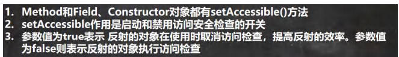

方法名.setAccessible(true);

## Class 类

### 基本介绍

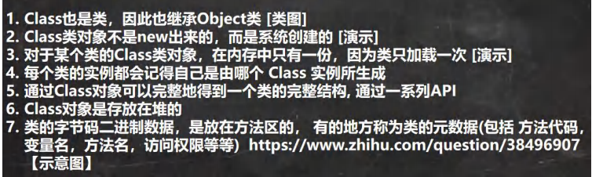

通过类加载器ClassLoader中的loadClass方法完成类加载，生成某个类对应的Class对象

### Class类的常用方法

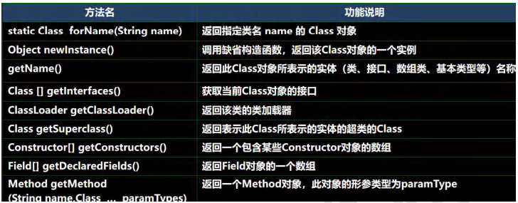

```java
String classAllPath = "com.hspedu.Car";
        //1 . 获取到 Car 类 对应的 Class 对象
        //<?> 表示不确定的 Java 类型
        Class<?> cls = Class.forName(classAllPath);
        //2. 输出 cls
        System.out.println(cls); //显示 cls 对象, 是哪个类的 Class 对象 com.hspedu.Car
        System.out.println(cls.getClass());//输出 cls 运行类型 java.lang.Class
        //3. 得到包名
        System.out.println(cls.getPackage().getName());//包名
        //4. 得到全类名
        System.out.println(cls.getName());
        //5. 通过 cls 创建对象实例
        Car car = (Car) cls.newInstance();
        System.out.println(car);//car.toString()
        //6. 通过反射获取属性 brand
        Field brand = cls.getField("brand");
        System.out.println(brand.get(car));//宝马
        //7. 通过反射给属性赋值
        brand.set(car, "奔驰");
        System.out.println(brand.get(car));//奔驰
        //8 我希望大家可以得到所有的属性(字段)
        System.out.println("=======所有的字段属性====");
        Field[] fields = cls.getFields();
        for (Field f : fields) {
            System.out.println(f.getName());//名称
        }
```


### 获取Class类对象

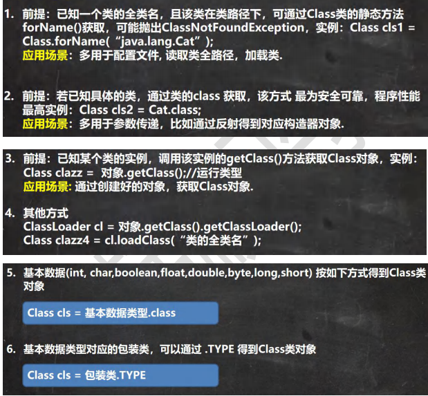


## 拥有Class对象的类型

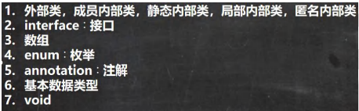

## 类加载

### 基本说明

反射机制是java实现动态语言的关键，也就是通过反射实现类动态加载。

1.  静态加载：在编译的时候加载相关的类，如果没有则报错，依赖性太强。
   + 一般传统的方法使用的是静态加载，eg：new Dog（）  即使不使用也需要加载Dog类
2. 动态加载：运行时加载需要的类，如果运行时不用该类，即使不存在该类，也不报错，降低了依赖性。只有当使用到该类的时候才会报错。
   + 反射使用的是动态加载

### 类的加载时机

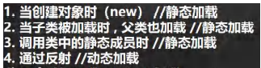

### 类加载过程图

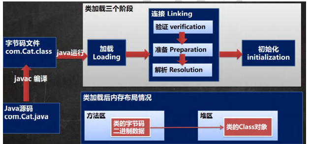


### 类加载各阶段完成的任务

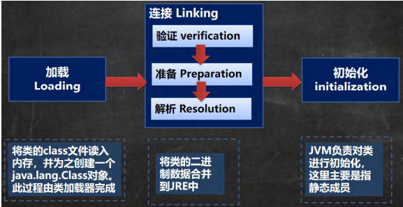


### 加载阶段

JVM在该阶段的主要目的是将字节码从不同的数据源（可能是class文件、也可能是jar包，甚至网络）转化为二进制字节流加载到内存中，并生成一个代表该类的java.lang.class对象


### 连接阶段

#### 验证

1. 目的是为了确保Class文件的字节流中包含的信息符合当前虚拟机的要求，并且不会危害虚拟机自身的安全
2. 会对Class文件格式验证（如果安全的话，.class文件是以oxcafebabe开头）、元数据验证、字节码验证和符号引用验证。（SecurityManager方法进行验证）
3. 如果想要缩短虚拟机类加载的时间可以考虑使用 -Xverify：none参数来关闭大部分的类验证措施。

#### 准备

1. JVM会在该阶段对静态变量，分配内存并默认初始化（对应数据类型的默认初始化值，如0、0L、null、false等）。这些变量所使用的内存都将在方法区中进行分配。

2. ```java
   //分析类加载的链接阶段-准备 属性是如何处理
   //n1是实例属性，不是静态变量，因此在准备阶段，是不会分配内存的
   public int n1=10;
   //n2是静态变量，分配内存n2 默认初始化是0，注意这个时候还没有赋值给n2=20，赋值是在初始化阶段
   public static int n2=20;
   //n3是static final，是常量，他和静态变量不一样，因为一旦赋值就不变 n3=30
   public static final int n3=30;
   ```

#### 解析

1. 虚拟机将常量池内的符号引用替换为直接引用的过程


### 初始化 --Initialization

1. 到初始化阶段，才真正开始执行类中的定义的Java程序代码，此阶段是执行<clinit>()方法的过程
2. <clinit>()方法是由编译器按语句在源文件中出现的顺序，依次自动收集类中的所有**静态变量**的赋值动作和**静态代码块**中的语句，并进行合并。
3. 虚拟机会保证一个类的<clinit>()方法在多线程环境中被正确的加锁、同步，如果多个线程同时去初始化一个类，那么只会有一个线程去执行这个类的<clinit>()方法，其他线程都需要阻塞等待，直到活动线程执行<clinit>()方法完毕。


## 通过反射获取类的结构信息

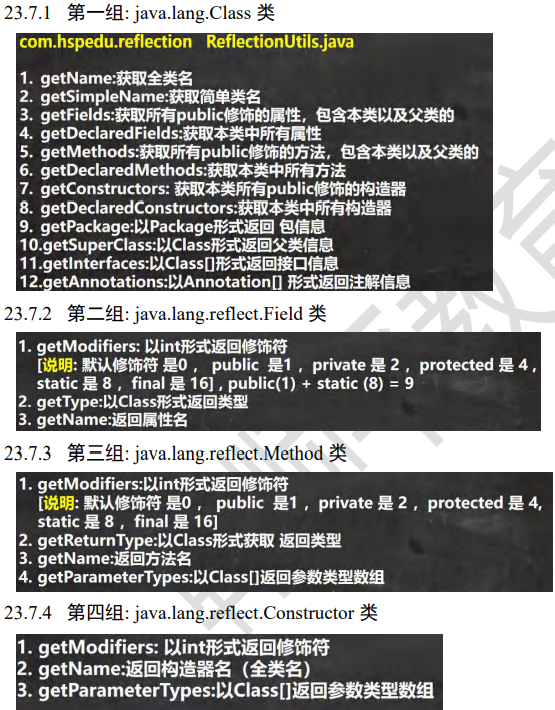


## 通过反射创建对象

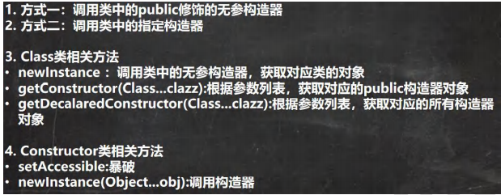


```javva
package com.zmm.reflection;

import java.lang.reflect.Constructor;

/**
 * @author zmm
 */
public class ReflecCreateInstance {
    public static void main(String[] args) throws Exception {
        Class<?> cls = Class.forName("com.zmm.reflection.User");
        //通过public的无参构造器创建实例
        Object o = cls.newInstance();
        System.out.println(o);
        //通过public有参构造器创建实例
        Constructor<?> constructor1 = cls.getConstructor(String.class);
        Object zw = constructor1.newInstance("zw");
        System.out.println(zw);

        //通过非public的有参构造器创建实例
        Constructor<?> declaredConstructor = cls.getDeclaredConstructor(int.class, String.class);
        //暴破【暴力破解】 , 使用反射可以访问 private 构造器/方法/属性。
        declaredConstructor.setAccessible(true);
        Object o1 = declaredConstructor.newInstance(23,"zmm-1");
        System.out.println(o1);

    }
}
class User { //User 类
    private int age = 10;
    private String name = "zmm";
    public User() {//无参 public
    }
    public User(String name) {//public 的有参构造器
        this.name = name;
    }
    private User(int age, String name) {//private 有参构造器
        this.age = age;
        this.name = name;
    }
    public String toString() {
        return "User [age=" + age + ", name=" + name + "]";
    }
}
```

## 通过反射访问类中的成员

### 访问属性

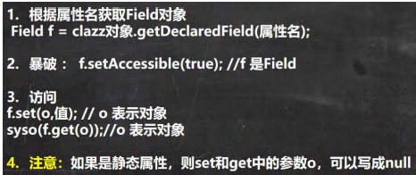


```java
//1. 得到 Student 类对应的 Class 对象
Class<?> stuClass = Class.forName("com.hspedu.reflection.Student");
//2. 创建对象
Object o = stuClass.newInstance();//o 的运行类型就是 Student
System.out.println(o.getClass());//Student
//3. 使用反射得到 age 属性对象
Field age = stuClass.getField("age");
age.set(o, 88);//通过反射来操作属性
System.out.println(o);//
System.out.println(age.get(o));//返回 age 属性的值
//4. 使用反射操作 name 属性
Field name = stuClass.getDeclaredField("name");
//对 name 进行暴破, 可以操作 private 属性
name.setAccessible(true);
//name.set(o, "老韩");
name.set(null, "老韩~");//因为 name 是 static 属性，因此 o 也可以写出 null
System.out.println(o);
System.out.println(name.get(o)); //获取属性值
System.out.println(name.get(null));//获取属性值, 要求 name是static
```


### 访问方法

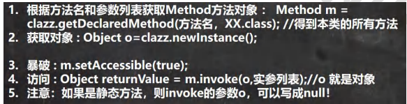


