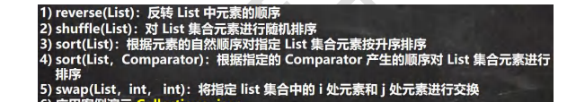

## 1.集合的理解和好处

1. 可以动态保存任意多个对象
2. 提供了一系列方便的操作对象的方法：add、remove、set、get等
3. 使用集合添加和删除新元素方便简洁


## 2.集合的框架体系

## 3.Collection接口和常用方法

###3.1常用方法

1. collection实现子类可以存放多个元素，每个元素可以是Object
2. 有些Collection的实现类，可以存放重复的元素，有些不可以
3. 有些Collection的实现类，有些是有序的（List），有些不是有序（Set）
4. Collection接口没有直接的实现子类，是通过它的子接口Set和List来实现的

```java
//Collection 接口常用方法,以实现子类 ArrayList 来演示. CollectionMethod.java
import java.util.ArrayList;
import java.util.List;

public class CollectionMethod {
	@SuppressWarnings({"all"})
	public static void main(String[] args) {
		List list = new ArrayList();
		// add:添加单个元素
		list.add("jack");
		list.add(10);//list.add(new Integer(10))
		list.add(true);
		System.out.println("list=" + list);
		// remove:删除指定元素
		//list.remove(0);//删除第一个元素
		list.remove(true);//指定删除某个元素
		System.out.println("list=" + list);
		// contains:查找元素是否存在
		System.out.println(list.contains("jack"));//T
		// size:获取元素个数
		System.out.println(list.size());//2
  		// isEmpty:判断是否为空
		System.out.println(list.isEmpty());//F
		// clear:清空
		list.clear();
		System.out.println("list=" + list);
		// addAll:添加多个元素
		ArrayList list2 = new ArrayList();
		list2.add("红楼梦");
		list2.add("三国演义");
		list.addAll(list2);
		System.out.println("list=" + list);
		// containsAll:查找多个元素是否都存在
		System.out.println(list.containsAll(list2));//T
		// removeAll：删除多个元素
		list.add("聊斋");
		list.removeAll(list2);
		System.out.println("list=" + list);//[聊斋]
		 }
	}
```

###3.2Collection接口遍历元素方式 

####3.2.1 使用Iterator（迭代器）

1. Iterator对象称为迭代器，主要用于遍历Collection集合中的元素
2. 所有实现了Collection接口的集合类都有一个iterator()方法，用以返回一个实现了Iterator接口的对象，既可以返回一个迭代器。
3. 演示：

```java
import java.util.ArrayList;
import java.util.Collection;
import java.util.Iterator;

public class CollectionIterator {
	@SuppressWarnings({"all"})
	public static void main(String[] args) {
		Collection col = new ArrayList();
		col.add(new Book("三国演义", "罗贯中", 10.1));
		col.add(new Book("小李飞刀", "古龙", 5.1));
		col.add(new Book("红楼梦", "曹雪芹", 34.6));
		
		//遍历 col 集合
		//1. 先得到 col 对应的 迭代器
		Iterator iterator = col.iterator();
		//2. 使用 while 循环遍历
		 while (iterator.hasNext()) {//判断是否还有数据
		//返回下一个元素，类型是 Object
		 	Object obj = iterator.next();
		 	System.out.println("obj=" + obj);
		 }
		//快捷键，快速生成 while => itit
		//显示所有的快捷键的的快捷键 ctrl + j
		//3. 当退出 while 循环后 , 这时 iterator 迭代器，指向最后的元素
		// iterator.next();//NoSuchElementException
		//4. 如果希望再次遍历，需要重置我们的迭代器
		iterator = col.iterator();
		System.out.println("===第二次遍历===");
		while (iterator.hasNext()) {
			Object obj = iterator.next();
			System.out.println("obj=" + obj);
		}
	}
}
class Book {略}
```
####3.2.2 for循环增强

增强for循环，可以代替iterator迭代器，特点：增强for就是简化版的iterator，本质是一样的，只能用于遍历集合或数组。

**基本语法：**

```java
for(元素类型 元素名:集合名或数组名){
	访问元素
}
```

**演示：**

```java
public class ListExercise {
    public static void main(String[] args) {
        List list = new ArrayList();
        for (int i = 0; i < 12; i++) {
            list.add("hello"+i);
        }
        list.add(2,"zmm");
        list.get(5);
        list.remove(6);
        list.set(7,"zmm_1");
        
        System.out.println("*********使用增强for遍历集合********");
        for (Object o :list) {
            System.out.println(o);
        }


    }
}
```

##4.List接口和常用方法

### 4.1 List接口的基本介绍

1. List集合类中元素**有序**（即添加顺序和取出顺序一致），且可重复
2. List集合中的每个元素都有其对应的顺序索引，即支持索引
3. 常用的实现类ArrayList、LinkedList、Vector

### 4.2 List接口的常用方法

```java
List list=new ArrayList();

//void add(int index, Object ele):在 index 位置插入 ele 元素
list.add(1,"zmm");
//boolean addAll(int index,collection eles):从 index 位置开始将 eles 中的所有元素添加进来
List list2 = new ArrayList();
list2.add("jack");
list2.add("tom");
list.addAll(1, list2);
//Object get(int index):获取指定 index 位置的元素
//int indexOf(Object obj):返回 obj 在集合中首次出现的位置
System.out.println(list.indexOf("tom"));//2
//int lastIndexOf(Object obj):返回 obj 在当前集合中末次出现的位置
//Object remove(int index):移除指定 index 位置的元素，并返回此元素
//Object set(int index, Object ele):设置指定 index 位置的元素为 ele , 相当于是替换.
//List subList(int fromIndex, int toIndex):返回从 fromIndex 到 toIndex位置的子集合
```


### 4.3 List的三种遍历方式

1. 使用iterator
2. 使用增强for
3. 使用普通for


## 5.ArrayLIst底层结构

###5.1 **ArrayList的注意事项：**

1. ArrayList可以加入一个或多个null
2. ArrayList是由数组来实现数据存储的
3. ArrayList基本等同于Vector，在多线程情况下，不建议使用ArrayList

### 5.2 ArrayList的底层操作机制

1. 当创建ArrayList对象时，如果使用的是无参构造器，则初始elementData容量为0，第一次添加，则扩容elementData为10，如需再次扩容，则扩容elementsData为1.5倍
2. 如果使用的是指定大小的构造器，则初始elementData容量为指定大小，如果需要扩容。则直接扩容elementData为1.5倍

## 6.Vector底层结构

### 6.1 Vector介绍

1. 底层也是一个对象数组
2. Vector是线程同步的，即线程安全，在开发中，需要线程同步安全时，考虑使用Vector

### 6.2 ArrayList和Vector的比较

底层结构都是可变数组，线程安全ArrayLIst不安全，但是效率高；Vector安全，但是效率不高。在扩容倍数方面，ArrayLIst如果使用的是有参构造器，需要扩容的时候直接扩充原来的1.5倍，如果使用的是无参构造器，则第一次扩容为10，第二次开始按1.5倍扩充。Vector如果是无参，默认10，满后按2倍扩容；如果指定大小，则每次按3倍扩容。

## 7.LinkedList底层结构

### 7.1 LinkedList的基本介绍

1. LinkedList底层实现了双向链表和双端队列特点
2. 可以添加任意元素（元素可以重复），包括null
3. 线程不安全，没有实现同步
4. LinkedList中维护了两个属性first和last分别指向首节点和尾节点
5. 每个节点（Node对象），里面又维护了prev、next、item三个属性，其中通过prev指向前一个，通过next指向后一个节点。最终实现双向链表。
6. LinkedList的元素添加和删除不是通过数组完成的，相对来说效率较高

```java
package com.zmm.list_;

/**
 * @author zmm
 * 双向链表的简单演示
 */
public class LinkedList01 {
    public static void main(String[] args) {
        Node zmm = new Node("zmm");
        Node z1 = new Node("z1");
        Node z2 = new Node("z2");

        zmm.next=z1;
        z1.next=z2;

        z2.pre=z1;
        z1.pre=zmm;

        Node first=zmm;
        Node last=z2;
        //双向链表循环
        while(true){
            if(first==null){
                break;
            }
            System.out.println(first);
            first=first.next;
        }
        System.out.println("--------------------------");
        //向链表插入节点
        Node mmz = new Node("mmz");
        mmz.next=z2;
        mmz.pre=z1;

        z1.next=mmz;
        z2.pre=mmz;

        first=zmm;
        while(true){
            if(first==null){
                break;
            }
            System.out.println(first);
            first=first.next;
        }
        System.out.println("--------------------------");
        //向链表删除节点
        z1.next=z2;
        z2.pre=z1;

        mmz.next=null;
        mmz.pre=null;
        first=zmm;
        while(true){
            if(first==null){
                break;
            }
            System.out.println(first);
            first=first.next;
        }
    }

}
class Node{
    public Object item;
    public Node next;
    public Node pre;
    public Node(Object name){
        this.item=name;
    }

    @Override
    public String toString() {
        return "Node name="+item;
    }
}
```

### 7.2 ArrayList和LInkedList的比较

ArrayLIst的底层结构是可变数组，LInkedLIst是双向链表；在增删效率上，ArrayList较低，LinkedList较高；改查效率的话，ArrayList较高，LinkedList较低。

**如何选择ArrayList和LinkedList：**

如果改查的操作较多，使用ArrayList

如果删增的操作较多，使用LinkedList

一般来说大部分业务是查询，因此大部分情况下会选择ArrayList

## 8.Set接口和常用方法

### 8.1 Set接口基本介绍

1.无序（添加和取出顺序不一致），没有索引

2.不允许重复元素，所以最多包含一个null

### 8.2 Set接口的常用方法

Set接口也是Collection的子接口，因此，常用方法和Collection接口一样

### 8.3 Set接口的遍历方式

1. 可以使用迭代器-iterator
2. 增强for
3. **不能使用索引的方式来获取**

## 9.Set接口实现类-HashSet

1. HashSet实现了Set接口
2. **HashSet实际上是HashMap**，HaspMap底层是（**数组+链表**）
3. 可以存放null值，但是只能有一个null
4. HashSet不保证元素是有序的，取决于hash后，在确定索引的结果（即，不保证存放元素的顺序和取出的顺序一致）确定取出的顺序之后是不会改变 因为底层的算法是固定的。
5. **不能有重复的元素或对象**

### 9.1 HashSet底层机制说明

**结论：**

1. HashSet底层是HashMap
2. 先获取元素的哈希值（hashCode方法）
3. 对哈希值进行运算，得出一个索引值即为要存放在哈希表中的位置号
4. 如果该位置上没有其他元素，则直接存放，如果该位置上已经有其他元素，则需要进行equals（自定义）判断，如果相等，则不再添加，如果不相等，则以链表的方式添加。

 ## 10. Set接口实现类-LinkedHashSet

1. LinkedHashSet是HashSet的子类
2. LinkedHashSet底层是一个LinkedHashMap，底层维护了一个**数组+双向链表**
3. LinkedHashSet根据元素的hashCode值来决定元素的存储位置，同时使用链表维护元素的次序，这使得元素看起来是以插入顺序保存的
4. LinkedHashSet不允许添加重复元素

## 11. Map接口和常用方法

### 11.1 Map接口实现类的特点

1. Map与Collection并列存在。用于保存具有映射关系的数据：Key-Value
2. Map中的key和value可以是任何引用类型的数据
3. Map中的key不允许重复
4. Map中的value可以重复
5. Map的key可以为null，value也可以为null，注意key为null，只能有一个，value为null，可以多个
6. 常用String类作为Map的key
7. Key和value之间存在单向一对一关系，即通过指定的key总能找到对应的value

### 11.2Map接口常用方法

1. put：添加
2. remove：根据键删除映射关系
3. get：根据键获取值
4. size：获取元素个数
5. isEmpty：判断个数是否为0
6. clear：清除
7. containsKey:查找键是否存在

### 11.3Map接口遍历方法

1. containsKey：查找键是否存在
2. KeySet：获取所有的键
3. entrySet：获取所有关系k-v
4. values：获取所有的值

```java
package com.zmm.map_;

import java.util.*;

/**
 * @author zmm
 */
public class MapFor {
    public static void main(String[] args) {
        Map map = new HashMap();
        map.put("邓超", "孙俪");
        map.put("王宝强", "马蓉");
        map.put("宋喆", "马蓉");
        map.put("刘令博", null);
        map.put(null, "刘亦菲");
        map.put("鹿晗", "关晓彤");
        //第一组: 先取出 所有的 Key , 通过 Key 取出对应的 Value
        Set keySet = map.keySet();
        //(1) 增强 for
        System.out.println("-----第一种方式-------");
        for(Object key:keySet){
            System.out.println(key+"-"+map.get(key));
        }
        //(2) 迭代器
        System.out.println("----第二种方式--------");
        Iterator iterator = keySet.iterator();
        while (iterator.hasNext()) {
            Object next =  iterator.next();
            System.out.println(next+"-"+map.get(next));
        }
        //第二组: 把所有的 values 取出
        Collection values = map.values();
        System.out.println("---取出所有的 value 增强 for----");
        for(Object value:values){
            System.out.println(value);
        }
        //(2) 迭代器
        System.out.println("---取出所有的 value 迭代器----");
        Iterator iterator1 = values.iterator();
        while (iterator1.hasNext()) {
            Object value = iterator1.next();
            System.out.println(value);
        }
        //第三组: 通过 EntrySet 来获取 k-v
        Set entrySet = map.entrySet();
        //(1) 增强 for
        System.out.println("----使用 EntrySet 的 for 增强(第 3 种)----");
        for(Object entry:entrySet){
            Map.Entry m=(Map.Entry)entry;
            System.out.println(m.getKey()+"-"+m.getValue());
        }
        //(2) 迭代器
        System.out.println("----使用 EntrySet 的 迭代器(第 4 种)----");
        Iterator iterator2 = entrySet.iterator();
        while (iterator2.hasNext()) {
            Object entry = iterator2.next();
            Map.Entry m = (Map.Entry) entry;
            System.out.println(m.getKey() + "-" + m.getValue());
        }
    }
}

```


## 12.Collections工具类

Collections是一个操作Set、List和Map等集合的工具类。

Collections中提供了一系列静态的方法对集合元素进行排序、查询和修改等操作。

### 排序操作：（均为static方法）




