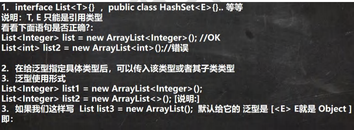

## 泛型

### 1.泛型的基本介绍

1. 泛型又称参数化类型
2. 在类声明或实例化时只要指定好需要的具体的类型即可
3. Java泛型可以保证如果程序在编译时没有发出警告，运行时就不会产生类型转换异常。同时，代码更加简洁、健壮
4. 泛型的作用：可以在类声明时通过一个标识表示类中某个属性的类型，或者是某个方法的返回值类型，或者是参数类

### 2.泛型的语法

#### 2.1 泛型的声明

interface 接口 <T>{}和 class 类<k,v>{}

具体实例：

```java
package com.zmm.set_;

import java.util.*;

/**
 * @author zmm
 */
public class HashSet_ {
    public static void main(String[] args) {
        HashSet<Student> hashSet = new HashSet<>();
        hashSet.add(new Student("zmm",23));
        hashSet.add(new Student("zmm1",24));

        for (Student student :hashSet) {
            System.out.println(student+",");
        }

        HashMap<String,Student> stu= new HashMap<>();
        stu.put("1",new Student("zmm2",25));
        stu.put("2",new Student("zmm3",25));

        Set<Map.Entry<String, Student>> entries = stu.entrySet();

        Iterator<Map.Entry<String, Student>> iterator = entries.iterator();
        while (iterator.hasNext()) {
            Map.Entry<String, Student> next = iterator.next();
            System.out.println(next.getKey()+"-"+next.getValue());

        }


    }
}

class Student{
    private String name;
    private int age;

    public Student(String name, int age) {
        this.name = name;
        this.age = age;
    }

    public String getName() {
        return name;
    }

    public void setName(String name) {
        this.name = name;
    }

    public int getAge() {
        return age;
    }

    public void setAge(int age) {
        this.age = age;
    }

    @Override
    public String toString() {
        return "Student{" +
                "name='" + name + '\'' +
                ", age=" + age +
                '}';
    }
}
```

 ### 3.泛型使用细节



