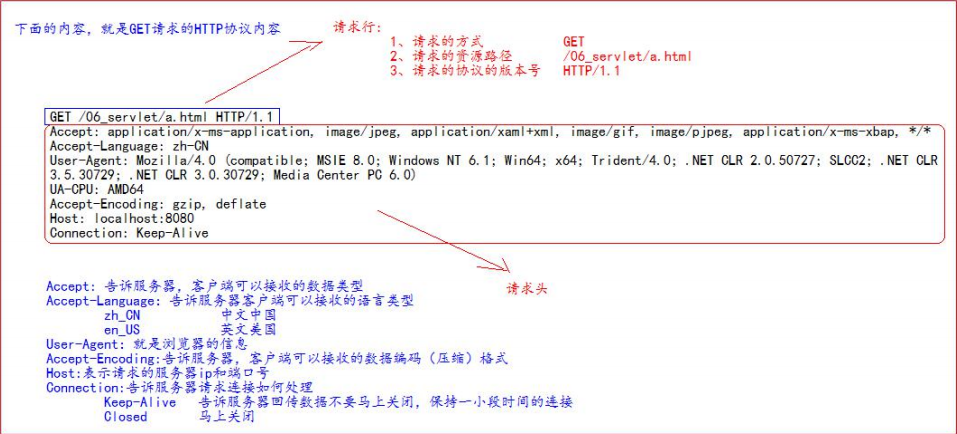
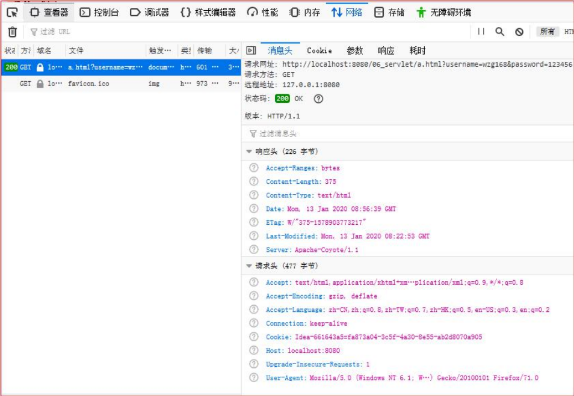

# Servle

## 1. Servlet技术

### 1.1 什么是Servlet

1、Servlet 是 JavaEE 规范之一。规范就是接口 

2、Servlet 就 JavaWeb 三大组件之一。三大组件分别是：Servlet 程序、Filter 过滤器、Listener 监听器。 

3、Servlet 是运行在服务器上的一个 java 小程序，它可以接收客户端发送过来的请求，并响应数据给客户端。

### 1.2 手动实现Servlet程序

1、编写一个类去实现 Servlet 接口 

2、实现 service 方法，处理请求，并响应数据 

3、到 web.xml 中去配置 servlet 程序的访问地址：配置如下图：


代码：

```
<servlet>
    <servlet-name>HelloServlet</servlet-name>
    <servlet-class>com.zmm.servlet.HelloServlet</servlet-class>
</servlet>

<servlet-mapping>
    <servlet-name>HelloServlet</servlet-name>
    <url-pattern>/hello</url-pattern>
</servlet-mapping>
```


###1.3 url地址到Servlet程序的访问


### 1.4 Servlet的生命周期

1、执行 Servlet 构造器方法 

2、执行 init 初始化方法

+ 第一、二步，是在第一次访问，的时候创建 Servlet 程序会调用。 

3、执行 service 方法

+ 第三步，每次访问都会调用。

4、执行 destroy 销毁方法 第四步，在 web 

### 1.5 get和post请求的分发处理


### 1.6 通过继承HttpServlet实现Servlet程序

**一般在实际项目开发中，都是使用继承 HttpServlet 类的方式去实现 Servlet 程序。**

步骤：

1、编写一个类去继承 HttpServlet 类 

2、根据业务需要重写 doGet 或 doPost 方法 

3、到 web.xml 中的配置 Servlet 程序的访问地址

### 1.7 Servlet类的继承体系


## 2.ServletConfig类

1. ServletConfig 类从类名上来看，就知道是 Servlet 程序的配置信息类。 

2. Servlet 程序和 ServletConfig 对象都是由 Tomcat 负责创建，我们负责使用。 

3. Servlet 程序默认是第一次访问的时候创建，ServletConfig 是每个 Servlet 程序创建时，就创建一个对应的 ServletConfig 对 象

### 2.1 ServletConfig 类的三大作用

1、可以获取 Servlet 程序的别名 servlet-name 的值 

2、获取初始化参数 init-param 

3、获取 ServletContext 对象


## 3. ServletContext类


## 4.HTTP协议

### 4.1**什么是协议? **

​	协议是指双方，或多方，相互约定好，大家都需要遵守的规则，叫协议。

**HTTP 协议**

​	就是指，客户端和服务器之间通信时，发送的数据，需要遵守的规则，叫 HTTP 协议。 HTTP 协议中的数据又叫报文。

### 4.2 请求的HTTP协议格式

客户端给服务器发送数据叫请求。 

服务器给客户端回传数据叫响应。 

请求又分为 GET 请求，和 POST 请求两种

#### GET请求

1、请求行

​	(1) 请求的方式 GET 

​	(2) 请求的资源路径[+?+请求参数] 

​	(3) 请求的协议的版本号 HTTP/1.1 

2、请求头 

​	key : value 组成 不同的键值对，表示不同的含义。




#### POST请求

1、请求行

​	(1) 请求的方式 POST 

​	(2) 请求的资源路径[+?+请求参数] 

​	(3) 请求的协议的版本号 HTTP/1.1 

2、请求头 

​	1) key : value 不同的请求头，有不同的含义 

​	空行 

3、请求体 ===>>> 就是发送给服务器的数据


### 4.3 常用请求头的说明 

Accept: 表示客户端可以接收的数据类型 

Accpet-Languege: 表示客户端可以接收的语言类型 

User-Agent: 表示客户端浏览器的信息 

Host： 表示请求时的服务器 ip 和端口

### 4.4 哪些是 GET 请求，哪些是 POST 请求

**GET 请求有哪些：** 

​	1、form 标签 method=get 

​	2、a 标签 

​	3、link 标签引入 css 

​	4、Script 标签引入 js 文件 

​	5、img 标签引入图片 

​	6、iframe 引入 html 页面 

​	7、在浏览器地址栏中输入地址后敲回车 

**POST 请求有哪些： **

​	8、form 标签 method=pos

### 4.6 响应的 HTTP 协议格式

1、响应行 

​	(1) 响应的协议和版本号 

​	(2) 响应状态码 

​	(3) 响应状态描述符 

2、响应头 

​	(1) key : value 不同的响应头，有其不同含义 

​	**空行 **

3、响应体 ---->>> 就是回传给客户端的数


###4.7 常用的响应码说明

200 	表示请求成功 

302 	表示请求重定向

404 	表示请求服务器已经收到了，但是你要的数据不存在（请求地址错误） 

500 	表示服务器已经收到请求，但是服务器内部错误（代码错误)


### 4.8 MIME 类型说明

MIME 是 HTTP 协议中数据类型。 

MIME 的英文全称是"Multipurpose Internet Mail Extensions" 多功能 Internet 邮件扩充服务。MIME 类型的格式是“大类型/小 类型”，并与某一种文件的扩展名相对应




## 5.HttpServletRequest类


### 5.1 HttpServletReuest类有什么作用

​	每次只要有请求进入 Tomcat 服务器，Tomcat 服务器就会把请求过来的 HTTP 协议信息解析好封装到 Request 对象中。 然后传递到 service 方法（doGet 和 doPost）中给我们使用。我们可以通过 HttpServletRequest 对象，获取到所有请求的 信息。


### 5.2 HttpServletRequest类的常用方法


代码示例：

```java
public class RequestAPIServlet extends HttpServlet {
    @Override
    protected void doGet(HttpServletRequest req, HttpServletResponse resp) throws ServletException, IOException {
        System.out.println("URI:"+req.getRequestURI());
        System.out.println("URL:"+req.getRequestURL());
        System.out.println("客户端ip地址："+req.getRemoteHost());
        System.out.println("请求头User-Agent:"+req.getHeader("User-Agent"));
        System.out.println("请求的方式："+req.getMethod());

    }
}
```


### 5.3 如何获取参数

表单

```
<form action="http://localhost:8080/07_servlet/parameterServlet" method="get">
    用户名：<input type="text" name="username"><br/>
    密  码：<input type="password" name="password"><br/>
    兴趣爱好：<input type="checkbox" name="hobby" value="cpp">c++
    <input type="checkbox" name="hobby" value="java"><br/>Java
    <input type="checkbox" name="hobby" value="js"><br/>JavaScript<br/>
    <input type="submit">

</form>
```

Java代码

```java
public class ParameterServlet extends HttpServlet {
    @Override
    protected void doGet(HttpServletRequest req, HttpServletResponse resp) throws ServletException, IOException {
        String username = req.getParameter("username");
        String password = req.getParameter("password");
        String[] hobby = req.getParameterValues("hobby");
        System.out.println("用户名：" + username);
        System.out.println("密码：" + password);
        System.out.println("兴趣爱好：" + Arrays.asList(hobby));

    }
}
```


### 5.4 请求转发

什么是请求的转发?  

请求转发是指，服务器收到请求后，从一次资源跳转到另一个资源的操作叫请求转发。


 


问号后面是请求的参数


### 5.5 base标签的作用


### 5.6 Web中的相对路径和绝对路径


###5.7 web中/斜杠的不同意义


## 6.HttpServletResponse 类

### 6.1 HttpServletResponse 类的作用

​	HttpServletResponse 类和 HttpServletRequest 类一样。每次请求进来，Tomcat 服务器都会创建一个 Response 对象传 递给 Servlet 程序去使用。HttpServletRequest 表示请求过来的信息，HttpServletResponse 表示所有响应的信息， 

​	我们如果需要设置返回给客户端的信息，都可以通过 HttpServletResponse对象来进行设置

### 6.2 两个输出流的说明

字节流 			getOutputStream(); 			常用于下载（传递二进制数据） 

字符流 			getWriter(); 						  常用于回传字符串（常用） 

两个流同时只能使用一个。 

使用了字节流，就不能再使用字符流，反之亦然，否则就会报错

### 6.3 往客户端回传数据


### 6.4 请求重定向

​	请求重定向，是指客户端给服务器发请求，然后服务器告诉客户端说。我给你一些地址。你去新地址访问。叫请求 重定向（因为之前的地址可能已经被废弃）。


## 7.JavaEE三层架构介绍


