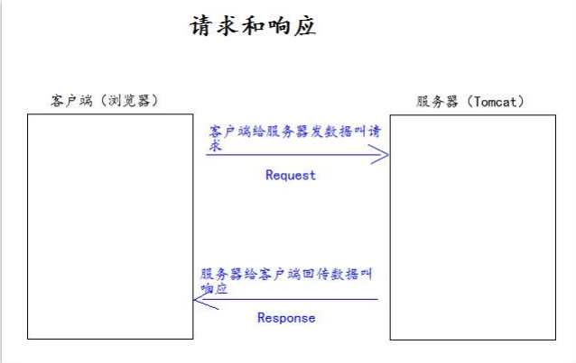
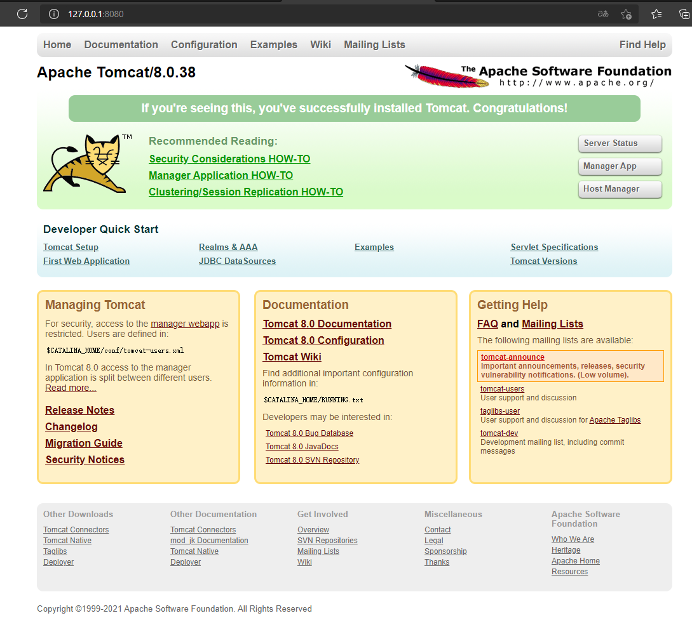
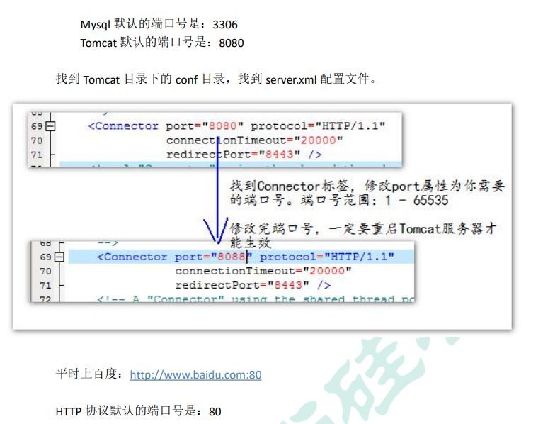
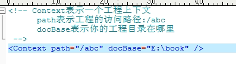
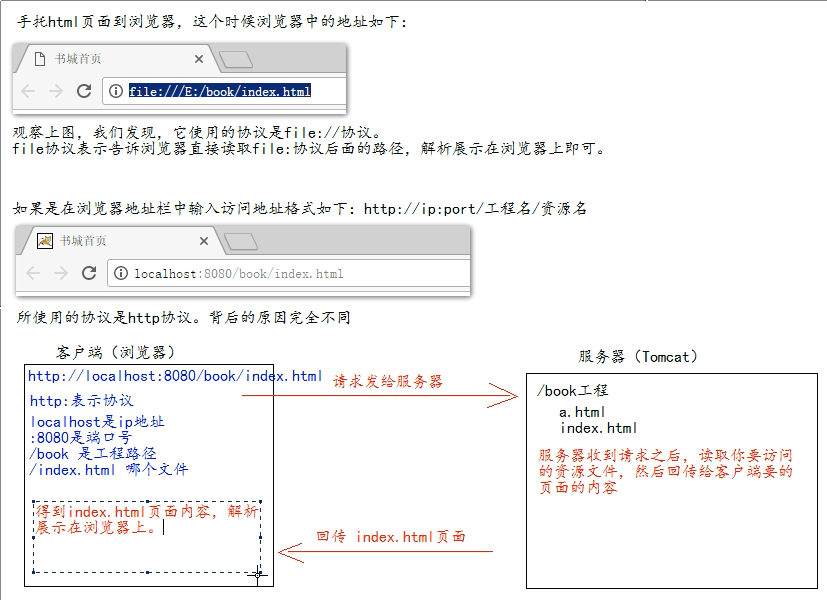
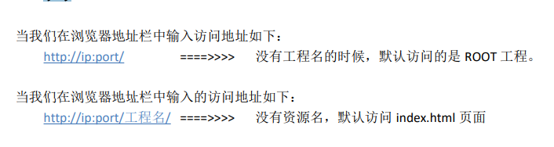
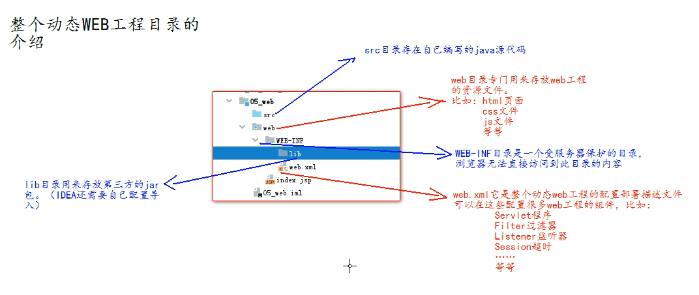
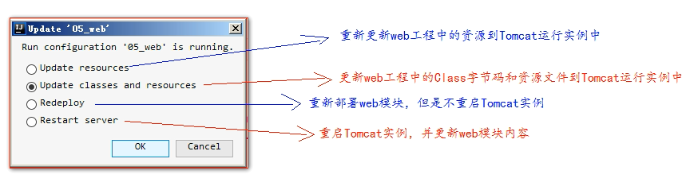
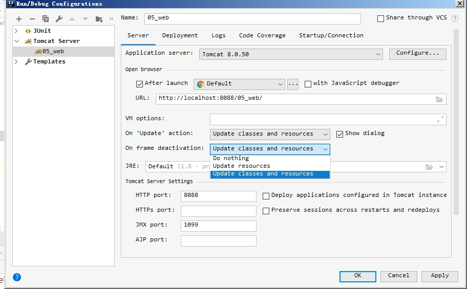

#1. JavaWeb 的概念 

a)什么是 JavaWeb 

​	JavaWeb 是指，所有通过 Java 语言编写可以通过浏览器访问的程序的总称，叫 JavaWeb。 

​	JavaWeb 是基于请求和响应来开发的

b)什么是请求 

​	请求是指客户端给服务器发送数据，叫请求 Request。

c)什么是响应 

​	响应是指服务器给客户端回传数据，叫响应 Response。 

d)请求和响应的关系 

​	请求和响应是成对出现的，有请求就有响应。

#2.Web 资源的分类

web 资源按实现的技术和呈现的效果的不同，又分为静态资源和动态资源两种。 

静态资源： html、css、js、txt、mp4 视频 , jpg 图片 

动态资源： jsp 页面、Servlet 程序

# 3. Tomcat服务器

## 3.1 基本介绍：

**Tomcat：**

由 Apache 组织提供的一种 Web 服务器，提供对 jsp 和 Servlet 的支持。它是一种轻量级的 javaWeb 容器（服务 器），也是当前应用最广的 JavaWeb 服务器（免费）。

**目录介绍：**

bin              专门用来存放 Tomcat 服务器的可执行程序 

conf            专门用来存放 Tocmat 服务器的配置文件 

lib                专门用来存放 Tomcat 服务器的 jar 包 

logs             专门用来存放 Tomcat 服务器运行时输出的日记信息 

temp           专门用来存放 Tomcdat 运行时产生的临时数据 

webapps    专门用来存放部署的 Web 工程。

work            是 Tomcat 工作时的目录，用来存放 Tomcat 运行时 jsp 翻译为 Servlet 的源码，和 Session

##3.2 **如何启动Tomcat服务器**

方法一：

找到 Tomcat 目录下的 bin 目录下的 startup.bat 文件，双击，就可以启动 Tomcat 服务器。

方法二：

1、打开命令行

 2、cd 到 你的 Tomcat 的 bin 目录下

3、敲入启动命令：catalina run

**关闭Tomcat服务器**

1. 关闭tomcat服务器窗口或者将其设置为当前窗口然后快捷键ctrl+c

2. **找到 Tomcat 的 bin 目录下的 shutdown.bat 双击，就可以停止 Tomcat 服务**

 **如何测试 Tomcat 服务器启动成功？**

 打开浏览器，在浏览器地址栏中输入以下地址测试： 

1、http://localhost:8080 

2、http://127.0.0.1:8080 

3、http://真实 ip:808

浏览器出现下列界面则配置成功

## 3.3 如何修改Tomcat的端口号

## 3.4 如何部署 web 工程到 Tomcat 中

**方法一：**

+ 只需要把 web 工程的目录拷贝到 Tomcat 的 webapps 目录下 即可。

+ 访问方法：
  + 本机访问方式：
    + http://localhost:8080/工程的路径
  + 他人访问的方式：
    + 只需要在浏览器中输入访问地址格式如下： http://ip:port/工程名/目录下/文件名 其中ip是本机的IP地址

**方法二：**

找到 Tomcat 下的 conf 目录\Catalina\localhost\ 下,创建如下的配置文件：

此时doBase不受工程存放位置的限制。配置完之后需要重新启动Tomcat。

可能会出现utf-8的问题，需要选择编码方式

**手拖html页面到浏览器和在浏览器中输入http://ip:端口号/工程名/访问的区别**

**ROOT 的工程的访问，以及 默认 index.html 页面的访问**

## 3.5 动态WEB工程目录的介绍

如何在idea中启动部署web模板

**配置资源热部署**

当页面发生更改之后，浏览器上刷新是没有办法显示更改之后的效果。需要配置资源热部署

