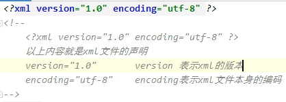
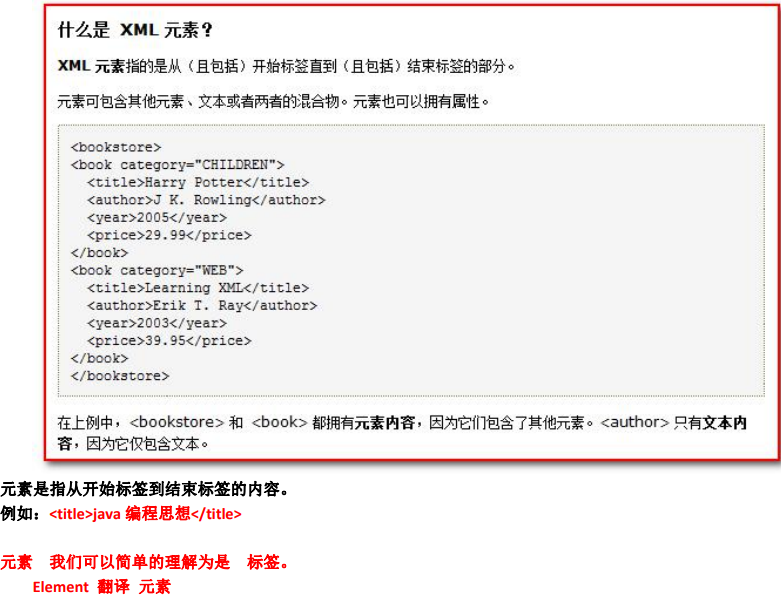
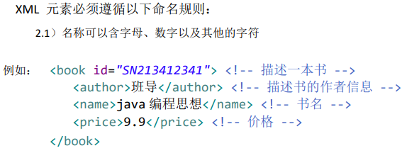
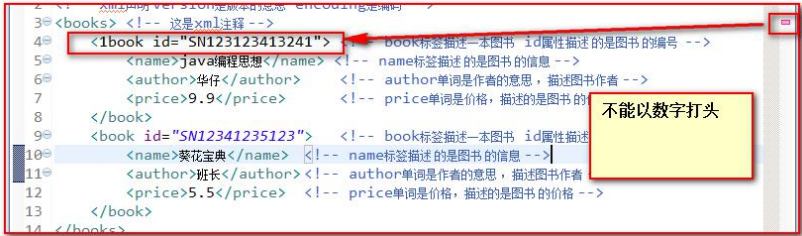
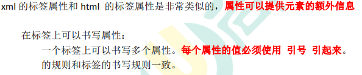
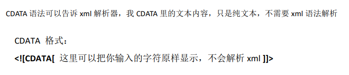

# XML

## 1.XML简介

### 1.1 什么是xml？

xml 是可扩展的标记性语言。

###1.2 xml 的作用？ 

xml 的主要作用有： 

1、用来保存数据，而且这些数据具有自我描述性 

2、它还可以做为项目或者模块的配置文件 

3、还可以做为网络传输数据的格式（现在 JSON 为主）。

##2.xml语法

1. 文档声明。 

2. 元素（标签） 
3. xml 属性 
4. xml 注释
5. 文本区域（CDATA 区）

### 2.1 文档声明



###2.2 元素（标签）

####2.2.1**什么是xml元素**



#### 2.2.2 **xml元素的命名规则**



**2.名称不能以数字或者标点符号开始**



3.**名称不能含空格**

**4.xml中的元素（标签）也分成单标签和双标签**

### 2.3 xml属性




**部分语法规则：**

**xml中的特殊字符**

\>特殊字符:   &gt；

<特殊字符:  \&lt; 

**文本区域（CDATA区）**



## 3. dom4j 解析技术

 Dom4j 它是第三方的解析技术。

我们需要使用第三方给我们提供好的类库才可以解析 xml 文件。

### 3.1 dom4j编程步骤：

第一步： 先加载 xml 文件创建 Document 对象

```java
public void getDocument() throws DocumentException {
	// 要创建一个 Document 对象，需要我们先创建一个 SAXReader 对象
	SAXReader reader = new SAXReader();
	// 这个对象用于读取 xml 文件，然后返回一个 Document。
	Document document = reader.read("src/books.xml");
    // 打印到控制台，看看是否创建成功
    System.out.println(document);
}
```

第二步：通过 Document 对象拿到根元素对象 

第三步：通过根元素.elelemts(标签名); 可以返回一个集合，这个集合里放着。所有你指定的标签名的元素对象 

第四步：找到你想要修改、删除的子元素，进行相应在的操作 

```java
@Test
//在Junit测试中，相对路径是从模块名开始算
public void test2() throws DocumentException {
    //读取xml文件
    SAXReader reader=new SAXReader();
    Document document = reader.read("src/books.xml");
    //通过Document对象获取根元素
    Element rootElement =document.getRootElement();
    //通过根元素获取指定标签对象
        //element和elements都是可以通过标签名查找子元素，elements是返回多个，element是返回单个
        List<Element> books = rootElement.elements("book");
        //遍历，处理每个book标签转换成Book类
        for (Element book : books) {
            //asXML()把标签对象。转换为标签字符串
            //System.out.println(book.asXML());
            Element nameElement = book.element("name");
            //两种获得标签中的文本内容方式：getText()或标签名.elementText()
            //getText();可以获取标签中的文本内容
            String nameText=nameElement.getText();
            //直接或获取指定标签名的文本内容
            String priceText = book.elementText("price");
            String authorText = book.elementText("author");
            String snValue = book.attributeValue("sn");

            System.out.println(new Book(snValue,nameText,Double.parseDouble(priceText),authorText));

}}
```

第五步，保存到硬盘上


