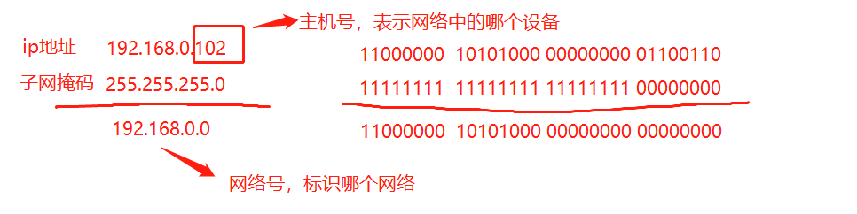
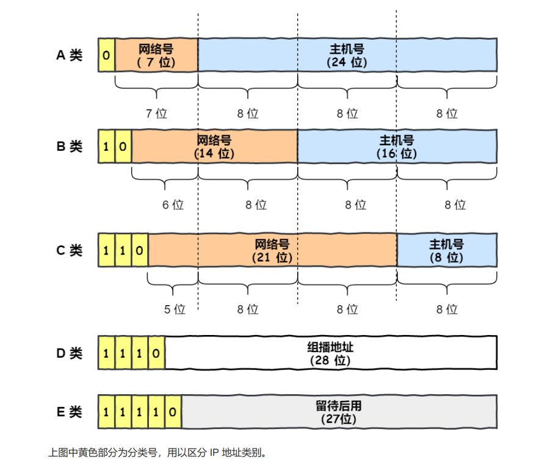
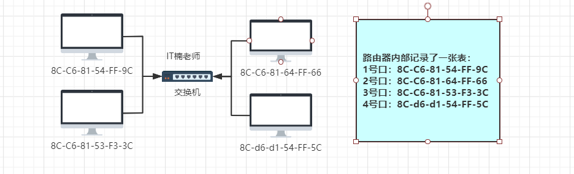
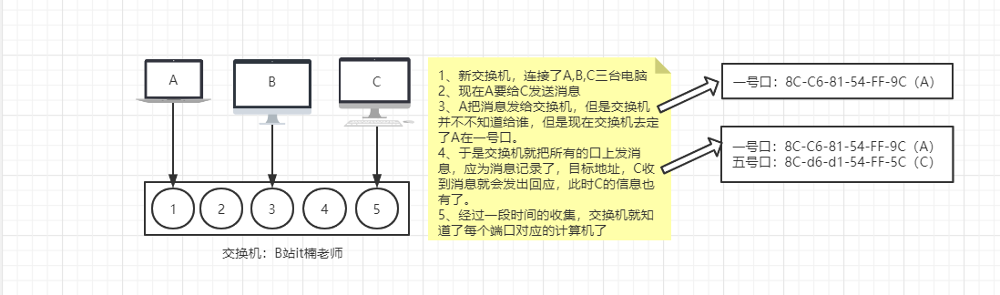
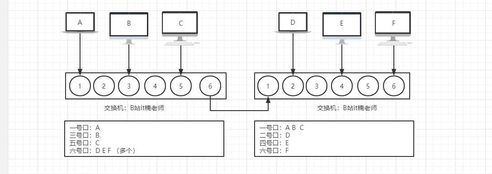

# HTTP协议

**HTTP协议是客户端服务器交互的一种通讯的格式**

> 什么是交互？
>
> 理解什么是交互，首先要知道什么是请求和响应。
>
> 客户端向服务器发送一段东西（**请求**），服务器收到之后回复（**响应**）
>
> 这个过程就叫做**交互**。
>
> 而HTTP协议就是规定客户端和服务器端双方发送东西的格式。

## ip协议

# 网络
## 网络相关的基本概念

### MAC地址

mac地址也叫**物理地址**和**局域网地址**，主要用户确认网上设备的地址，类似于身份证号，具有唯一标识，每个网卡制作完成之后就有带有一个mac地址，永远都不会改变。

> eg：34-E1-2D-39-8B-85
>
> 长度为48位 (6个字节，每个字节8位)，通常表示为12个**16进制数**

### ip地址

类似与现住址，是标记在网络中的具体位置，一个网卡的ip地址是可以改变的。

> 如果查看IP地址和mac地址？
>
> ipconfig -all

#### IP地址和子网掩码

IP地址只要是用来表示计算机的网络位置，IP地址和子网掩码共同定位一个计算机在网络中的位置。

IP地址和子网掩码进行 与 运算，得到的就是网络号。IP地址就是后面两位0.102就是主机号表示是该网络的中的主机的位置。

网络号的最后一位0和255不能用于分配主机号，0代表的是网络号，255代表的是网络内的广播地址，能够使用的是1~254。

> eg:192.168.10.5/16 后面的代表的是子网掩码的位数。
>
> 0代表的是网络号，255代表的是网络内的广播地址的意思是：
>
> 全0表示整个子网；全1表示向子网上所有设备发送包，即“广播”

u

#### IP地址分类：

1、A类IP地址

一个A类IP地址由1字节的网络地址和3字节主机地址组成，网络地址的最高位必须是“0”， 地址范围从1.0.0.0 到126.0.0.0。可用的A类网络有126个，每个网络能容纳1亿多个主机。  

2、B类IP地址

一个B类IP地址由2个字节的网络地址和2个字节的主机地址组成，网络地址的最高位必须是“10”，地址范围从128.0.0.0到191.255.255.255。可用的B类网络有16382个，每个网络能容纳6万多个主机 。 

3、C类IP地址

一个C类IP地址由3字节的网络地址和1字节的主机地址组成，网络地址的最高位必须是“110”。范围从192.0.0.0到223.255.255.255。C类网络可达209万余个，每个网络能容纳254个主机。 

4、D类地址

用于多点广播（Multicast）。 D类IP地址第一个字节以“lll0”开始，它是一个专门保留的地址。它并不指向特定的网络，目前这一类地址被用在多点广播（Multicast）中。多点广播地址用来一次寻址一组计算机，它标识共享同一协议的一组计算机。224.0.0.0到239.255.255.255用于多点广播 。

5、E类IP地址

以“llll0”开始，为将来使用保留。240.0.0.0到255.255.255.254，255.255.255.255用于广播地址，全零（“0．0．0．0”）地址对应于当前主机。全“1”的IP地址（“255．255．255．255”）是当前子网的广播地址。

**IP私有地址：**

在IP地址3种主要类型里，各保留了3个区域作为私有地址，其地址范围如下： 

A类地址：10.0.0.0～10.255.255.255 

B类地址：172.16.0.0～172.31.255.255 

C类地址：192.168.0.0～192.168.255.255

A类地址的第一组数字为1～126。注意，数字0和 127不作为A类地址，数字127保留给内部回送函数，而数字0则表示该地址是本地宿主机，不能传送。

B类地址的第一组数字为128～191。

C类地址的第一组数字为192～223。

### 交换机

第一次的时候会广播知道各个主机的物理地址将其记录在表中，往后发送便可以直接定位。

>ascii码：一个英文是一个字节
>
>utf-8：一个英文是一个字节，一个汉字是三个字节
>
>unicode：一个英文两个字节
>
>如果发送一个数据段 hello（utf-8），说明数据段的长度是5字节。
>
>宽带：200MHZ、500MHZ等等。
>
>>1MHZ=10^6HZ, 则200MHZ=2*10^8HZ，意思是每秒传输200兆个0和1位（bit），转换成字节（byte）就是2x10^8/8,准换成kb就是再除以1024，转换成M就是再除以1024，准换成G就是再除以1024。
>>
>>结果就是200MHZ的宽带理论传输数据就是23.8M/s
>
>网线：
>
>> 五类线：百兆双绞线，最多支持100M，传输距离超过100m就会产生衰减
>>
>> 七类线：千兆双绞线，
>
>调制解调器：
>
>俗称：猫，
>
>作用：将外界的光信号转换成家用能够识别的电信号

交换机效率比较高，而且可以进行桥接

>src:源
>
>dist:目标

### 路由器

网络与网络之间连接通信的设备

家用路由器有个wan口，有好几个lan扣，wan口用来连接互联网端（一般是连接猫，即调制调节器），lan口用来连接家庭设备。

现在路由器一般都内置一个小型的交换机，用于lan口。

>什么是网关？
>
>网关实质上是一个网络通向其他网络的IP地址。
>
>比如有网络A和网络B，
>
>网络A的IP地址范围为“192.168.1.1~192. 168.1.254”，子网掩码为255.255.255.0；
>
>网络B的IP地址范围为“192.168.2.1~192.168.2.254”，子网掩码为255.255.255.0。
>
>在没有路由器的情况下，两个网络之间是不能进行TCP/IP通信的，即使是两个网络连接在同一台交换机(或集线器)上，TCP/IP协议也会根据子网掩码(255.255.255.0)判定两个网络中的主机处在不同的网络里。而要实现这两个网络之间的通信，则必须通过网关。如果网络A中的主机发现数据包的目的主机不在本地网络中，就把数据包转发给它自己的网关，再由网关转发给网络B的网关，网络B的网关再转发给网络B的某个主机。网络B向网络A转发数据包的过程。
>
>对默认网关，其意思是一台主机如果找不到可用的网关，就把数据包发给默认指定的网关，由这个网关来处理数据包。现在主机使用的网关，一般指的是默认网关。
>
>

