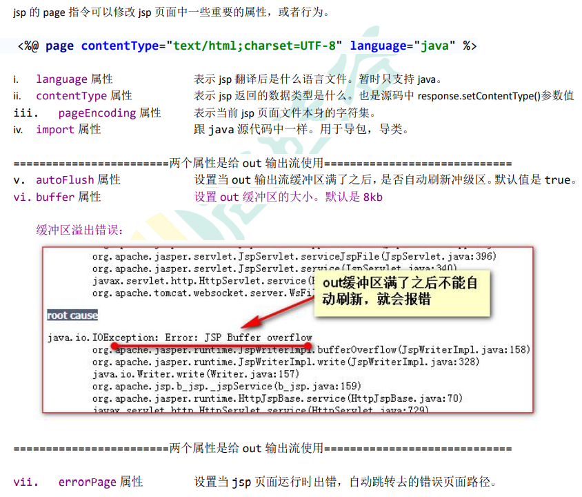

# jsp

## jsp介绍

jsp 的全称是 java server pages。Java 的服务器页面。

 jsp 的主要作用是代替 Servlet 程序回传 html 页面的数据。

 因为 Servlet 程序回传 html 页面数据是一件非常繁锁的事情。开发成本和维护成本都极高

## jsp的本质

jsp页面本质上是一个servlet程序。

当第一次访问jsp页面时，Tomcat服务器会把jsp页面翻译成为一个Java源文件。并且将其编成.class字节码程序。

跟踪原代码发现，HttpJspBase 类。它直接地继承了 HttpServlet 类。也就是说。jsp 翻译出来的 java 类，它间接了继 承了 HttpServlet 类。也就是说，翻译出来的是一个 Servlet。

其底层实现也是通过输出流，把html页面数据回传给客户端。

## jsp的三种语法

### jsp头部的page指令

