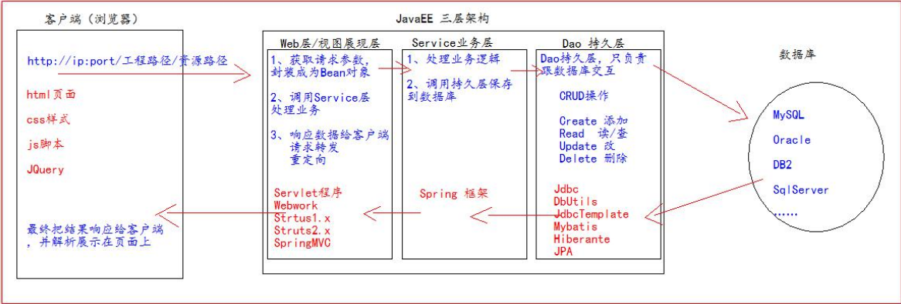
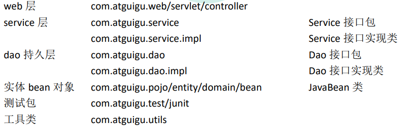

javaEE项目分为三层架构

在javaweb项目中：

​	web层：表示层，给页面传递数据

​	service层：业务逻辑层,对数据进行处理

​	dao层：数据访问层,操作数据库，对数据进行增删改查

一般常见的命名：

编码流程：

1. 先创建项目要需要的数据库和表。

2. 编写数据库表对应的JavaBean对象。domain

3. 编写工具类jdbcUtils （基于druid数据库连接池的工具类）

   1. 编写配置文件  jdbc.properties
   2. **复习**德鲁伊数据库连接池的方法

4. 编写BaseDao: **复习**DButils的方法

5. 编写UserService

6. 编写Web层、

   1. base标签fu'xi

7. 

   

   

   