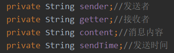

#  项目开发流程

1. 需求分析
   1. 需求分析师:懂技术+知道行业规范
   2. 出一个需求分析报告（白皮书），包含该项目功能，客户具体要求。
2. 设计阶段
   1. 架构师或者项目经理
   2. 设计工作（UML类图，流程图，模块设计，数据库设计，使用什么架构）
   3. 原型开发
   4. 组建团队
3. 实现阶段
   1. 程序员
   2. 完成架构师的模块功能
   3. 测试自己的模块
4. 测试阶段
   1. 测试工程师
   2. 单元测试，测试用例，白盒测试，黑盒测试，集成测试。
5. 实施阶段
   1. 实施工程师（对开发能力要求不高/要求环境配置部署能力高）
   2. 项目正确的部署到客户的平台，并保证运行正常
6. 维护阶段
   1. 发现bug解决/项目升级


# 多用户通信系统

## 需求分析

1. 界面设计
2. 拉取在线用户列表
3. 无异常退出（客户端、服务端）
4. 私聊
5. 群聊
6. 发文件
7. 服务器推送新闻

## 开发步骤

### QQClient部分

1. 因为Message和User是客户端和服务端共有的，所以在两个project（QQClient和QQServer）中创建共有的类（Message、User）在qqcommon包中。其中User表示一个用户信息，Message表示客户端和服务端通信时的消息对象

   1. User类中有（私有）用户名userId和（私有）密码passwd。构造器、get和set方法

   2. User对象将会在网络进行传输，因为是传输的是对象所以使用的是对象流，而一个类的对象想要通过object对象流类的形式进行读写则该类需要implements Serializable接口，使其能够序列化（保存数据时保存数据的值和数据类型）

   3. Message对象也要通过对象流的形式进行读写，所以也要实现Serializable接口

   4. 分析Message需要使用到什么，

      1. 

      2. get和set方法

      3. 因为Message消息类型有多种，所以添加一个mesType类型的消息类型用来记录，同时设置set和get方法。

      4. 创建一个接口用来定义已知的消息类型

         + 为什么在接口的位置上定义常量？
           + 简化代码

         ```java
         String MESSAGE_LOGIN_SUCCEED="1";//表示登录成功
         String MESSAGE_LOGIN_FAIL="2";//表示登录失败
         ```

2. 创建包qqclient.view

   1. 创建一个类QQView，编写客户端的菜单界面
   2. 细节略

3. 在包qqclient下创建包service

   1. 新建一个类 UserClientService
      1. 在客户端主界面得到输入的用户号和密码，需要发送User对象到服务端验证该用户是否合法，如果合法则返回一个Message对象，告知客户端验证成功。将这一功能封装到UserClientService类中，该类完成用户登录验证和用户注册等功能。
      
      2. 将User做成一个属性，因为可能在其他地方使用到user信息
      
      3. 在该类创建一个方法checkUser，参数是userId和pwd，到服务器验证该用户是否合法。
         1. 在该方法创建一个user对象，然后new一个socket对象与服务端建立连接。
         2. 因为传输的是对象，所以使用对象流向服务端传输信息
         3. 将user对象传输到服务端之后，我们需要得到服务端验证之后的反馈，因为传回来的也是Message对象，所以也是用对象流接收Message对象，但是传回来的对象是Object类型的，所以需要将其强制转换成Message类型。
         4. 为了知道有没有登录成功，我们需要知道服务端传回来的Message对象中的mesType是否是之前在接口中定义的常量1。这里使用if-else语句判断和equals
         
      4. 如果checkUser返回登录成功的消息，创建一个和服务端保持通信的线程。如果登录失败，就不能启动和服务器通信的线程，关闭socket
         1. 这里为什么要创建一个线程？
            1. 一是客户端将来可能需要有多个socket与服务端进行连接，所以需要通过线程来管理socket
            2. 另外socket需要不断从服务器监听消息，如果不开启子线程，那么主线程就无法做其他事。
         2. 创建一个类 ClientConnectServerThread，继承Thread(后面会new一个ClientConnectServerThread线程，然后传入socket对象。开启这个线程，然后再把这个线程传入到一个集合当中去)
            3. 该线程需要持有socket，所以将socket声明为属性
            2. 创建一个构造器可以接受Socket对象
            3. 为了方便得到socket，创建一个get方法
            4. 重写run方法
               1. 因为Thread需要在后台和服务器通信，因此设置一个while循环
               2. 客户端线程，等待读取从服务器端发送的消息
               3. 因为得到消息是Message对象，所以使用对象流去接收并强制转换成Message类型，值得注意的是如果服务器没有发送Message对象，线程会阻塞在这里
         
      5. 因为checkUser方法是返回一个布尔型数据，所以在该方法中声明一个临时变量为false，如果登录成功则将false改为true，最后再返回这个类型。
      
      6. 现在为了后面客户端的扩展，我们将线程放入到集合管理。
      
         1. 在service包中创建ManageClientConnectServerThread类，该类管理客户端连接到服务器端的线程的类。
         2. 把多个线程放入一个（私有）HashMap集合，key就是用户id，value就是线程
      
   3. 将某个线程放入到集合中 addClientConnectServerThread静态方法
         
      4. 通过userId可以得到对应线程 getClientConnectServerThread静态方法
      7. 在主界面的之前的if语句中使用userClientService中的方法来判断是否登录成功
      


拉取在线用户列表模块（Client）

1. 在接口MessageType中定义新的常量

   + ```java
     	String MESSAGE_COMM_MES = "3"; //普通信息包
         String MESSAGE_GET_ONLINE_FRIEND = "4"; //要求返回在线用户列表
         String MESSAGE_RET_ONLINE_FRIEND = "5"; //返回在线用户列表
         String MESSAGE_CLIENT_EXIT = "6"; //客户端请求退出
         String MESSAGE_TO_ALL_MES = "7"; //群发消息报
         String MESSAGE_FILE_MES = "8"; //文件消息(发送文件)
     ```

2. 创建方法onlineFriendList()向服务器端请求在线用户列表（UserClientService）

   + new一个Message , 类型MESSAGE_GET_ONLINE_FRIEND
   + 把message对象发送给服务器
     + 从线程集合中根据userId得到对应的线程的socket，然后得到inputStream，传入对象流
     + 写入message对象到数据通道
   + 之前在线程run方法里面有个不断监听的循环，需要判断得到的message对象是什么类型的，然后做相应的业务处理
     + 判断类型
     + 定义字符串数组接收列表信息
     + for循环输出

​      

无异常退出系统(客户端解决方法)

1. 在main线程调用方法，给服务器端发送一个退出系统的message对象
2. 调用System.exit(0)//正常退出


私聊实现

1. 接收用户希望给某个其他在线用户聊天的内容
2. 将消息构建成Message对象，通过对应的socket发送给服务器
3. 在他的线程（通信线程中），读取到发送的message消息，并显示即可


群聊

​	略


发文件思路

客户端

1. 先把文件a.jpg读取到客户端，字节数组
2. 把文件对应的字节数组封装到message对象[包含文件内容，sender，getter]
3. 将message对象发送给服务端
4. 在接受到包含有文件的消息后，将该文件保存到磁盘


​      
### QQServer部分

1. 在qqserver.service包下创建一个类QQServer，这是服务器，在监听9999，等待客户端连接，并保持通信
   1. 因为ServerSocket会在其他地方使用到，所以将其声明为属性（私有）
   2. 在构造器中创建一个while循环不断监听端口socket.accept（这里如果没有客户端连接的话，就会阻塞在这里），接收User对象判断是否登录通过，如果通过则改变MesType的值。并创建message对象回复客户端，还要创建一个线程和客户端保持通信，该线程需要持有socket对象
      1. 创建线程类ServerConnectClientThread，该类的一个对象和某个客户端保持通信
      2. 私有属性socket和userId，这里的userId是为了区分哪个socket，并且能够解决单点登录问题
      3. 构造器
      4. 重写run方法，创建一个while循环，读取到message对象
   3. 启动该线程
   4. 将该线程放入到集合中
      1. 创建ManageClientThreads类，用于管理和客户端通信的线程
      2. 添加线程对象到集合中
      3. 根据userId返回ServerConnectClientThread线程
   5. 如果登录失败设置mesType的值并且返回给客户端message对象，并且可以关闭socket
   6. 在finally中关闭serverSocket
2. 在QQServer中创建一个集合hashmap用于存放多个用户，如果是这些用户登录，就认为是合法的。
   1. 在静态代码块，初始化这个集合validUsers
3. 写一个checkUser的方法用来验证客户端传入的User对象服务端是否存在


拉取在线用户列表模块（Server）

1. 在接口MessageType中定义新的常量

2. 在run方法里面判断接收的message对象类型

3. 在ManageClientThreads里面编写方法getOnlineUser可以返回在线用户列表

   + 设置一个String类型的变量onlineUserList
   + 遍历集合，遍历hasmap的key，将值传入给onlineUserList
   + 返回字符串

4. 当message对象类型是要求返回用户列表

   + 调用getOnlineUser方法。
   + 创建一个新的message对象，将返回的字符串内容传入，并更改信息类型
   + 更新新的message对象的接收者的值

5. 返回给客户端

    

无异常退出系统(服务端解决方法)

1. 服务器端和某个客户端通信的线程如果接收到了一个退出系统的message后
2. 把这个线程持有的socket关闭
3. 退出线程


细聊实现

1. 可以读取到客户端发送给某个客户的消息
2. 从管理线程的集合中，根据message对象的getterid获取到对应线程的socket
3. 然后将message对象转发给指定的客户

群发


发文件思路分析

发文件思路

客户端

1. 接收到message对象
2. 拆解message对象的gettid，获取该用户的通信线程
3. 将message对象转发给指定用户


### 测试

1. 在QQServer中创建一个包qqframe，里面再创建一个类QQFrame，该类创建QQServer，启动后台的服务
2. 


## 代码

### QQClient

qqcommon

```java
package com.zmm.qqcommon;

import java.io.Serializable;

/**
 * @author zmm
 */
public class Message implements Serializable {
    private String sender;//发送者
    private String getter;//接收者
    private String content;//消息内容
    private String sendTime;//发送时间
    private String mesType;//消息类型[可以在接口定义消息类型]

    public String getSender() {
        return sender;
    }

    public void setSender(String sender) {
        this.sender = sender;
    }

    public String getGetter() {
        return getter;
    }

    public void setGetter(String getter) {
        this.getter = getter;
    }

    public String getContent() {
        return content;
    }

    public void setContent(String content) {
        this.content = content;
    }

    public String getSendTime() {
        return sendTime;
    }

    public void setSendTime(String sendTime) {
        this.sendTime = sendTime;
    }

    public String getMesType() {
        return mesType;
    }

    public void setMesType(String mesType) {
        this.mesType = mesType;
    }
}


```

```java
package com.zmm.qqcommon;

/**
 * @author zmm
 */
public interface MessageType {
    /*
        在接口中定义了一些常量
        不同的常量的值，表示不同的消息类型
     */
    String MESSAGE_LOGIN_SUCCEED="1";//表示登录成功
    String MESSAGE_LOGIN_FAIL="2";//表示登录失败
}
```

```java
package com.zmm.qqcommon;

import java.io.Serializable;

/**
 * @author zmm
 * 表示一个用户信息
 */
public class User implements Serializable {
    private String userId;
    private String passwd;

    public User() {
        
    }
    
    public User(String userId, String passwd) {
        this.userId = userId;
        this.passwd = passwd;
    }

    public String getUserId() {
        return userId;
    }

    public void setUserId(String userId) {
        this.userId = userId;
    }

    public String getPasswd() {
        return passwd;
    }

    public void setPasswd(String passwd) {
        this.passwd = passwd;
    }
}
```

QQClient-view-QQView

```java
package com.zmm.qqclient.view;

import com.zmm.qqclient.Utility.Utility;

import java.util.Scanner;

/**
 * @author zmm
 */
public class QQView {
    private boolean loop=true;
    private String key="";

    public static void main(String[] args) {
        new QQView().mainMenu();
        System.out.println("客户端退出系统。。。。。");
    }
    //显示主菜单
    private void mainMenu(){
        while(loop){
            System.out.println("=============欢迎登录网络通信系统=============");
            System.out.println("1 登录系统");
            System.out.println("9 退出系统");
            Scanner scanner = new Scanner(System.in);
            System.out.print("请输入你的选择：");
            key= Utility.readString(1);
            switch (key){
                case "1":{
                    System.out.print("请输入用户号：");
                    String userId=Utility.readString(50);
                    System.out.print("请输入你的密码：");
                    String pwd=Utility.readString(50);
                    if(false){
                        System.out.println("=============欢迎"+userId+"用户=============");
                        while(loop){

                            System.out.println("=============网络通信系统二级菜单(用户"+userId+")=============");
                            System.out.println("1 显示在线用户列表");
                            System.out.println("2 群发消息");
                            System.out.println("3 私聊消息");
                            System.out.println("4 发送文件");
                            System.out.println("9 退出系统");
                            System.out.print("请输入你的选择：");
                            String key=Utility.readString(1);
                            switch (key){
                                case "1":
                                    System.out.println("======当前在线用户列表======");

                                    break;
                                case "2":
                                    System.out.println("2 群发消息");
                                    break;
                                case "3":
                                    System.out.println("3 群发消息");
                                    break;
                                case "4":
                                    System.out.println("4 发送文件");
                                    break;
                                case "9":
                                    loop=false;
                                    break;
                                default:
                                    System.out.println("输入有误，请重新输入！");

                            }
                        }


                    }else{
                        System.out.println("=============登录失败=============");
                    }
                    break;
                }
                case "9":{
                    loop=false;
                    break;
                }

            }

        }
    }
}
```

service

```java
package com.zmm.qqclient.service;

import java.io.IOException;
import java.io.ObjectInputStream;
import java.net.Socket;
import com.zmm.qqcommon.Message;

/**
 * @author zmm
 */
public class ClientConnectServerThread extends Thread{
    private Socket socket;

    public ClientConnectServerThread(Socket socket) {
        this.socket=socket;
    }


    public Socket getSocket() {
        return socket;
    }

    @Override
    public void run() {
        while(true){
            ObjectInputStream ois = null;
            try {
                ois = new ObjectInputStream(socket.getInputStream());
                Message message = (Message)ois.readObject();


            } catch (Exception e) {
                e.printStackTrace();
            }
        }
    }
}
```

```java
package com.zmm.qqclient.service;

import java.util.HashMap;

/**
 * @author zmm
 */
public class ManageClientConnectServerThread {
    //把多个线程放入一个HashMap集合，key就是用户id，value就是线程
    private static HashMap<String,ClientConnectServerThread> hm=new HashMap<>();

    //将某个线程加入到集合
    public static void addClientConnectServerThread(String userId,ClientConnectServerThread clientConnectServerThread){
        hm.put(userId,clientConnectServerThread);
    }
    //通过userId 可以得到对应线程
    public static ClientConnectServerThread getClientConnectServerThread(String userId){
        return hm.get(userId);
    }

}
```

```java
package com.zmm.qqclient.service;

import com.zmm.qqcommon.Message;
import com.zmm.qqcommon.MessageType;
import com.zmm.qqcommon.User;

import java.io.IOException;
import java.io.ObjectInputStream;
import java.io.ObjectOutputStream;
import java.net.InetAddress;
import java.net.Socket;
import java.net.UnknownHostException;

/**
 * @author zmm
 * 该类完成用户登录验证和用户注册等功能
 */
public class UserClientService {

    boolean b=false;
    //因为可能在其他地方会使用到user信息，因此变作成员属性
    private User u=new User() ;
    //因为socket在其他地方也可能使用，因此作出属性
    private Socket socket;

    //根据userId和pwd到服务器验证用户是否合法
    public boolean checkUser(String userId,String pwd)  {

        //创建User对象
        u.setUserId(userId);
        u.setPasswd(pwd);

        //连接到服务端，发送u对象

        try {
            socket = new Socket(InetAddress.getLocalHost(), 9999);
            //得到ObjectOutputStream对象
            ObjectOutputStream oos = new ObjectOutputStream(socket.getOutputStream());
            oos.writeObject(u);

            //读取从服务器回复的Message对象
            ObjectInputStream ois = new ObjectInputStream(socket.getInputStream());
            Message ms = (Message) ois.readObject();

            if(ms.getMesType().equals(MessageType.MESSAGE_LOGIN_SUCCEED)){


                //创建一个和服务器保持通信的线程-> 创建一个类ClientConnectServerThread
                ClientConnectServerThread clientConnectServerThread = new ClientConnectServerThread(socket);

                //启动一个线程
                clientConnectServerThread.start();
                //为了后续客户端的扩展，将线程放入到集合管理
                ManageClientConnectServerThread.addClientConnectServerThread(userId,clientConnectServerThread);
                b=true;


            }else{
                //如果登录失败，我们就不能启动和服务器通信的线程，关闭socket
                socket.close();
            }


        } catch (Exception e) {
            e.printStackTrace();
        }
        return b;
    }
}
```

### QQServer

```java
package com.zmm.qqserver.service;

import java.net.Socket;
import java.util.HashMap;

/**
 * @author zmm
 */
public class ManageClientThreads {

    private static HashMap<String,ServerConnectClientThread> hashMap=new HashMap<>();

    public static void addServerConnectClientThread(String userId,ServerConnectClientThread serverConnectClientThread){
        hashMap.put(userId,serverConnectClientThread);
    }

    public static ServerConnectClientThread getServerConnectClientThread(String userId){
        return hashMap.get(userId);
    }

}
```

```java
package com.zmm.qqserver.service;

import com.zmm.qqcommon.MessageType;
import com.zmm.qqcommon.User;

import java.io.IOException;
import java.io.InputStream;
import java.io.ObjectInputStream;
import java.io.ObjectOutputStream;
import java.net.ServerSocket;
import java.net.Socket;
import com.zmm.qqcommon.Message;

/**
 * @author zmm
 */
public class QQServer {
    private ServerSocket serverSocket=null;


    public QQServer(){
        try {
            System.out.println("服务端在9999端口监听。。。");
            serverSocket=new ServerSocket(9999);

            while(true){
                Socket socket = serverSocket.accept();
                InputStream inputStream = socket.getInputStream();
                ObjectInputStream ois = new ObjectInputStream(inputStream);

                ObjectOutputStream oos = new ObjectOutputStream(socket.getOutputStream());


                User user = (User)ois.readObject();
                Message message = new Message();

                if(user.getUserId().equals("100") && user.getPasswd().equals("123")){
                    message.setMesType(MessageType.MESSAGE_LOGIN_SUCCEED);
                    oos.writeObject(message);
                    ServerConnectClientThread serverConnectClientThread=new ServerConnectClientThread(socket,user.getUserId());
                    serverConnectClientThread.start();


                }else{
                    message.setMesType(MessageType.MESSAGE_LOGIN_FAIL);
                    oos.writeObject(message);
                    socket.close();
                }

            }
        } catch (Exception e) {
            e.printStackTrace();
        }finally {
            try {
                serverSocket.close();
            } catch (IOException e) {
                e.printStackTrace();
            }
        }


    }
}
```

```java
package com.zmm.qqserver.service;

import java.io.IOException;
import java.io.InputStream;
import java.io.ObjectInputStream;
import java.net.Socket;
import com.zmm.qqcommon.Message;

/**
 * @author zmm
 */
public class ServerConnectClientThread extends Thread{
    private Socket socket;
    private String userId;

    public ServerConnectClientThread(Socket socket, String userId) {
        this.socket = socket;
        this.userId = userId;
    }

    @Override
    public void run() {
        try {

            while(true){
                InputStream inputStream = socket.getInputStream();
                ObjectInputStream ois = new ObjectInputStream(inputStream);
                Message message = (Message)ois.readObject();
            }

        } catch (Exception e) {
            e.printStackTrace();
        }


    }
}
```